# MARCH TECHNOLOGY WEEK | I HAVE TO WEAR THIS NEUTRON (1): THE UNDERLYING NETWORK IMPLEMENTATION MODEL ARTICLES	

**DỊCH BÀI:** 

http://www.99cloud.net/10741.html%EF%BC%8F

## Lời tựa

Một vài người nói rằng Neutron rất khó để học. Tôi không cho là vậy.

Loạt bài này sẽ giới thiệu về kiến trúc triển khai của Neutron, mô hình triển khai của Mạng, mô hình resource phía trên, hỗ trợ các kỹ thuật cơ bản, ý tưởng thiết kế và các trường hợp vận dụng. Mục đích là nắm bắt bối cảnh toàn cầu từ cái nhìn của một con chim. Bài viết này sẽ đề cập và trích dẫn một số lượng lớn từ các tại liệu và sách, với các link ở cuối mỗi đoạn trích dẫn

## Sự phát triển đi từ mạng truyền thống tới mạng được ảo hóa

**Traditional Network:**

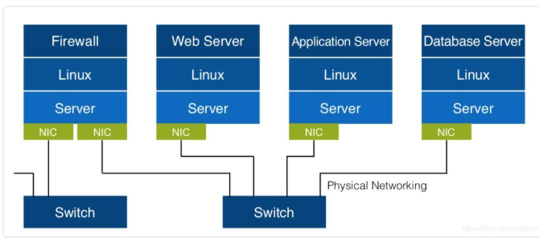

**Virtual Network:**

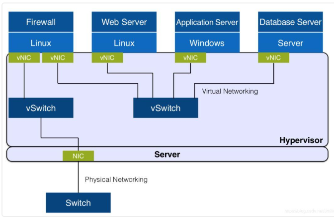

**Distributed Virtual Network**

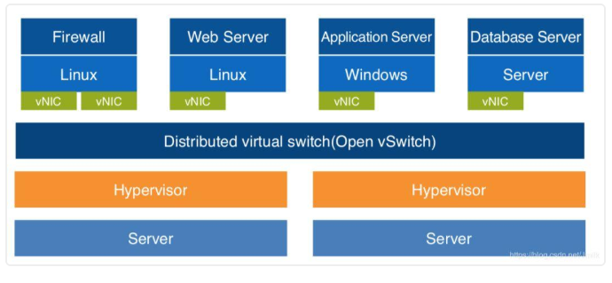

## Sự phát triển của Single-Plane Network tới Hybrid Planar Network

**Single-plane tenant shared network**: tất cả các tenants chia sẻ với nhau một mạng đơn (IP address pool) và có thể chỉ tồn tại một kiểu mạng duy nhất là (VLAN hoặc FLAT)

* Không có private network
* Không có sự cô lập giữa các tenant
* Không có layer 3 để routing

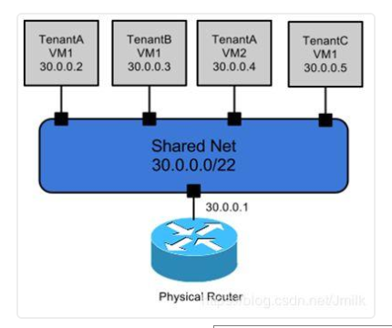

**Multi-plane tenant shared network**: Nhiều mạng được chia sẻ cho các tenants để lựa chọn

* Không có private network
* Không có sự cô lập giữa các tenant
* Không có layer 3 để routing

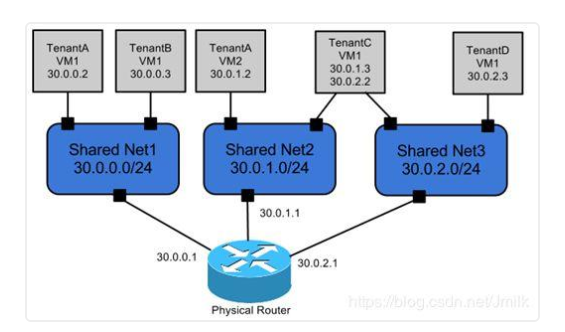

**Hybrid (shared/private) network**: là một sự kết hợp của shared networks và tenant private networks.

* Private network
* No tenant isolation
* No Layer 3 routing

> Note: Vì nhiều tenants vẫn dựa vào các shared networks (ví dụ cần thiết để truy cập vào external networks), nên các tenant sẽ không được cô lập hoàn toàn.

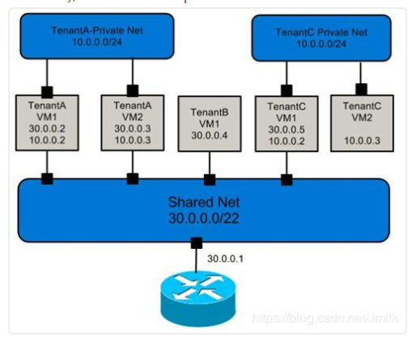

**Multi-plane tenant private network based on carrier routing function**: Mỗi một tenant đều có một private network của riêng họ, và khác với network sử dụng và các networks khác sử dụng carrier router (public) để triển khai liên kết layer 3.

* Private network
* Tenant isolation
* Shared Layer 3 routing	

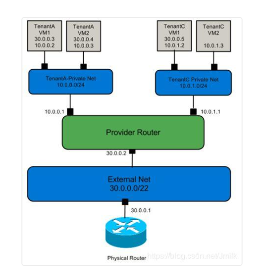

**Multi-Plane Tenant Private Multi-Network Based on Private Routers**: Mỗi tenant có thể có một vài private networks và routers. Tenants có thể sử dụng private routers để triển khai liên kết layer 3 giữa các private networks.

* Private network
* Tenant isolation
* There are three layers of routing

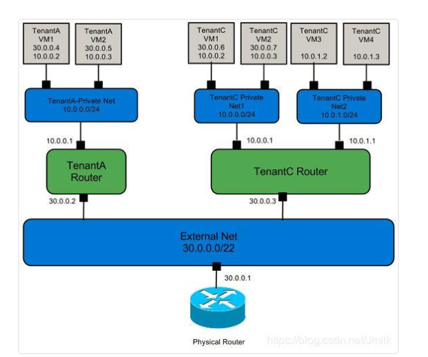

## Tóm tắt Neutron

> Neutron là một project của Openstack cung cấp các kết nối network như một dịch vụ giữa các thiết bị interface (vi dụ: vNICs) được quản lý bởi các OpenStack service khác (ví dụ: nova). Neutron cung cấp một API cho phép người dùng thiết lập và định nghĩa các kết nối đánh địa chỉ trong cloud. Với Neutron là code-name của Network service. OpenStack Networking xử lý việc tạo và quản lý kiến trúc mạng ảo, bao gồm networks, switches, subnets và routers cho các thiết bị được quản lý bởi  OpenStack Compute service (nova). Các service cao cấp như firewalls hoặc VPN cũng có thể được sử dụng. (https://docs.openstack.org/neutron/latest/)

Tóm lại Neutron là một dự án cung cấp các mạng kết nối như một dịch vụ cho OpenStack. Tất nhiên Neutron cũng có thể được tách ra từ hệ thống Keystone như một phần mềm trung gian SDN độc lập.

* **Như một thành phần của Openstack**: cung cấp dịch vụ network cho các máy ảo của openstack, bare metal và container.
* **Như một SDN middleware**: cung cấp resource interface trừu tượng thống nhất ở phía bắc và SDN controller ở phía nam.

Hai chương đầu tiên được dự định sẽ dẫn tới mục đích mà Neutron theo đuổi - **Một distributed virtualized network trong vùng của cloud computing và một multi-tenant network, cái mà multi-tenant được cô lập**.

Từ một góc độ triển khai phần mềm, các nhà phát triển quen thuộc với Neutron không quá khó để nhận ra rằng: Neutron team đầu tiên là phải thiết kế Core API Models (core resource model) và sau đó mới triển khai chúng. Điều này cũng chính là cách triển khai của nhiều dự án khác của OpenStack, rất đáng để học hỏi. Khi bạn thiết kế một kiến trúc phần mềm, dừng quá vội vàng để code, đầu tiên hãy nghĩ về ý nhĩa của service như "XXX as a service", điều đó có nghĩa là "Một dịch vụ là gì, dành cho ai, cho dịch vụ gì và như thế nào?" Bản chất của network-as-a-service được cung cấp bởi neutron là các tenants chỉ cần quan tâm về các dịch vụ, không triển khai chi tiết nội dụng của service là sự định nghĩa của các resource type (API). Chỉ có sự chuyển đổi API ổn định tương thích và mượt mà mới có thể kích hoạt APIs economy (xung quanh hệ sinh thái của open APIs), cho phép phần mềm tồn tại trong thị trường nguồn mở khốc liệt hiện nay.

Thiết kế ban đầu của Neutron hoàn toàn là định nghĩa phần mềm, không cần các thiết kế phần cứng mới, nhưng có sự phối hợp với các hardware hiện có. Đây là một ý tưởng thiết kế thực dụng, thông qua cách mà các plugin-driver gọi các function thành phần physical/virtual network để cung cấp sự hỗ trợ cho các service ở layer cao hơn. Tính năng này đảm bảo cho neutron nhận được sự chú ý rộng rãi trong các ngành công nghiệp.

## Mô hình triển khai mạng của Neutron

Để có thể hiểu được mô hình triển khai network của Neutron, chúng tôi sẽ tập trung vào ba vấn đề:

* Làm thế nào Neutron có thể hỗ trợ nhiều kiểu network (ví dụ VLAN, VXLAN)
* Làm thế nào để các VM trên các node compute khác nhau trong cùng tenant network có thể giao tiếp được với nhau?
* Làm thế nào để các VM có thể truy cập external network

Dưới đây là một mô hình tổng quan về kiến trúc của Neutron


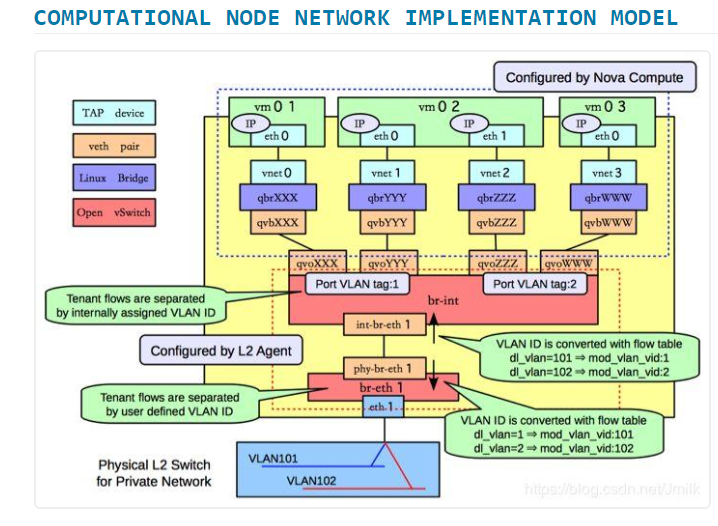

Dưới đây chúng tôi sẽ trực tiếp giới thiệu các luồng VM trên các compute node nếu nó được gửi ra ngoài compute node, chèn thêm phần giới thiệu các virtual network device vào quy trình.

* **Bước 1**: traffic được xử lý bởi kernel TCP/IP Stack của VM tới virtual NIC vNIC. **vNIC** là một tap device cho phép các chương trình user-mode (ở đây là GuestOS, a qemu process) để inject dữ liệu vào kernel TCP/IP stack. Tap device có thể chạy trên GuestOS và cung cấp chính xác các chức năng tương tự như physical NICs.

* **Bước 2**: virtual machine's vNIC (tap device) không trực tiếp kết nối tới OvS Bridge mà được chuyển tiếp tới OvS br-int (integrated bridge) thông qua Linux Bridge. Tại sao vNic lại không kết nối trực tiếp với OvS br-int? Bởi OvS chỉ có các static firewall rules ở các phiên bản trước v2.5 và không hỗ trợ các stateful firewall rules. Các rules đó cơ bản được hỗ trợ bởi Neutron Security Group, cung cấp các port-based (vNIC) level security cho virtual machines, vậy nên Linux Bridge được xem như là một layer of security, và iptables được sử dụng để filter stateful packets. Linux Bridge **qbr** là từ viết tắt của `quantum bridge`.

* **Bước 3**: Linux Bridge và OvS được kết nối với nhau bởi một veth pair device. Điểm kết thúc của "network cable" được gọi là qvb (quantum veth bridge) và một đầu khác là qvo (quantum veth ovs). Veth pair device luôn luôn có một cặp và được sử dụng để kết nối hai virtual network device để mô phỏng cho việc truyền và nhận dữ liệu giữa các virtual devices. Veth pair device làm việc bằng cách đảo ngược chiều giao tiếp dữ liệu. Dữ liệu cần được gửi được chuyển đổi thành dữ liệu cần nhận để gửi lại tới kernel TCP/IP protocol stack để xử lý và cuối cùng được chuyển hướng tới target device ("network cable") 

* **Bước 4**: OVS br-int là một integrated bridge, hoạt động như một local computing node (the Local) virtual switching device, virtual machine để hoàn thành quá trình xử lý các flow locally, các luồng tenant phân biệt với nhau được gán các VLAN ID (Vlan tenant, local network ID đều **internal distribution**)

	* Các traffic được gửi bởi các VM đều được đánh dấu với Local VLAN tag trong br-int, và các traffic được chuyển tới VM sẽ được xóa bỏ các VLAN tag bởi br-int.
	* Layer 2 traffic giữa các local VM ddwuocj chuyển hướng forwarded trong br-int và nhận bởi port cung VLAN tag.

* **Bước 5**: Traffic từ local VM để điều khiển VM (hoặc gateway) được gửi tới OvS `br-ethX` bởi int-br-eth1 (ovs patch peer device) port trên OvS br-int. Chú ý là `br-ethX` không phải luôn luôn được sử dụng: khi network type là Flat hoặc VLAN thì `br-ethX` được sử dụng, khi network có kiểu là **tunnel** (ví dụ; VXLAN, GRE), `br-ethX` được thay là `br-tun`. Như ví dụ bên trên là một VLAN network. Ở đây chúng tôi sẽ nói tới br-ethX, br-tun như là tenant network layer bridge device (TBN) cho dễ miêu tả.

	**Chú ý**: 
	
	* `qbr-XXX` được kết nối với OvS `br-int` bằng việc sử dụng veth pair device, và `br-int` kết nối tới `br-ethX/br-tun` sử dụng patch peer device. Cả hai đều tương tự như "network cables" ảo, điều khác biệt đầu tiên là một Linux virtual network device, thứ hai là virtual network device được triển khai bởi OvS.
	* Nếu tenant bridge là `br-tun` thay vì `br-ethX` thì `port:patch-int` trên `br-tun` và `port-patch-tun` trên `br-int`, thông qua `patch-int` và `patch-tun` để giao tiếp giữa các tenant bridge `br-tun` và local bridge `br-int`.

* **Bước 6**: Khi các luồng VM traffic giữa OvS `br-int` and OvS `br-ethX`, hoạt động rất quan trọng và phức tạp được yêu cầu - chuyển  đổi internal và external VID. Đây là khái niệm thiết kế về một "layered compatible" nhắc nhở tôi rằng tất cả các vấn đề về máy tính có thể được giải quyết bằng một lớp trung gian. Vấn đề là bề ngoài Neutron được hỗ trợ nhiều kiểu tenant network (Flat, VLAN, VXLAN, GRE)

* **Bước 7**: Cuối cùng, VM traffic được gửi tới physical network thông qua physical NIC ethX được gắn với TNB (br-ethX/br-tun). OvS br-int và OvS br-ethX cũng được triển khai với một veth pair device.

* **Bước 8**: Sau khi các traffic của VM đi vào physical network, phần còn lại sẽ do mạng truyền thống xử lý (traditional network). Các network packets được chuyển tiếp bởi các switches hoặc các thiết bị bridge device tới node compute khác, network node khác (điều này phụ thuộc vào topo mạng được triển khai như thế nào, và thông thường thì các VM traffic chỉ được nhận bởi các node cùng internal network).

## Internal và external VID conversion

Nhìn từ phía các network layer, mô hình mạng của các computing nodes có thể được chia ra: tenant network layer và local network layer.

Local network layer phân chia các VM (ports) của các mạng khác trong br-int bằng VLAN ID. Local network sẽ chỉ hỗ trợ VLAN type. Tenant network layer hỗ trợ kiểu network flat non-tunnel để đáp ứng yêu cầu của nhiều kiểu hybrid planes, VLAN (br-ethX) và tunnel type network VXLAN, GRE (br-tun). Chắc chắn rằng sẽ có một lớp chuyển tiếp giữa local network layer và tenant network layer. Điều này gọi là chuyển đổi VID.

VID là một khai niệm logical với các kiểu VIDs khác nhau cho các kiểu tenant network khác nhau.

| LOCAL NETWORK LAYER	|TENANT NETWORK LAYER|
|--|--|
| VLAN (ID)	|VLAN (ID)|
| VLAN (ID)	|VxLAN (VNI)|
| VLAN (ID)	|GRE(key)|

Chú ý; phạm vi của VID được định nghĩa bởi tenant - các tenant flow được phân tách với định danh người dùng VLAN ID. (VID của tenant network là **user defined**, ví dụ một mạng kiểu VLAN). **"User Defined"** là một dải được người dùng cấu hình cho nhiều kiểu network thông qua configuration file ml2_conf.ini của Neutron.

Ví dụ:

```sh
$ vim /etc/neutron/plugins/ml2/ml2_conf.ini

[ml2_type_vlan]
network_vlan_ranges = public:3001:4000

[ml2_type_vxlan]
vni_ranges = 1:1000

[ml2_type_gre]
tunnel_id_ranges = 1:1000
```

> Vlan ID của local network chỉ định bởi internal code logic algorithm và VID của tenant network được tùy chọn bởi người dùng.

Có bạn sẽ tự hỏi rằng tại sao chuyển đổi internal và external VID lại được yêu cầu khi tenant network có cùng VLAN với local network. Để trả lời câu hỏi này, bạn cần nghĩ tới: chuyện gì sẽ xảy ra khi bạn join VID conversion? Câu trả lời internal và external VID sẽ bị conflict khi kết hợp hai kiểu tenant network là VLAN và VXLAN. 

**Giả sử Network 1:** VID của tenant network VLAn là 100. Nếu internal và external VID conversion không được thực hiện, local network VLAN ID cũng là 100. **Giả sử Network 2**: tenant network VXLAN có VID của internal và external conversion là 1000, và local network VLAN 100 cũng là 100.

Đây là do VXLAN network không biết về VID của VLAN network khi nó thực hiện internal và external VID conversion. Nó chỉ biết khi VLAN network thực hiện internal và external VID conversion, bởi VID conversion được ghi lại và thực thi bởi OvS Flow Table - VLAN ID được chuyển đổi trong Flow Table.

> Vì vậy, VLan type network cũng cần thực hiện Internal và external VID conversion để ngăn việc internal và external VID bị conflict trong trường hợp kết hợp cả hai kiểu tenant network là VLAN và VXLAN.

Bây giờ chúng ta sẽ quay lại hai trong số những cấu hỏi mở đầu, đó là:

* Làm thế nào để Neutron hỗ trợ multiple types of network?
* Làm thế nào để các VM trên các node compute khác nhau trong cùng tenant network có thể giao tiếp được với nhau?

## Mô hình triển khai mạng của Network node

Chức năng chính của network node là giải quyết các vấn đề giao tiếp giữa các VM và external network (internet). Vậy làm thế nào để có thề hình dung được cách triển khai nó trong mạng truyền thông (traditional network)?

1. Để kết nối tới internet, tất cả các VM trong node compute trước tiên sẽ phải đi qua network node và network node thực hiện như một layer gateway đầu tiên.

2. Network node sẽ đi tới gateway của DC bằng kết nối với các thiết bị switch, router,.. trong physical network của DC. Thiết bị này được gọi là layer 2 gateway. Tất nhiên là network node cũng có thể điều hướng kết nối tới DC gateway (nếu DC gateway có thể điều khiên được), cùng lúc đó, một layer gateway thứ 2 là không cần thiết.

3. DC gateway sau đó sẽ được kết nối tới internet.

Có thể thấy được rằng những thứ mà network node phải xử lý là những thứ đã được xử lý bởi first layer gateway. Traffic của tất cả các node compute được kết nối với phía tây, physical network (layer thứ 2) gateway device được kết nối tới phía đông. Để làm được điều đó, các thành phần cần thiết ở network node là một L3 Router. Chú ý rằng L3 Router được đề cập ở đây không phải là vRouter (virtual router in SDN), nó chính là network node (một server linux có thể hoạt động như một router). Bản thân chính linux server (network node với mục đích để định tuyến, forward) cần được kết nối với external network của **first layer gateway**.

Nhìn từ phía layer, mô hình triển khai mạng của network node được chia ra làm 4 layer:

* **Tenant network layer**: Tất cả các node (computing, control, network) và hỗ trợ nhiều network types
* **Local network layer**: Dựa trên cơ chế Internal và external VID conversion, local VLAN tag được sử dụng để phân biệt các network, để phân biệt đúng gói tin của các network khác nhau
* **Service network layer**: cung cấp L3 Router and DHCP services.
* **External network layer**: Những thứ thuộc về external network (eg Internet)

Network node cung cấp L3 Router service và cũng cung cấp DHCP service cho mỗi tenant network là cần thiết (người dùng tự kích hoạt bằng tay). Để có thể cô lập mutil-tenant network resource isolation, cần sử dụng công nghệ Network Namespace được cung cấp bởi linux. Mỗi khi một L3 Router resource object được tạo, một qrouter-XXX namespace tương ứng sẽ được thêm vào; mỗi khi một DHCP service được kích hoạt cho một tenant netwok thì một qdhcp-XXX namespace được thêm vào.

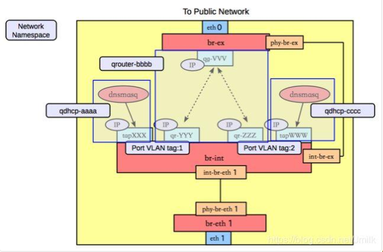

Như hình trên, DHCP service thực chất được cung cấp bởi tiến trình dnsmasq service. Một DHCP port (Tap device) được thêm vào qdhcp-XXX namespace. DHCP port này được kết nối tới br-int và có cùng mạng với tenant network tương ứng. Local VLAN tag (và tenant network VID) để cung cấp DHCP service cho tenant network.

Ngoài ra bạn có thể thấy `br-int` và `br-ex` bridge devices trong qrouter-XXX namespace được kết nối bởi veth pair device qr-XXX (quantum router) và qg-XXX (quantum gateway). Hơn nữa, qr-XXX port cũng có một local VLAN tag tương ứng cho tenant network. Các tenant network khác nhau thực hiện cấu hình router (routing table, iptables rules) là độc lập thông qua các Network Namespace khác nhau. Kích hoạt iptables để cung cấp chức năng NAT trong qrouter-XXX hỗ trợ cho việc floating ip của router.

> Các tenants khác nhau có các instance của qrouter-XXX và qdhcp-XXX khác nhau nên có thể tái sử dụng địa chỉ IP giữa các tenants khác nhau.

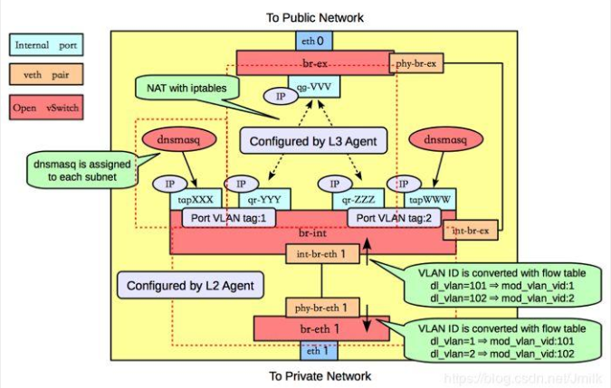

Trong mô hình mạng của compute node, chúng tôi sẽ giới thiệu làm thế nào để các VM traffic được gửi ra ngoài compute nodes. Ở đây chúng tôi sẽ tiếp tục miêu tả cách các VM traffic được gửi ra external network:

* **Bước 9**: card mạng vật lý ethX (OvS br-ethX/br-tun) nhận các traffictruy cập external network từ các VM tới các physical network, đầu tiên thực hiện internal và external VID conversion, và sau đó chuyển tới OvS br-int thông qua veth pair device.

**Chú ý**: VID trên tenant network layer chắc chắn giống nhau giữa mỗi tenant network, nhưng local VLAN IDs trên các compute, network node không cần thiết giống nhau, điều này sẽ không dẫn tới sự nhầm lẫn packet giữa các tenant network khác nhau. Nhầm lẫn bởi tất cả đều nằm trong flow table của OvS, chúng tôi sẽ tập trung vào vấn đề này ở đây.

* **Bước 10**: Trên network node, OvS br-int kết nối tới các network namespace khác, và qrouter-XXX nhận các inter-network segment access traffic và public network access traffic thông qua qr-XXX port.

	* **Inter-network segment access traffic**: 

	* **Public network access traffic**: 

* **Bước 11**: Cuối cùng, card mạng vật lý ethX kết nối với layer gateway thứ 2 và gắn với br-ex được gửi tới internet router.

Tóm lại, cấu hỏi "Làm thế nào để VM truy cập vào external network?" đã được giải quyết.

## Mô hình triển khai mạng của control node

Mô hình triển khai mạng của controller node tương đối dễ hiểu, bởi controller node không chịu trách nhiệm cho phần data plane, vậy nên nó không triển khai tính các năng network cụ thể. Tất cả những gì chúng tôi cần là quan tâm về tiến trình neutron-server service. Neutron không có một neutron-api service rõ ràng (được đặt tên), nhưng một web server service lại được cung cấp bởi neutron-server. Một phía nhận REST API request và chuyển tiếp tới tiến trình Neutron agent service trên mỗi node thông qua RPC protocol. Đây là mô hình triển khai mạng của Netron trên controller node.

Chúng tôi nói về mô hình triển khai mạng của neutron tách biệt các node (compute node, controller node, network node). Giờ hãy tóm tắt lại các ý tưởng thiết kế các layer quan trọng nhất.

Bỏ qua Openstack và neutron sang một bên, và tưởng tượng đơn giản cách để sử dụng virtual switch kết nối các VM giữa các hosts và VM kết nối tới external network. Nếu bạn sử dụng OvS sẽ rất đơn giản như việc tạo ra một bridge device (eg br-int) trên mỗi node mà không có br-ex, br-ethX/br-tun, Linux Bridge,... 

```sh
# Host1
ovs-vsctl add-br br-vxlan

# Host2
ovs-vsctl add-br br-vxlan

# Host1 thêm kết nối tới Host2 qua Tunnel Port
ovs-vsctl add-port br-vxlan tun0 --set Interface tun0 type=vxlan options:remote_ip=<host2_ip>

# Host2 thêm kết nối tới Host1 qua Tunnel Port
ovs-vsctl add-port br-vxlan tun0 --set Interface tun0 type=vxlan options:remote_ip=<host1_ip>
```

Nếu bạn sử dụng Linux Bridge, nó sẽ phức tạp hơn một chút, bạn có thể tìm hiểu thêm trong bài viết của tôi "KVM + LinuxBridge Network Virtualization Solution Practice".

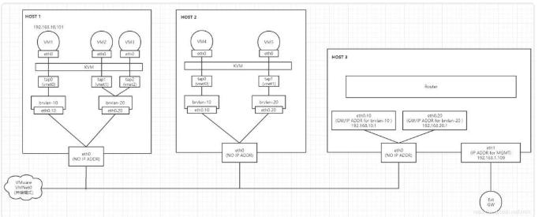

Nếu bạn thấy cần phải triên khai một multi-tenant multi-plane network trên nên tảng cloud thì mọi thứ sẽ trở nên khá phức tạp. Một nên tảng cloud tự động và linh động sẽ có quá nhiều kiểu network được hỗ trợ và Neutron vẫn đang phải làm việc chăm chỉ. Trong điều kiện như này, điều cấp thiết là phải thiết kế một kiến trúc phần mềm "lớp trên trừu tượng, lớp dưới tương thích không đồng nhất", cái mà chúng ta vẫn thường nói - thiết kế kiến trúc được phân lớp. Sơ đồ thiết kế luôn phụ thuộc vào lựa chọn nền tảng hỗ trợ và kiến trúc phân cấp của mô hình triền khai mạng của Neutron từ việc định nghĩa Flow table của OpenvSwitch (OpenFlow Switch).

