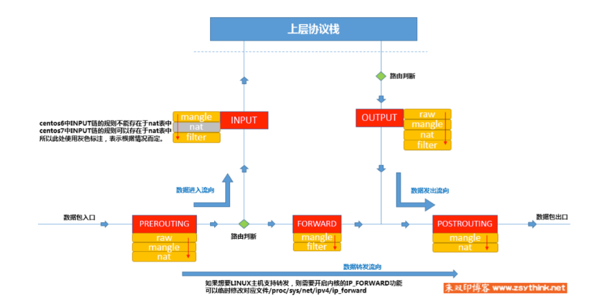

# Explain the principle of OpenStack security group

**DỊCH BÀI**:

http://int32bit.me/2019/06/01/%E6%B7%B1%E5%85%A5%E6%B5%85%E5%87%BAOpenStack%E5%AE%89%E5%85%A8%E7%BB%84%E5%AE%9E%E7%8E%B0%E5%8E%9F%E7%90%86/

Như chúng ta đã biết, Openstack security group được implemented mặc định bởi Linux iptables. Tuy nhiên, ta có thể nhận thấy rằng có rất ít chi tiết đi sâu về việc khai thác security group.

## 1. Giới thiệu iptables

### 1.1 Tổng quan iptables

Trước khi giới thiệu về OpenStack security group, tôi sẽ dành một chút thời gian để giới thiệu về iptables. Thực tế, iptables chỉ là một user space program. Linux kernel netfilter mới nơi thực sự thực hiện các rule. Tạo một rule mới thông qua iptables, chèn vào một hook trên netfilter để thực hiện thay đổi. Packets, control packet flow,... không quen thuộc với việc sử dụng iptables. Bạn có thể tham khảo thêm các khái niệm về iptables [ở đây](https://www.zsythink.net/archives/1199)

Đơn giản, iptables thực hiện một action cụ thể thông qua một chuỗi các rule với các điều kiện được matching, vì vậy **rule** chính là sự kết hợp của condition(điều kiện) và action(hành động), ví dụ như source IP address, layer 4 protocol, port,... ví dụ một số các sctions như: reject, pass, discarrd, modify the package,... action thường được sử dụng với tham số `-j`

Ví dụ, để reject 192.168.1.2 truy cập tới port 22 của target thì thêm dòng rule sau:

	iptables -t filter -I INPUT -s 192.168.1.2 -p tcp --dport 22 -j DROP

Trong đó: 

* `-t` chỉ định bảng là bảng filter (table), nếu bạn đặt tất cả các rule với nhau nó sẽ rất lộn xộn, vậy nên iptables sẽ chia ra làm các bảng khác nhau phân theo chức năng, lọc các gói tin sẽ được đặt trong bảng filter, NAT sẽ được đặt trong nat table,... một số các bảng khác như: raw table. security table, tổng cộng có 5 bảng. Nếu bạn không chỉ định tham số này, thì mặc định sẽ chọn filter table.

* `-I` chỉ ra hành động chèn, nó sẽ thực hiện chèn rules vào trên đầu bảng, tương tự với tham số `-A` chỉ định việc chèn rule vào cuối, `-I` và `-A` cũng có thể chỉ định ra vị trí mong muốn chèn rule.

* `INPUT` chỉ định tên của chain, chain có thể được coi là môt danh sách liên kết, các thành phần của các danh sách lên kết chính là các rule. Tổng cộng có tất cả 5 chain: PREROUTING, INPUT, FORWARD, OUTPUT, POSTROUTING. Lưu ý là tất cả các bảng nằm trên 5 chains, và tất nhiên không phải tất cả các bảng đều cần thiết trên cả 5 chain này, ví dụ bảng filter sẽ không có trên hai chain PREROUTING, POSTROUTING. Nếu nhiều bảng được chèn vào với các rule về chain trên, chúng sẽ được xem xét theo thứ tự sau: `raw -> mangle -> nat -> filter`.

* `-s`, `-p`, `--dport`  chỉ ra các điều kiện so sánh xem match với các rule nào, ví dụ `-s` chỉ ra source IP address, `-p` chỉ ra giao thức là `TCP`, `--dport` chỉ định port đích là port 22. Nếu thỏa mãn hết với các điều kiện này thì mới match rule.

* `-j` chỉ định hành vi để xử lý, vsi dụ `DROP` nghĩa là packet sẽ bị bỏ đi (không phản hồi lại cho client)

### 1.2 iptables matching conditions

Ngoài một số các tùy chọn `-s`, `-p`, `--dport` và một số các tham số khác thì iptables còn hỗ trợ tham số `-d` chỉ ra địa chỉ đích, `-i` `-o` chỉ định card NIC nào theo chiều vào, card NIC nào theo chiều ra. Tất nhiên các matching conditions đó là không đủ, thậm chí không hỗ trợ lọc đối với địa chỉ MAC. Để đáp ứng các nhu cấu khác, iptable hỗ trợ nhiều matching conditions thông qua extension modules, chủ yếu nó được chia làm hai loại sau:

* **Function-enhanced**: Ví dụ, tham số `--dport` chỉ có thể match với một port đơn hoặc một chuỗi port liên tiếp. Nếu bạn cần match nhiều port không liên tiếp thì bạn sẽ phải thêm nhiều rule. `mulport` một extension module cho phép nhiều port được chỉ định cùng một lúc, phần biệt với nhau bằng các dấu phẩy `,`.  Một ví dụ khác là `ip-range` module hỗ trợ chỉ định một đoạn địa chỉ IP.

* **New features**: Ví dụ, `mac` module hỗ trợ match địa chỉ source MAC. `time` module hỗ trợ việc sử dụng một khoảng thời gian (time periods) như matching conditions, ví dụ implementing external SSH từ 0:00 tới 8:00 mỗi ngày.

Các expansion modules khác nhau hỗ trợ các tham số khác nhau, ví dụ như `mac` modules sư dụng tham số `mac-source`

Việc sử dụng các extension modules phải được load bởi tham số `-m` (viết tắt của `--match`). 

Ví dụ, ta không cho phép địa chỉ MAC `FA:16:3E:A0:59:BA` pass, cấu hình như sau:

	iptables -A INPUT -m mac --mac-source FA:16:3E:A0:59:BA -j DROP

Có nhiều extension modules cho iptable, có thể xem thêm bằng cấu lệnh `man iptables-extensions`, nhưng Openstack security group	không sử dụng nhiều:

* `comment`: thêm một comment cho rule
* `tcp`/`udp`/ `icmp`: các module cơ bản của iptable thậm chí còn không có chức năng chỉ định port.
* `set`: match ipset, cái mà thỏa mãn các điều kiện khi ip nằm trong bộ ipset 
* `mac`: như đã đề cập trước đó, nó hỗ trợ matching MAC addresses.
* `state`: Module này rất hữu dụng. Một ví dụ đơn giản, giả sử iptables rule được cấu hình bởi server A (192.168.0.1) hoàn toàn không thể truy cập, tức là INPUT chain sẽ DROP toàn bộ, và all-pass sẽ đều được ghé thăm, cái mà OUTPUT chain đều full ACCEPT. Một server B khác (192.168.0.2), phải chắc chắn rằng B không ping được tới A, vậy liệu A có ping được tới B hay không? Một vài người sẽ nói chắc chắn rằng từ A tất cả đều được kết nối nên chắc chắn rằng có thể ping tới B. Nhưng thực tế là A không thể ping tới B, bởi các package của A không trở về, các gói tin ICMP của A thì có thể tới B nhưng khi gói tin trả về từ B thì sẽ bị drop ở chain INPUT của A, vậy nên A không thể nhận được gói tin phản hồi của B. Vậy làm thế nào để giải quyết vấn đề này? Thêm B vào **whitelist** của A sẽ không đúng với ý định ban đầu của tôi. Vấn đề sẽ được giải quyết hoàn hảo với module `state`. Chỉ định state `ESTABLISHED` để match các package đã sẵn sàng thành lập được kết nối. Lưu ý rằng kết nối ở đây không phải là một TCP connection, các kết nối có thể là UDP, icmp, hiểu đơn giản là match các return packet. Vì vậy để giải quyết vấn đề trên bạn chỉ cần add rule `-A INPUT -m state --state RELATED,ESTABLISHED -j ACCEPT`

* `physdev`: module này kết hợp với tham số `-i` và `-o` mạnh mẽ hơn. Nếu chúng ta tạo ra một linux bridge `br0`, chúng ta sẽ có card ảo tap devices `br0`. Chúng tôi sẽ sử dụng tham số `-i` để chỉ sịnh `br0`, sau đó bất kể NIC ảo nào xuất hiện cũng đều match. Module `physdev` rất mạnh mẽ, tham số `physdev-in` chỉ định xem sẽ interface nào sẽ đi vào, tham số `physdev-out` chỉ định interface nào sẽ đi ra. 

### 1.3 iptables execution action

Như đã đề cập bên trên, tham số `-j` sẽ chỉ ra target để thực thi, một số các target của iptables như sau:

* **ACCEPT**: Nhận các packets, phát hành gói trực tiếp, mà không cần match với các rule khác trên chain. Lưu ý về các chain là vẫn cần phải khớp với các chain khác.

* **DROP**: Loại bỏ gói ngay lập tức, không cần phải tiếp tục với các rule khác.

* **REJECT**: Từ chối gói tin, vậy nó khác gì so với DROP? DROP sẽ lập tức từ bỏ gói tin, và không trả lời, client sẽ phải chở cho hết timeout. REJECT sẽ từ bỏ gói tin và trả về một phản hồi cho client, để client biết mà không phải chờ đợi một cách mù quáng.

* **LOG**: Chỉ ghi lại log

Tất nhiên, có SNAT, MASQUERADE, DNAT cho kỹ thuật NAT. Bởi việc triển khai sercurity group không liên quan, nên sẽ không được miêu tả chi tiết. Thêm nữa, có action `RETURN` điều hướng đến một chain khác, và các sub-chain sẽ được thảo luận sau.

Các action sẽ thường làm ngắn mạch, có nghĩa là khi một rule được match và các action được thực thi thì chúng sẽ không được tiếp tục match với các rule khác nữa. Tất nhiên không phải tất cả, ví dụ như LOG là một ngoại lệ, sau khi thực hiện action LOG nó sẽ tiếp tục đi tới để match với các rule khác.
 
### 1.4 Iptables chain

Có 5 chain chính trong iptable, và các chain có thể được coi là một danh sach liên kết. Vấn đề là làm thế nào để match các rules khi nhận một packet mới. Dưới đây là một hình ảnh để hiểu về cách thức hoạt động của iptables.



* Đầu tiên gói tin sẽ đến **PREROUTING** chain, với các bảng là **raw**, **mangle**, **nat** thực hiện match để sắp xếp các rule được định nghĩa cho PREROUTING. 

* Tiếp theo nó được xem xét các route, nếu gói tin được gửi tới chính nó thì gói tin sẽ được chuyển tới packet chain INPUT, sau đó nó được gửi tới user space bằng INPUT chain. Nếu không phải gói tin gửi cho nó thì nó sẽ chuyển tới chain FORWARD, kết hợp với việc matching các bảng raw -> mangle -> nat -> filter để match với các rule trên chain.

* Tương tự với chain OUTPUT và POSTROUTING, chiều thực hiện xử lý gói tin như hình trên.

Như bên trên, các rule có thể được chèn vào các chain và được thực hiện tuần tự, mỗi lần iptable matching, nó sẽ so sánh với từng rule một, nếu match với rule đầu tiền thì nó mới được tiếp tục với các rule tiếp theo, cứ như thế cho tới khi nào hết rule, hoặc cho tới khi được chuyển tới các chain khác.

Vấn đề được đặt ra là nếu không có rule nào match thì sẽ như thế nào? Điều này sẽ phụ thuộc vào policy mặc định. Nếu policy mặc định là DROP, thì sau khi đi hết tất cả các rule mà không match với bất kỳ rule nào thì gói tin sẽ bị loại bỏ, đó được gọi là whitelist. Nếu mặc định là ACCEPT, thì gói tin sẽ mặc định pass nếu không khớp với bất cứ rule nào, đó gọi là blacklist của chain. Tất nhiên policy thường được sử dụng là **ACCEPT**, nếu cấu hình mặc định là **DROP** thì sẽ quá nguy hiểm, nếu iptable chưa có bất cứ một rule nào, mà bạn cấu hình policy là DROP khi đang ssh tới server thì lập tức kết nối sẽ bị gián đoạn.

Sử dụng command sau để xem policy mặc định cho mỗi chain trong filter table:

```sh
[root@trang-68-110 ~]# iptables -nL| grep 'policy'
Chain INPUT (policy ACCEPT)
Chain FORWARD (policy ACCEPT)
Chain OUTPUT (policy ACCEPT)
```

Nếu rule đặc biệt phức tạp, nó sẽ rất khó khăn để quản lý, vậy nên cần nhóm chúng lại theo chức năng. IPtables thực hiện thông qua một chain tùy chỉnh. Users có thể add rules vào một chain mới được tạo bởi command `iptables -N name`. Tuy nhiên cần chú ý rằng custom chain không thể tồn tại độc lập, mà cần phải kết hợp với 5 chain mặc định, nghĩa là nó phải là một chain con của các chain phía trên.

Như đã đề cập ở trên mục 1.3, bạn có thể chỉ định một chain mới thôi qua tham số `-j`, chain mới ở đây được gọi là sub-chain, tạo chain theo một rule nhất định với tham số `-j`. Ví dụ, để tạo một whitelist cho phép tất cả các phiên kết nối SSH, bạn có thể tạo một sub-chain mới, và SSH-related policies được đặt trong chain mới này:

```sh
iptables -N SSH_Access_List
iptables -I INPUT -p tcp -m tcp --dport 22 -j SSH_Access_List
iptables -I SSH_Access_List -s 197.168.1.1 -j RETURN
iptables -I SSH_Access_List -s 197.168.1.2 -j RETURN
# ... whitelist
iptables -I SSH_Access_List -j DROP
```

Dòng thứ hai ở trên chỉ ra việc cho phép tất cả các gói tin truy cập tới local port 22 được đặt trong `SSH_Access_List` trên sub-chain, và phía sau là một số các whitelist rules được thêm vào sub-chain. Do sub-chain có target là port 22, vì vậy rule sẽ không cần chỉ đinh `--dport` và cuối cùng là drop packet, đó không phải là một whitelist trực tiếp loại bỏ.

Lưu ý: Lưu ý rằng action trong whitelist không phải là `ACCEPT` mà là `RETURN`, vậy có gì khác biệt giữa hai action này? `ACCEPT` có nghĩa là gói tin được phép đi qua INPUT mà không cần match với bất kỳ rule nào khác của INPUT chain. RETURN có nghĩa là không cần phải match các quy tắc phía sau trong sub-chain, nhưng các rule hoặc sub-chain sẽ cần phải được trả về để tiếp tục match với các rule trong chain mẹ.

Một điều cần lưu ý là 5 chuỗi tích hợp đã nói ở trên có thể được cấu hình bằng policy, sử dụng policy để loại bỏ tất cả các gói khi tất cả các rule không match. Tuy nhiên các custom chain không hỗ trợ các policy, cụ thể hơn, policy không được hỗ trợ, vì các policy của custom chain chỉ có thể là RETURN, nghĩa là, nếu các rule của sub-chain không match thfi nó sẽ trả lại chuỗi mẹ để tiếp tục match.

### 1.5 Tóm tắt lại về Iptables

Phần này giới thiệu ngắn gọn về các chức năng và cách thức sử dụng iptables, tóm tắt lại như sau:

1. Xác định đích đến của gói tin thông qua việc match các rule. Các rule này bao gồm điều kiện + action match, rulư được thêm vào bởi tham số `-I` và `-A`

2. Gồm có 5 table: raw, mangle, nat, filter, security và 5 chain: PREROUTING, INPUT, FORWARD, OUTPUT, POSTROUTING.

3. Nếu tất cả các rule trong chain không match, iptable sẽ xử lý gói theo policy mặc định mà chain đặt ra. Policy này nên để là ACCEPT, không nên cấu hình đổi thành DROP

4. Bạn có thể tạo một sub-chain được gắn vào trong chain nào đó và đặt policy là RETURN. 

5. Điều kiện match bao gồm cách điều kiện cơ bản và một số các điều kiện khác được mở rộng thêm đưuọc cung cấp bởi các extension module. Sử dụng tham số `-m` để thực hiện các điều kiện match, một số các extention module cần nhớ là: comment, tcp, udp, icmp, mac, state, physdev, set.

6. Các iptables actions (target) là ACCEPT, DROP, RETURN, LOG và jump to sub-chains.

## 2. Giới thiệu về OpenStack Security Group

### 2.1 Neutron security group và Nova security group

Openstack security group ban đầu được quản lý bởi Nova, sau này nó được quản lý bởi Neutron, và các đối tượng liên quan không phải là các instance mà là các port. Chúng tôi add các instance trên web vào một security group, nhưng thực thế là các port được thêm vào.

Vì một số lý do, có thể có môt số phiên bản thì Nova vẫn duy trì API cho các security group hoạt động, nhưng không nên sử dụng, nên sử dụng Neutron để quản lý.

### 2.2 Security group vs Firewall

Nhiều người dùng mới sử dụng openstack không biết về sự khác biệt giữa firewall và security group, vì cả hai đều thực hiện kiểm soát truy cập mạng dựa trên iptables. Trên thực tế sự khác biệt là tương đối lớn:

* security group chủ yếu để bảo vệ các VM, nói cách khác security group được liên kết với các port của VM. Nó thực hiện kiểm soát truy cập mạng cho mỗi port, do đó nó giống như một host firewall. Firewall dành cho mạng VPC, nó nhằm mục đích kiểm soát toàn bộ mạng của VPC, thường là dùng cho mục đích định tuyến. Vì vậy, security group làm việc với tap device của compute node, còn firewall làm việc với các router của network node.

* So với mô hình mạng truyền thống, security group tương tự với firewall được cấu hình vởi chính hệ thống của nó, còn firewall là một tường lửa được kết nối với các router để điều khiên traffic trong LAN.

* Security group định nghĩa bộ các rules được cho phép để pass, cái mà action của rule là ACCEPT. Nói cách khác, một whitelist rule được định nghĩa, vậy nếu VM được liên kết với một security group trống, thì VM có thể sẽ không thể ra ngoài và từ ngoài cũng không thể vào trong. Bởi tất cả chúng đều là rule whitelist nên thứ tự của security group là không quan trọng, một port của VM có thể liên kết tới nhiều security group cùng một lúc, tương đương với việc kết hợp các bộ rule lại với nhau. Firewall rule có các actions (allow, deny, reject). Các rule cũng có thể là ACCEPT hoặc DROP nên thứ tự không quan trọng. Số phần của các gói tin không chỉ phụ thuộc vào các rule mà còn phụ thuộc vào độ ưu tiên của các rule, thứ tự của chúng.

* Như đã được đề cập phía trên, security group là dành cho các port của VM. Bởi địa chỉ IP của VM là một điều kiện được biết đến, Bạn không cần chỉ định IP VM khi định nghĩa rule.  Ví dụ, khi định nghĩa access rule, bạn chỉ cần định nghĩa source IP address, target port và protocol. Firewall dành cho layer 2 network, layer 2 network chắc chắn sẽ có nhiều VMs. Vì vậy, các rule cần định nghĩa source IP, source port, destination IP, target port và protocol. 


### 2.3 Giới thiệu về việc sử dụng Security Group

Security Group đã được giới thiệu trước đó, nó thực ra chính là một nhóm các security group rules.

Neutron `security-group-create` tạo một security group với subcommands. Tham số này chỉ có một `name` đó là tên của security group:

	neutron security-group-create int32bit-test-secgroup-1

Tuy nhiên, security group mới được tạo bởi Neutron không phải là một empty rule security group, mặc định sẽ tự động có 2 rule được thêm vào: 

```sh
[root@trang-40-71 ~(openstack)]# neutron security-group-rule-list  \
    -F security_group \
    -F ethertype \
    -F remote \
    -F port/protocol \
    -F direction \
    | grep trangnth
neutron CLI is deprecated and will be removed in the future. Use openstack CLI instead.
| trangnth       | egress    | IPv4      | any           | any              |
| trangnth       | egress    | IPv6      | any           | any              |
```

Như trên nghĩa là tất cả các traffic truy cập tới đều bị cấm, và cho phép tất cả các traffic đi ra ngoài.

Khi bạn tạo một security group, bạn có thể thêm rule vào. Neutron sử dụng command `security-group-rule-create` để tạo mới security group với một số các tham số như sau:

* `--direction`: Whether the rule is an egress or an ingress.
* `--ethertype`: Ethernet type, ipv4 or ipv6.
* `--protocol`: Protocol type, tcp/udp/icmp, etc. If this parameter is not specified, it means any protocol.
* `--port-range-min`, `--port-range-max` Port range, if only one port, the two parameters can fill the same, the port ranges from 1 to 65535.
* `--remote-ip-prefix` If it is an access, it refers to the source IP address segment. If it is a visit, it refers to the target IP segment. It is defined by the CIDR format. If only one IP is x.x.x.x/32specified, it is specified. If it is any IP, it is 0.0.0.0/0specified.
* `--remote-group-id` In addition to specifying rules through the ip segment, OpenStack also supports security groups as matching conditions, such as allowing all virtual machines associated with the xyz security group to access port 22.

Ví dụ tạo một security group chỉ cho phép địa chỉ 192.168.4.5 được phép truy cập tới VM qua port 22 của SSH:

```sh
int32bit ~# neutron security-group-rule-create \
>     --direction ingress \
>     --ethertype ipv4 \
>     --protocol tcp \
>     --port-range-min 22 \
>     --port-range-max 22 \
>     --remote-ip-prefix 192.168.4.5/32 \
>     int32bit-test-secgroup-1
Created a new security_group_rule:
+-------------------+--------------------------------------+
| Field             | Value                                |
+-------------------+--------------------------------------+
| created_at        | 2019-06-01T02:42:41Z                 |
| description       |                                      |
| direction         | ingress                              |
| ethertype         | IPv4                                 |
| id                | de122da4-e230-4f59-949b-9e4bd18a96a8 |
| port_range_max    | 22                                   |
| port_range_min    | 22                                   |
| project_id        | b9539efbfe0342f7aef6375ef6586d70     |
| protocol          | tcp                                  |
| remote_group_id   |                                      |
| remote_ip_prefix  | 192.168.4.5/32                       |
| revision_number   | 0                                    |
| security_group_id | 7df7f951-a376-44aa-a582-c8bd96199f82 |
| tenant_id         | b9539efbfe0342f7aef6375ef6586d70     |
| updated_at        | 2019-06-01T02:42:41Z                 |
+-------------------+--------------------------------------+
```

Chú ý rằng khi bạn tạo một security group và một security group rule sẽ chỉ tạo ở mức vật lý thôi, chứ không tạo bất cứ một iptables rule nào. Các iptable rules chỉ thực sự được tạo khi security group được liên kết với các port. Thực hiện liên kết các port với security group bằng cách dùng lệnh `port-update`, ví dụ muốn thêm một VM có uuid `38147993-08f3-4798-a9ab-380805776a40` vào một security group:

```sh
VM_UUID=38147993-08f3-4798-a9ab-380805776a40
PORT_UUID=$(neutron port-list -F id -f value -- --device_id=${VM_UUID})
neutron port-update --security-group int32bit-test-secgroup-1 ${PORT_UUID}
```

Hoặc có thể thêm trên dashboard

## 3. Phân tích cơ chế thực hiện của security group

### 3.1 virtual machine network flow path

Linux network virtualization hỗ trợ hai loại là linux bridge và openvswitch (OVS for short), và OpenStack Netron ml2 driver hỗ trợ cả hai thứ đó. Hiện tại thì đang sử dụng OVS là chủ yếu.

Tuy nhiên, ban đầu thì iptables không hỗ trợ các OVS bridge và port, vì vậy để có thể implement security group, các tap device của VM sẽ không trực tiếp kết nối tới OVS bridge mà kết thông qua một linux bridge ở giữa, linux bridge và ovs bridge kết nối với nhau thông qua veth pair. Khi đó ta có thể thêm các iptables rule trên linux bridge để triển khai security group.

Hầu hết các môi trường Openstack hiện tại đang tuân thủ theo các quy tắc trên. Mô tả đơn giản về đường đi, luồng traffic của VM như sau:

```sh
   vm1                  vm2              vm3
    |                    |                |
   tapX                tapY             tapZ
    |                    |                |
    |                    |                |
  qbrX                 qbrY             qbrZ
    |                    |                |
---------------------------------------------   
|                   br-int(OVS)              |
---------------------------------------------
                         |
-----------------------------------------------
|                  br-tun(OVS)                |
-----------------------------------------------
```

X, Y, Z là 11 bits đầu tiên của UUID port VM.


### 3.2 Which chain of iptables does the security group rule hang?

Theo như nền tảng trước đó, nó không khó để đoán rằng iptables rule của security group được định nghĩa trên bảng filter. Bảng filter sẽ chỉ gồm 3 chain: INPUT, FORWARD, OUTPUT. Mô hình hoạt động cơ bản sẽ như sau:

```sh
               INPUT                          							OUTPUT
                 ^                            							  | 
                 |                            							  | 
                 | Y                          							  |
                 |                           				N			  v
Lối đi vào ----> Kiểm tra xem có phải gói tin đi vào không? ----> FORWARD  -----> Đi ra ngoài
```

### 3.3 Định nghĩa security group rule

Ví dụ ta đã tạo một VM `int32bit-server-1`  với IP là 192.168.100.10/24, port có UUID là `3b90700f-1b33-4495-9d64-b41d7dceebd5`, và thêm một security group có tên là `int32bit-test-secgroup-1`

Đầu tiên chúng ta cần liệt kê tất cả các port trên node compute. Thực hiện tạo một script `dump_all_taps.sh` có nội dung như sau:

```sh
#!/bin/bash
# Description: Dumps all tap devices to Neutron port.

# Dump ovs tap devices
for tap in $(ovs-vsctl show | grep -P 'Port "' | grep -Pv "(eth)|(qvo)" | tr -d '"' | awk '{print $2}'); do
    ./tap_to_port.sh $tap
done

# Dump linux bridge tap devices
for tap in $(brctl show | grep -Po 'tap\w{8}-\w{2}'); do
    ./tap_to_port.sh $tap
done
```

Và một file `tap_to_port.sh` có nội dung như sau:

```sh
#!/bin/bash
# Description: Convert tap to Neutron port.

TAP_NAME=$1

if [[ -z $TAP_NAME ]]; then
    echo "Usage $0 <tap_name>"
    exit 1
fi

# tap6fee5e4d-56 -> 6fee5e4d-56
PORT_PREFIX=${TAP_NAME:3} #bo di 3 ky tu dau
PORT_ID=$(neutron port-list | grep $PORT_PREFIX | cut -d '|' -f 2 | tr -d ' ')
PORT_INFO_PATH=/tmp/port_info_${PORT_ID}
neutron port-show $PORT_ID >$PORT_INFO_PATH 
IP=$(cat $PORT_INFO_PATH | awk -F '|' '/fixed_ips/{print $3}' | tr -d '"' | grep -Po "ip_address: [a-f0-9:.]+" | cut -d ':' -f 2- | tr -d ' ')
MAC=$(cat $PORT_INFO_PATH | awk -F '|' '$2~/mac_address/{print $3}' | tr -d ' ')
DEVICE_OWNER=$(cat $PORT_INFO_PATH | grep 'device_owner' | cut -d '|' -f 3 | tr -d ' ')

printf "%s: %s  %s %s %s\n" $TAP_NAME $PORT_ID $IP $MAC $DEVICE_OWNER

# Clean works
rm -rf $PORT_INFO_PATH
```


Chạy script để liệt kê các port:

```sh
int32bit ~# ./dump_all_taps.sh
tap8ea41395-1e: 8ea41395-1e13-4b44-a185-0b0f6d75ba9e  192.168.100.254 fa:16:3e:c3:0e:a0 network:router_interface
tap6fee5e4d-56: 6fee5e4d-5655-4411-b85b-db8da2e8f69e  192.168.100.1 fa:16:3e:63:88:59 network:dhcp
tap3b90700f-1b: 3b90700f-1b33-4495-9d64-b41d7dceebd5  192.168.100.10 fa:16:3e:a0:59:ba compute:nova
```

Theo như phân tích trước đó, VM security group được định nghĩa trên FORWARD chain của filter table. Ta có thể nhìn thấy các rule đó của chain như sau:

```sh
int32bit ~# iptables -n --line-numbers -L FORWARD
Chain FORWARD (policy ACCEPT)
num  target     prot opt source  destination
1    neutron-filter-top  all  --  0.0.0.0/0            0.0.0.0/0
2    neutron-openvswi-FORWARD  all  --  0.0.0.0/0            0.0.0.0/0
```

FORWARD chain tới sub-chain `neutron-filter-top` trước, sau đó sẽ tới `neutron-openvswi-local`, và chain `neutron-openvswi-local` trống, nên nó sẽ trả về parent chain là FORWARD, vì vậy các rule ở đây là vô dụng.

Trả về với chain FORWARD và tiếp tục match rule thứ hai, tới `neutron-openvswi-FORWARD` chúng ta có thể nhìn thấy các rule của chain:

```sh
int32bit ~# iptables -n --line-numbers -L neutron-openvswi-FORWARD
Chain neutron-openvswi-FORWARD (1 references)
num  target     prot opt source               destination
1    ACCEPT     all  --  0.0.0.0/0            0.0.0.0/0  
          PHYSDEV match --physdev-out tap6fee5e4d-56 --physdev-is-bridged
2    ACCEPT     all  --  0.0.0.0/0            0.0.0.0/0 
          PHYSDEV match --physdev-out tap8ea41395-1e --physdev-is-bridged
3    neutron-openvswi-sg-chain  all  --  0.0.0.0/0            0.0.0.0/0  
          PHYSDEV match --physdev-out tap3b90700f-1b --physdev-is-bridged
4    neutron-openvswi-sg-chain  all  --  0.0.0.0/0            0.0.0.0/0
          PHYSDEV match --physdev-in tap3b90700f-1b --physdev-is-bridged
```

Có tất cả là 4 chain. Tap device tương ứng với rule thứ nhất và rule thứ hai và dhcp và router_interface port, nghĩa là DHCP và gateway có thể vượt qua

Tên `tap3b90700f-1b` tương ứng với port của VM, tên đó bằng với `tap` + `11 bit đầu portUUID`, rule thứ 3 và thứ 4 chỉ ra rằng tất cả các gói tin đến và đi đều đi qua chain `neutron-openvswi-sg-chain`

Chúng ta tiếp tục xem chain `neutron-openvswi-sg-chain`:

```sh
int32bit # iptables -n --line-numbers -L neutron-openvswi-sg-chain
Chain neutron-openvswi-sg-chain (4 references)
num  target     prot opt source               destination
1    neutron-openvswi-i3b90700f-1  all  --  0.0.0.0/0            0.0.0.0/0
            PHYSDEV match --physdev-out tap3b90700f-1b --physdev-is-bridged
2    neutron-openvswi-o3b90700f-1  all  --  0.0.0.0/0            0.0.0.0/0
            PHYSDEV match --physdev-in tap3b90700f-1b --physdev-is-bridged
3    ACCEPT     all  --  0.0.0.0/0            0.0.0.0/0
```

Ta có thể thấy:

* `--physdev-out` là chiều các gói tin được gửi từ `tap3b90700f-1b` tới VM. sub-chain `neutron-openvswi-i3b90700f-1` sẽ xử lý các traffic truy cập này.

* `--physdev-in` chỉ ra chiều các gói tin được gửi từ VM tới `tap3b90700f-1b`, các traffic truy cập này sẽ được xử lý bởi sub-chain `neutron-openvswi-o3b90700f-1`

Cần chắc chắn rằng `neutron-openvswi-i3b90700f-1` và `neutron-openvswi-o3b90700f-1` tương ứng với các rule access của security group. Virtual machine's access rule thường có dạng như sau `neutron-openvswi-i` + `tiền tố của port`.

### 3.4 Security Group Access Rules

Như ở mục trước, mục 3.3, security group access rule chain là `neutron-openvswi-i3b90700f-1` và có thể xem các rule như sau:

```sh
int32bit # iptables -n --line-numbers -L neutron-openvswi-i3b90700f-1
Chain neutron-openvswi-i3b90700f-1 (1 references)
num  target     prot opt source               destination
1    RETURN     all  --  0.0.0.0/0            0.0.0.0/0            state RELATED,ESTABLISHED
2    RETURN     udp  --  0.0.0.0/0            192.168.100.10       udp spt:67 dpt:68
3    RETURN     udp  --  0.0.0.0/0            255.255.255.255      udp spt:67 dpt:68
4    RETURN     tcp  --  192.168.4.5          0.0.0.0/0            tcp dpt:22
5    DROP       all  --  0.0.0.0/0            0.0.0.0/0            state INVALID
6    neutron-openvswi-sg-fallback  all  --  0.0.0.0/0            0.0.0.0/0    
```

Ở ví dụ trên có tất cả 6 rule:

* Rule đầu tiên được giới thiệu như trước đó, vậy nên nó khá là quen thuộc, chủ yếu đưuọc sử dụng để release và return.

* Rule thứ 2 và thứ 3 dành cho dhcp broadcast packets.

* Dòng thứ 4 là security group được thêm vào trước đó

* Rule thứ 5 để loại bỏ các packet không cần thiết

* Dòng thứ 6 được sử dụng để xử lý các gói tin không match với bất cứ rule nào, và đi vào sub-chain `neutron-openvswi-sg-fallback` và chain chỉ có một rule suy nhất, DROP ALL. Vì vậy các gói tin không match với security group rule thì sẽ bị loại bỏ.

Lưu ý, các rule thứ 1, 2, 3, 5, 6 trong security group access rule đều đã được fixed. khi có một security group policy mới thì nó sẽ được thêm vào sau rule thứ 4.


### 3.5 Security Group Visit Rules

Theo như phần 3.3, security group access rule chain là `neutron-openvswi-o3b90700f-1`

```sh
int32bit # iptables -n --line-numbers -L neutron-openvswi-o3b90700f-1
Chain neutron-openvswi-o3b90700f-1 (2 references)
num  target     prot opt source               destination
1    RETURN     udp  --  0.0.0.0              255.255.255.255      udp spt:68 dpt:67
2    neutron-openvswi-s3b90700f-1  all  --  0.0.0.0/0            0.0.0.0/0
3    RETURN     udp  --  0.0.0.0/0            0.0.0.0/0            udp spt:68 dpt:67
4    DROP       udp  --  0.0.0.0/0            0.0.0.0/0            udp spt:67 dpt:68
5    RETURN     all  --  0.0.0.0/0            0.0.0.0/0            state RELATED,ESTABLISHED 
6    RETURN     all  --  0.0.0.0/0            0.0.0.0/0
7    DROP       all  --  0.0.0.0/0            0.0.0.0/0            state INVALID 
8    neutron-openvswi-sg-fallback  all  --  0.0.0.0/0            0.0.0.0/0 
```

Trong đó:

* Rule 1 và rule 3 được sử dụng cho virtual machine DHCP client broadcast packet.
* rule thứ 2 được giới thiệu ở chapter 4
* Rule thứ 4 được sử dụng để ngăn DHCP spoofing, và ngăn chặn user starting một DHCP server bên trong VM ảnh hưởng đến DHCP server của Neutron
* Rule thứ 6 là security group rule, do security group rule là ANY nên tất cả các gói tin đều được released.
* Rule 7 để bỏ các rule không hữu ích
* Rule thứ 8 để xử lý các gói tin không match với các rule trên và đưa nó vào chain `neutron-openvswi-sg-fallback`, chain này chỉ có một rule là DROP ALL.

### 3.6 Security Groups Use Security Groups as Matching Conditions

Như đã đề cập từ phần 2.3 phía trên, security group không chỉ hỗ trợ matching conditions của IP address segment như source hoặc destination, nhưng cũng hỗ trợ các security group khác. Vậy làm thế nào để giải quyết được tất cả các tình huống này?

Để có thể thử nghiệm, tôi tạo một security group mới là `int32bit-test-secgroup-2` và một máy ảo mới là `int32bit-server-2` (192.168.100.7) và VM này liên kết với `int32bit-test-secgroup-2`

vào cùng một thời gian, thêm một acess rule để `int32bit-test-secgroup-1` cho phép VM với `int32bit-test-secgroup-2` truy cập tới port 8080:

```sh
SECURITY_GROUP_UUID=$(neutron security-group-list \
    -F id -f value \
    --name=int32bit-test-secgroup-2
)
neutron security-group-rule-create \
    --direction ingress \
    --ethertype ipv4 \
    --protocol tcp \
    --port-range-min 8080 \
    --port-range-max 8080 \
    --remote-group-id ${SECURITY_GROUP_UUID} \
    int32bit-test-secgroup-1
```

Xem lại các rule hiện có trong chain `neutron-openvswi-i3b90700f-1`:

```sh
int32bit # iptables -n --line-numbers -L neutron-openvswi-i3b90700f-1
Chain neutron-openvswi-i3b90700f-1 (1 references)
num  target     prot opt source               destination
1    RETURN     all  --  0.0.0.0/0            0.0.0.0/0            state RELATED,ESTABLISHED
2    RETURN     udp  --  0.0.0.0/0            192.168.100.10       udp spt:67 dpt:68
3    RETURN     udp  --  0.0.0.0/0            255.255.255.255      udp spt:67 dpt:68
4    RETURN     tcp  --  0.0.0.0/0            0.0.0.0/0            tcp dpt:8080
 match-set NIPv4fc83d82a-5b5d-4c90-80b0- src
5    RETURN     tcp  --  192.168.4.5          0.0.0.0/0            tcp dpt:22
6    DROP       all  --  0.0.0.0/0            0.0.0.0/0            state INVALID 
7    neutron-openvswi-sg-fallback  all  --  0.0.0.0/0            0.0.0.0/0            
```

Tất cả các rule mới sẽ được chèn vào dòng thứ 4. Rule này sử dụng `set` extension module. Như được giới thiệu  trước đó `set` được sử dụng để match ipset. Tham số sau đó `NIPv4fc83d82a-5b5d-4c90-80b0-` là ipset name, nó tương tự với `NIPv4 + <tiền tố UUID security group`

Đây là ipset:

```sh
int32bit # ipset list NIPv4fc83d82a-5b5d-4c90-80b0-
Name: NIPv4fc83d82a-5b5d-4c90-80b0-
Type: hash:net
Revision: 3
Header: family inet hashsize 1024 maxelem 65536
Size in memory: 16816
References: 1
Members:
192.168.100.7
```

Có thể thấy rằng IP 192.168.100.7 đã nằm trong ipset collection.

Vì vậy, khi Openstack security group sử dụng security group làm matching condition, nó sẽ được triển khai bởi ipset. mỗi một security group sẽ tạo một ipset tương ứng, và liên kết với IP của VM được đặt  trong đó. Iptables triển khai security group matching function thông qua matching ipset.

## 4. Security group anti snoop function

Rule đầu tiên được đề cập tới trong phần 3.5. Tất cả các gói tin sẽ đi vào sub-chain `neutron-openvswi-s3b90700f-1` để xử lý. Chain này sẽ làm gì?

Trước tiên hãy xem chi tiết các rules ở bên trong:

```sh
int32bit # iptables -n --line-numbers -L neutron-openvswi-s3b90700f-1
Chain neutron-openvswi-s3b90700f-1 (1 references)
num  target     prot opt source               destination
1    RETURN     all  --  192.168.100.10       0.0.0.0/0            MAC FA:16:3E:A0:59:BA
2    DROP       all  --  0.0.0.0/0            0.0.0.0/0
```

Logic xử lý của chuỗi này khá là đơn giản, chỉ pass IP là 192.168.100.10 và MAC address là FA:16:3E:A0:59:BA. Đây là chức năng anti-snoofing để chống giả mạo của Neutron được kích hoạt mặc định. Chỉ có IP và MAC match được liên kết với Neutron port thì mới pass, nói cách khác, bạn có một VM với IP là 192.168.3.1, sau đó bạn thực hiện cấu hình bằng tay IP cho network card đó là 192.168.3.2, khi đó các traffic qua port này là không được cho phép.

Tuy nhiên, các doanh nghiệp của chúng tôi thì thường cần tới VIP, phổ biến nhất là haproxy, pacemaker vip. Opensatck đã tính tới điều này và cho phép các user được thêm vào các whitelist thông qua địa chỉ pair được cho phép của port.

Ví dụ, tôi có hai VM với IP lần lượt là 192.168.0.10 và 192.168.0.11. Tôi đặt một VIP là 192.168.0.100 cho cả hai port trên của VM. Thực hiện update thông tin port như sau:

```sh
neutron port-update --allowed-address-pair ip_address=192.168.0.100 ${port_id_1}
neutron port-update --allowed-address-pair ip_address=192.168.0.100 ${port_id_2}
```

Sau khi thêm xong, chúng ta có thể xem lại các rule của `neutron-openvswi-s3b90700f-1` như sau:

```sh
int32bit # iptables -n --line-numbers -L neutron-openvswi-s3b90700f-1
Chain neutron-openvswi-s3b90700f-1 (1 references)
num  target     prot opt source               destination
1    RETURN     all  --  192.168.0.100        0.0.0.0/0            MAC FA:16:3E:A0:59:BA 
2    RETURN     all  --  192.168.100.10       0.0.0.0/0            MAC FA:16:3E:A0:59:BA 
3    DROP       all  --  0.0.0.0/0            0.0.0.0/0            
```

Có thể thấy một rule được thêm vào phía trước để cho phép các gói tin với IP là 192.168.0.100 trêm VM 192.168.0.10.

## 5. What should I do if the virtual machine accesses the host?

Tất cả đều đã biết security group được thực hiện dựa trên FORWARD chain của filter table, nhưng nếu gói tin của VM đi đến host machine, Kernel sẽ xác định target address là chính nó, nó sẽ không đưa gói tin tới FORWARD chain mà sẽ đưa vào INPUT chain. Có phải nó sẽ không được kiểm tra bởi security group rules?


```sh
               INPUT                                       					   OUTPUT
                 ^                                       						 | 
                 |                                      						 |
                 | Y                                      						 |
                 |      						N                                v
in ----> kiểm tra packet có đi vào local không --X--> FORWARD(security-group)  -----> out
```

Đơn giản là chỉ cần đặt `neutron-openvswi-o3b90700f-1` quay lại chuỗi INPUT chain.

Hay xem INPUT chain rule:

```sh
int32bit # iptables -n --line-numbers -L INPUT
Chain INPUT (policy ACCEPT)
num  target     prot opt source               destination
1    neutron-openvswi-INPUT  all  --  0.0.0.0/0            0.0.0.0/0

int32bit # iptables -n --line-numbers -L neutron-openvswi-INPUT
Chain neutron-openvswi-INPUT (1 references)
num  target     prot opt source               destination
1    neutron-openvswi-o3b90700f-1  all  --  0.0.0.0/0  0.0.0.0/0
 PHYSDEV match --physdev-in tap3b90700f-1b --physdev-is-bridged
```

Chiều thực hiện sẽ như sau:

```sh
INPUT -> neutron-openvswi-INPUT -> neutron-openvswi-o3b90700f-1
```

Một vài người có thể sẽ hỏi, liệu có vấn đề gì xảy ra với gói tin được gửi từ host tới VM không? Cần thực hiện add rules tới OUTPUT  chain hay không? Câu trả lời là không cần, bởi đi ra trực tiếp từ OUTPUT sau đó có thể thực hiện các quy trình bình thường.

## 6. Summarry

Bài này đầu tiên giới thiệu về iptables sau đó giới thiệu OpenStack security group, và cuối cùng là phân tích chi tiết cơ chế để triển khai security group.

Một script nhanh thực hiện export iptable rule của VM như dưới đây, bạn cần thực hiện chạy trên compute node:

```sh
#!/bin/bash
SERVER_UUID=$1

if [[ -z $SERVER_UUID ]]; then echo "Usage: $0 <server_uuid>"
    exit 1
fi
PORT_ID=$(neutron port-list -F id -f value -- --device_id=$SERVER_UUID)
if [[ -z $PORT_ID ]]; then echo "Port not found for server '$SERVER_UUID'."
    exit 1
fi
PORT_PREFIX=${PORT_ID:0:10}

echo "# Ingress rules: "
iptables-save | grep "^-A neutron-openvswi-i$PORT_PREFIX"

echo -e "\n# Egress rules: "
iptables-save | grep "^-A neutron-openvswi-o$PORT_PREFIX"

echo -e "\n# Security rules: "
iptables-save | grep "^-A neutron-openvswi-s$PORT_PREFIX"

echo -e "\n# Fallback rules: "
iptables-save | grep "^-A neutron-openvswi-sg-fallback"
```

Ví dụ:

```sh
[root@trang-40-72 ~(openstack)]# ./list_iptable.sh de6e2a14-7012-4ed2-9c34-15627250a70a
neutron CLI is deprecated and will be removed in the future. Use openstack CLI instead.
# Ingress rules:
-A neutron-openvswi-ic841334e-7 -m state --state RELATED,ESTABLISHED -m comment --comment "Direct packets associated with a known session to the RETURN chain." -j RETURN
-A neutron-openvswi-ic841334e-7 -d 192.168.68.91/32 -p udp -m udp --sport 67 --dport 68 -j RETURN
-A neutron-openvswi-ic841334e-7 -d 255.255.255.255/32 -p udp -m udp --sport 67 --dport 68 -j RETURN
-A neutron-openvswi-ic841334e-7 -p tcp -j RETURN
-A neutron-openvswi-ic841334e-7 -p vrrp -m set --match-set NIPv46109bdeb-f933-4744-bfe5- src -j RETURN
-A neutron-openvswi-ic841334e-7 -p tcp -m tcp --dport 80 -j RETURN
-A neutron-openvswi-ic841334e-7 -m set --match-set NIPv46109bdeb-f933-4744-bfe5- src -j RETURN
-A neutron-openvswi-ic841334e-7 -p tcp -m tcp --dport 22 -j RETURN
-A neutron-openvswi-ic841334e-7 -p icmp -j RETURN
-A neutron-openvswi-ic841334e-7 -m state --state INVALID -m comment --comment "Drop packets that appear related to an existing connection (e.g. TCP ACK/FIN) but do not have an entry in conntrack." -j DROP
-A neutron-openvswi-ic841334e-7 -m comment --comment "Send unmatched traffic to the fallback chain." -j neutron-openvswi-sg-fallback

# Egress rules:
-A neutron-openvswi-oc841334e-7 -s 0.0.0.0/32 -d 255.255.255.255/32 -p udp -m udp --sport 68 --dport 67 -m comment --comment "Allow DHCP client traffic." -j RETURN
-A neutron-openvswi-oc841334e-7 -j neutron-openvswi-sc841334e-7
-A neutron-openvswi-oc841334e-7 -p udp -m udp --sport 68 --dport 67 -m comment --comment "Allow DHCP client traffic." -j RETURN
-A neutron-openvswi-oc841334e-7 -p udp -m udp --sport 67 --dport 68 -m comment --comment "Prevent DHCP Spoofing by VM." -j DROP
-A neutron-openvswi-oc841334e-7 -m state --state RELATED,ESTABLISHED -m comment --comment "Direct packets associated with a known session to the RETURN chain." -j RETURN
-A neutron-openvswi-oc841334e-7 -p tcp -j RETURN
-A neutron-openvswi-oc841334e-7 -j RETURN
-A neutron-openvswi-oc841334e-7 -m state --state INVALID -m comment --comment "Drop packets that appear related to an existing connection (e.g. TCP ACK/FIN) but do not have an entry in conntrack." -j DROP
-A neutron-openvswi-oc841334e-7 -m comment --comment "Send unmatched traffic to the fallback chain." -j neutron-openvswi-sg-fallback

# Security rules:
-A neutron-openvswi-sc841334e-7 -m mac --mac-source FA:16:3E:01:44:F5 -m comment --comment "Allow traffic from defined IP/MAC pairs." -j RETURN
-A neutron-openvswi-sc841334e-7 -s 192.168.68.91/32 -m mac --mac-source FA:16:3E:01:44:F5 -m comment --comment "Allow traffic from defined IP/MAC pairs." -j RETURN
-A neutron-openvswi-sc841334e-7 -m comment --comment "Drop traffic without an IP/MAC allow rule." -j DROP

# Fallback rules:
-A neutron-openvswi-sg-fallback -m comment --comment "Default drop rule for unmatched traffic." -j DROP
```
