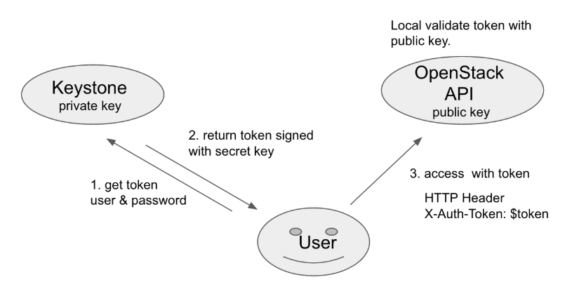
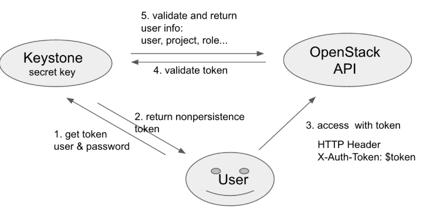
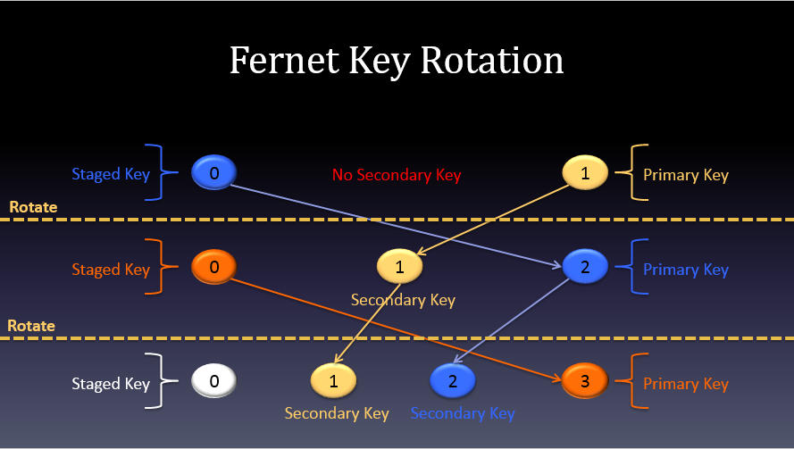

# TOKEN

## 1. Các loại token

Khi người dùng đã được xác thực, một token sẽ được sinh ra để có thê truy cập vào môi trường Openstack. Các token này có thể có vòng đời cố định. Tuy nhiên mặc định sẽ là 1 giờ. Thời hạn này thường được đặt sao cho đủ thời gian để hoàn thành các tasks. Trong trường hợp token hết hạn trước khi các tasks hoàn thành, cloud có thể sẽ không phản hồi hoặc dừng dịch vụ.

Hiện tại Openstack hỗ trợ 4 loại token:

### UUID

Là định dạng token đầu tiên của keystone với độ dài 32 bytes, là một chuỗi hex được sinh random. Chúng sẽ được lưu trữ trong back-end cùng với metadate để xác thực.

Ví dụ:

	16128b8d-95ae-4cb6-9031-1af7954e62fe

Sử dụng phương thức hexdigest() để tạo ra chuỗi hexa. 

Method sinh UUID token:

```sh
def _get_token_id(self, token_data):
 return uuid.uuid4().hex
```

UUID không mang thông tin về User. Keystone sẽ phải thực hiện việc xác thực token và lưu trữ, với kích thước của hệ thống lớn thì hiệu xuất của keystone sẽ bị giảm.

Clients sẽ phải chuyển UUID của hộ cho Identity service để xác thực. 


### PKI



PKI Token dựa trên chữ ký điện tử. Keystone sẽ dùng private key cho việc ký nhận và các Openstack API sẽ có public key để xác thực thông tin đó.

Method sing PKI token

```sh
def _get_token_id(self, token_data):
    try:
         token_json = jsonutils.dumps(token_data, cls=utils.PKIEncoder)
         token_id = str(cms.cms_sign_token(token_json,
                                           CONF.signing.certfile,
                                           CONF.signing.keyfile))
         return token_id
     except environment.subprocess.CalledProcessError:
         LOG.exception(_LE('Unable to sign token'))
         raise exception.UnexpectedError(_('Unable to sign token.'))
```


### PKIZ


PKIZ giống với PKI nhưng token sẽ được nén lại để giảm kích thước

PKI và PKIZ đã không hỗ trợ và không được dùng từ bản Ocata. 

### Fernet



Từ bản Pike, Fernet token đã được hỗ trợ mặc định. Fernet là một định dạng tin nhắn bảo mật, và đưuọc thiết kế cho việc sử dụng API token. 

Một số đặc điểm:
* Không cần phải lưu trong database
* Lightweight (nhẹ) kích thước nằm trong khoảng từ 180 tới 240 bytes, giúp tiết kiệm không gian bộ nhớ và chi phí để cloud hoạt động.
* Authentication and authorization metadata được gói gọn trong một message packed payload, sau đó được mã hóa và ký dưới dạng Fernet token.

Fernet tokens chứa một lượng nhỏ dữ liệu ví dụ như thông tin để nhận diện người dùng, project, thời gian hết hiệu lực,...Nó được ký bởi symmetric key để ngăn ngừa việc giả mạo. Cơ chế hoạt động của loại token này giống với UUID vì thế nó cũng phải được validate bởi Keystone.

Không giống như UUID, PKI and PKIZ tokens, Fernet tokens không yêu cầu phải được duy trì lâu dài, hạn chế về việc bị sao chép nên sẽ bảo mật hơn. Các node keystone sẽ được chia sẻ cùng một kho lưu trữ (repository), khi fernet key được tạo ra có thể sử dụng xác thực ngay trên tất cả các node.


## 2. Fernet 

Fernet token sử dụng một thư viện mã hóa đối xứng, mã hóa token (AES-CBC và SHA256). Fernet token được thiết kế rất nhẹ, luôn dưới 250 bytes, mặc dù lớn hơn UUID nhưng nhẹ hơn PKI và PKIZ rất nhiều. 

Hỗ trợ kỹ thuật Key rotation để cải thiện vấn đề về bảo mật.

Không yêu cầu phải giữ cố định lâu dài nên không cần lưu trong database làm giảm IO của ổ đĩa, cải thiện hiệu năng.

Fernet token sẽ chưa một ít thông tin như: userid, projectid, domainid, methods, expiresat, và các thông tin khác. 

Thư mục chưa Fernet key: `/etc/keystone/fernet-keys`

```sh
[root@trang-40-71 ~]# ll /etc/keystone/fernet-keys/
total 8
-rw------- 1 keystone keystone 44 Jan 15 20:38 0
-rw------- 1 keystone keystone 44 Jan 15 20:38 1
```

### Các loại Fernet key

* Loại 1: Primary key
	* Dùng để mã hóa và giải mã 
	* File name có số index cao nhất
* Loại 2: Secondary key
	* Chỉ được dùng để giải mã
	* file name có số index nằm giữa private key và staged key.
* Loại 3: Staged key
	* Giải mã và chuẩn bị để chuyển thành primary key
	* file name nhỏ nhất (0)

### Fernet Key rotation

Mô tả quá trình rotate fernet key



Khi sử dụng fernet tokens yêu cầu chú ý về thời hạn của token và vòng đời của khóa.

Có thể cấu hình số key tối đa tồn tại, nếu vượt quá số key này key cũ sẽ bị xóa. Các thông số này được cấu hình trong file `keystone.conf`

**Key Rotation Strategy** (Chiến lược xoay vòng key) gồm 3 phần sau:

* The rotation frequency
* The token lifespan (set with [token] expiration)
* The number of active keys: (set with [fernet_tokens] max_active_keys)

Giá trị `max_active_keys` cần tối thiểu 3 key, thường thì sẽ được xác định bởi `token lifespan` và `rotation frequency`. Nó thường lớn hơn `token lifespan / rotation frequency`, và thường sẽ để lớn hơn 2.

Ví dụ muốn token hợp lệ trong 24h và cứ 6h đổi khóa một lần. Như vậy key sẽ tồn tại trong 24 với mục đích giải mã, cần cấu hình `max_active_keys=6` (tính thêm cả 2 key đặc biệt là primary key và staged key). Việc này sẽ giúp giới hạn key được lưu trong repos (Tại thư mục /etc/keystone/fernet-keys/)

```sh
token_expiration = 24  # Set vòng đời của key
rotation_frequency = 6  # Tần số xoay vòng của key
max_active_keys = (token_expiration / rotation_frequency) + 2   # Số lượng key tối đa được phép hoạt động
```

Mặc định thì số lượng key tối đa sẽ là 3, để thay đổi số lượng ta sửa option `max_active_keys` trong section `fernet_tokens` ở file cấu hình `keystone.conf`

Fernet token gồm các trường sau:

* Fernet Format Version (0x80) - 8 bits, biểu thị phiên bản của định dạng token
* Current Timestamp – số nguyên 64-bit không dấu, chỉ nhãn thời gian tính theo giây, tính từ 1/1/1970, chỉ ra thời điểm token được tạo ra.
* Initialization Vector (IV) – key 128 bits sử dụng mã hóa AES và giải mã Ciphertext
* Ciphertext: là keystone payload kích thước biến đổi tùy vào phạm vi của token. Cụ thể hơn, với token có phạm vi project, Keystone Payload bao gồm: version, user id, method, project id, expiration time, audit ids
* HMAC: 256-bit SHA256 HMAC (Keyd-Hash Messasge Authentication Code) - Mã xác thực thông báo sử dụng hàm một chiều có khóa với signing key kết nối 4 trường ở trên.


## 3. So sánh 4 kiểu token


## Tham khảo

https://docs.openstack.org/security-guide/identity/tokens.html

https://github.com/thaonguyenvan/meditech-thuctap/blob/master/ThaoNV/Tim%20hieu%20OpenStack/docs/keystone/token-format.md

https://sapham.net/bon-kieu-token-cua-keystone-trong-openstack/

https://docs.openstack.org/keystone/pike/admin/identity-fernet-token-faq.html


