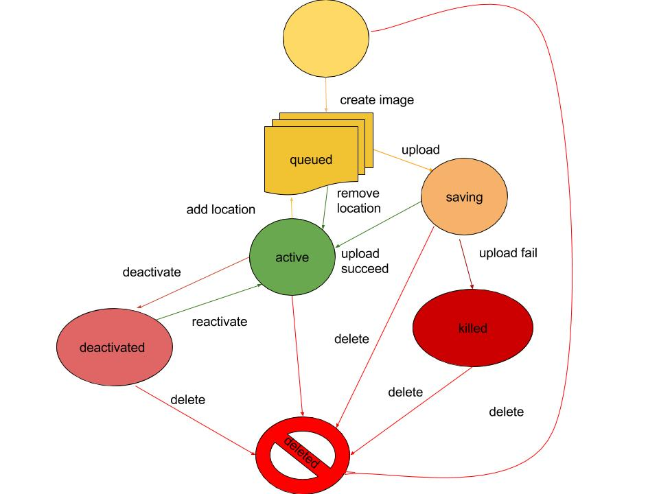
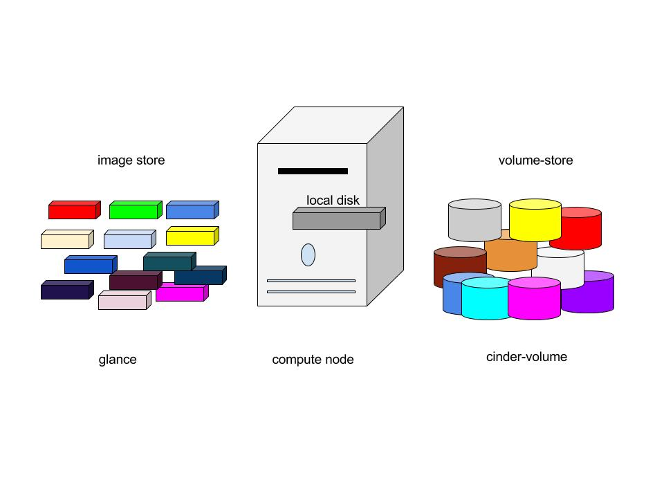
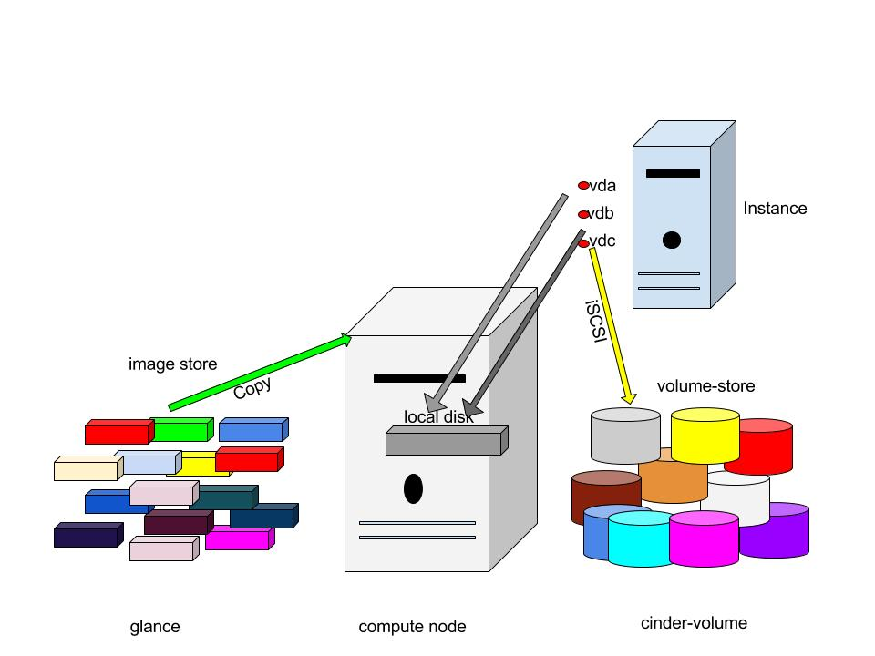

# Image Service - Glance

[1. Tổng quan](#overview)

[2. Các thành phần của Glance](#tp)

[3. Kiến trúc](#arch)

[4. Các định dạng image](#image)

[5. Glance Status Flow](#status)

[6. Các file cấu hình của Glance](#config)

[7. Image vs Instance](#vs)

## 1. Tổng quan

**Image service** (Glance) cho phép các user thực hiện discover, register và retrieve với các máy ảo dạng image.

Glance là trung tâm của kiến trúc Iaas, chấp nhận các API requests cho disk hoặc server images và metedata từ phía người dùng hoặc từ Compute service. 

VM image được tạo sẵn, thông qua glance có thể được lưu trữ trong nhiều vị trí khác nhau từ các hệ thống tệp tin đơn giản đến các hệ thống lưu trữ đối tượng như là OpenStack Swift project.

Glance có RESTful API cho phép truy vấn vào VM image cũng như khôi phục lại các image hiện tại.

Trong glance, các image được lưu trữ như các template mà có thể được sử dụng để tạo các máy ảo mới.

Glance được thiết kế trở thành một dịch vụ độc lập cho những người cần tổ chức các bộ virtual disk images lớn.

Glance cung cấp giải pháp end-to-end cho quản lý disk image trên cloud.

Nó cũng có thể snapshots từ các máy ảo đang chạy để sao lưu trạng thái của VM.

## 2. Các thành phần của Glance

Các thành phần chính của Glance:

* Glance api: tiếp nhận lời gọi API để tìm kiếm, thu thập và lưu trữ image, sử dụng registry để lấy thông tin image
* Glance registry: quản lý, lưu trữ, xử lý các metadata của mỗi image, Metadata gồm các thông tin như kích thước và loại image
* Database: lưu trữ các metadata của các image
* Storage repository for image files: Có rất nhiều loại repository được hỗ trợ để lưu image như:
	* Filesystems
	* Object Storage
	* Block Storage
	* VMWare
	* HTTP: Glance có thể đọc các images của các máy ảo sẵn sàng trên Internet thông qua HTTP. Hệ thống lưu trữ này chỉ cho phép đọc
	* RADOS Block Device (RBD): Lưu trữ các images trong cụm lưu trữ Ceph sử dụng giao diện RBD của Ceph

## 3. Kiến trúc

Glance có kiến trúc client-server cung cấp REST API cho user để thông qua đó gửi yêu cầu tới server.

Glance Domain Controller quản lí các hoạt động bên trong. Các hoạt động được chia ra thành các tầng khác nhau. Mỗi tầng thực hiện một chức năng riêng biệt.

Glane store là lớp giao tiếp giữa glane và storage back end ở ngoài glane hoặc local filesystem và nó cung cấp giao diện thống nhất để truy cập. Glance sử dụng SQL central Database để truy cập cho tất cả các thành phần trong hệ thống.

Kiến trúc của glance bao gồm một số các thành phần sau:

* Client: Bất kỳ ứng dụng nào sử dụng Glance server đều được gọi là client.
* REST API: dùng để gọi đến các chức năng của Glance thông qua REST.
* Database Abstraction Layer (DAL): một API để thống nhất giao tiếp giữa Glance và database.
* Glance Domain Controller: là middleware thực hiện các chức năng chính của Glance là: authorization, notifications, policies, database connections.
* Glance Store: tổ chức tương tác Glance và các data store.
* Registry Layer: Layer không bắt buộc để tổ chức giao tiếp mang tính bảo mật giữa domain và DAL nhờ việc sử dụng một dịch vụ riêng biệt.

## 4. Các định dạng image

### Disk Formats

Một số các định dạng đĩa (Disk Formats) cơ bản được hỗ trợ bởi Openstack Glance.

|Disk format|	Notes|
|--|--|
|Raw	|Định dạng đĩa phi cấu trúc|
|VHD	|Định dạng chung hỗ trợ bởi nhiều công nghệ ảo hóa trong OpenStack, ngoại trừ KVM|
|VMDK|	Định dạng hỗ trợ bởi VMWare|
|qcow2	|Định dạng đĩa QEMU, định dạng mặc định hỗ trợ bởi KVM vfa QEMU, hỗ trợ các chức năng nâng cao|
|VDI	|Định dạng ảnh đĩa ảo hỗ trợ bởi VirtualBox|
|ISO	|Định dạng lưu trữ cho đĩa quang|
|AMI, ARI, AKI	|Định dạng ảnh Amazon machine, ramdisk, kernel|

### Container Formats

**Container Formats** mô tả định dạng files và chứa các thông tin metadata về máy ảo thực sự. Các định dạng container hỗ trợ bởi Glance

|Container format	|Notes|
|--|--|
|bare|	Định dạng xác định không có container hoặc metadata đóng gói cho image|
|ovf	|Định dạng container OVF|
|aki	|Xác định lưu trữ trong Glance là Amazon kernel image|
|ari	|Xác định lưu trữ trong Glance là Amazon ramdisk image|
|ami	|Xác định lưu trữ trong Glance là Amazon machine image|
|ova	|Xác định lưu trữ trong Glance là file lưu trữ OVA|
|docker|	Xác định lưu trữ trong Glance và file lưu trữ Docker|

## 5. Glance StatusFlow

**Glance status flow** cho biết trạng thái của các image trong quá trình tải lên. Khi tạo một **image**, đầu tiên image sẽ được đưa vào hàng đợi và được nhận diện trong một khoảng thời gian ngắn, đưuọc bảo vệ và sẵn sàng để tải lên, sau đó **image** chuyển sang trạng thái **saving** (quá trình tải lên chưa hoàn thành). Khi tải lên hoàng thành, **image** sẽ chuyển trạng thái `Active`. Nếu quá trình tải lên thất bại, trạng thái của **image** sẽ chuyển sang bị hủy hoặc bị xóa.

Ngoài ra khi **image** đã được tải lên thành công, sẽ có hai trạng thái là `deactive` và `active`, ta có thể chuyển qua lại giữa hai trạng thái này bằng các command. 

**Glance status flow** 

Các trạng thái của image:

* `queued` : Định danh của image được bảo vệ trong Glance registry. Không có dữ liệu nào của image được tải lên Glance và kích thước của image không được thiết lập về zero khi khởi tạo.
* `saving` : Biểu thị rằng dữ liệu của image đang được upload lên glance. Khi một image đăng ký với một call đến POST /image và có một x-image-meta-location header, image đó sẽ không bao giờ được trong tình trạng saving (dữ liệu Image đã có sẵn ở vị trí khác).
* `active` : Biểu thị một image đó là hoàn toàn có sẵn trong Glane. Điều này xảy ra khi các dữ liệu image được tải lên.
* `deactivated` : Trạng thái biểu thị việc không được phép truy cập vào dữ liệu của image với tài khoản không phải admin. Khi image ở trạng thái này, ta không thể tải xuống cũng như export hay clone image.
* `killed` : Trạng thái biểu thị rằng có vấn đề xảy ra trong quá trình tải dữ liệu của image lên và image đó không thể đọc được
* `deleted` : Trạng thái này biểu thị việc Glance vẫn giữ thông tin về image nhưng nó không còn sẵn sàng để sử dụng nữa. Image ở trạng thái này sẽ tự động bị gỡ bỏ vào ngày hôm sau.

## 6. Các file cấu hình của Glance

Glance gồm một số các file cấu hình cơ bản sau:

* **glance-api.conf**: File cấu hình cho các API của image service.

* **glance-registry.conf**: File cấu hình cho glance image registry - nơi lưu trữ metadata về các images

* **glance-api-paste.ini**: Cấu hình cho các API middleware pipeline của Image service

* **glance-manage.conf**: Là tệp cấu hình ghi chép tùy chỉnh. Các tùy chọn thiết lập trong tệp `glance-manage.conf` sẽ ghi đè lên các section cùng tên thiết lập trong các tệp `glance-registry.conf` và `glance-api.conf`. Tương tự như vậy, các tùy chọn thiết lập trong tệp `glance-api.conf` sẽ ghi đè lên các tùy chọn thiết lập trong tệp `glance-registry.conf`

* **glance-registry-paste.ini**: Tệp cấu hình middle pipeline cho các registry của Image service.

* **glance-scrubber.conf**: Được dùng để dọn dẹp các image đã được xóa (đang ở trạng thái `deleted`)

* **policy.json**: Bổ sung truy cập kiểm soát áp dụng cho các image service. Trong này, chúng ta có thể xác định roles, policies, làm tăng tính bảo mật trong Glane OpenStack.

## 7. Image vs Instance

Các disk images được lưu trữ giống như các template. Image service kiểm soát việc lưu trữ và quản lý các images.

Instance là một máy ảo riêng biệt chạy trên compute node, compute node quản lý các instances. User có thể tạo nhiều máy ảo với cùng một image.

Mỗi Instance được tạo nên bởi một bản sao của image gốc, nên mọi chỉnh sửa trên Instance sẽ không ảnh hưởng tới image gốc.

Khi một tạo một máy ảo, cần pahir có flavor của máy ảo đó. Flalor đại diện cho tài nguyên ảo hóa được cấp cho các máy ảo, định nghĩa số lượng CPU ảo, tổng dung lượng RAM cấp cho máy ảo và kích thước ổ đĩa không bên vững cấp cho máy ảo. 

Trạng thái hệ thống trước khi vận hành máy ảo:

Image store chỉ số lượng các images đã được định nghĩa trước, compute node chứa các vcpu có sẵn, tài nguyên bộ nhớ và tài nguyên đĩa cục bộ, cinder-volume chứa số lượng volumes đã định nghĩa trước đó.

Trước khi vận hành 1 máy ảo, ta phải chọn một `image`, `flavor` và các thuộc tính tùy chọn. Lựa chọn `flavor` cung cấp root volume, có nhãn là `vda` và một ổ lưu trữ tùy chọn được đánh nhãn `vdb` (ephemeral - không bền vững), và cinder-volume được map với ổ đĩa ảo thứ ba, có thể gọi tên là `vdc`

Image gốc sẽ được copy vào ổ lưu trữ cục bộ từ image store. Ổ `vda` sẽ là ổ đầu tiên mà máy ảo truy cập tới. Ổ `vdb` là ở tạm thời và rỗng, được tạo nên cùng với máy ảo, nó sẽ bị xóa khi máy ảo ngắt hoạt động. Ổ `vdc` kết nối tới cinder-volume sử dụng giao thức iCSI. Máy ảo sẽ boot từ root volume (vda), chạy và thay đổi dữ liệu trên các ổ đĩa.

Khi máy ảo bị xóa, `ephemeral storage` (khối lưu trữ không bền vững) bị xóa, tài nguyên vCPU và bộ nhớ sẽ đưuọc giải phóng. Image gốc sẽ không bị thay đổi.