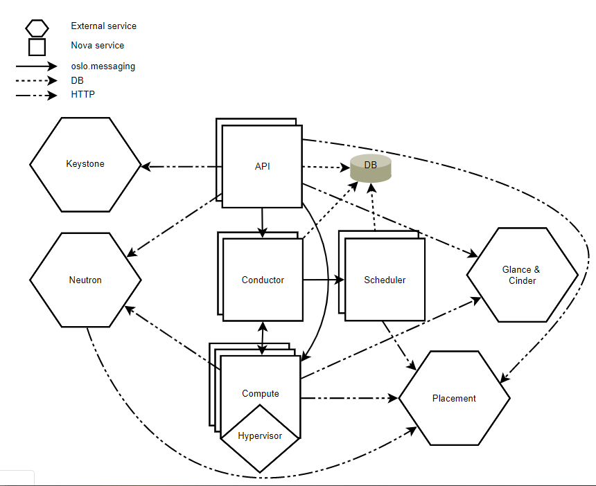

# Tổng quan Nova

[1. Tổng quan về Nova](#overview)

[2. Các thành phần của Nova](#tp)

[3. Kiến trúc](#arch)

## 1. Tổng quan về Nova
Là một trong những project quan trọng nhất trong Openstack. Nova quản lý các tài nguyên và số lượng máy lớn các máy ảo. 

Phần lớn các modules của Nova được viết bằng python.

Nova cung cấp REST API để tương tác với user, các thành phần bên trong Nova truyền thông với nhau thông qua cơ chế truyền RPC message

Openstack Compute không chứa các phần mềm ảo hóa. Thay vào đó nó sẽ định nghĩa các drivers để tương tác với các kỹ thuật ảo hóa khác chạy trên hệ điều hành của bạn và cung cấp các chức năng thông qua một web-based API

Nova yêu cầu một số các Openstack service như sau cho một số các function cơ bản:

* Keystone: Cung cấp dịch vụ identity và authentication cho tất cả các dịch vụ của Openstack
* Glance: Cung cấp các image repository. Tất cả các compute instance được tạo ra từ glance images.
* Neutron: Chịu trách nhiệm cung cấp mạng ảo hoặc vật lý cho các compute instance connect khi boot.

Nova cũng có thể tích hợp với các service khác như: persistent block storage, encrypted disks và baremetal compute instances.

Các end user sử dụng nova để tạo và quản lý các server bằng các tools hoặc các API

Các tool để thao tác với nova gồm:

* Horizon: là một project Web UI chính thức của Openstack 
* Openstack Client: CLI cho Openstack Project. Bạn nên sử dụng công cụ này như CLI của bạn cho mọi thứ, nó không chỉ dành cho Nova mà còn dùng cho hầu hết các projects khác trong Openstack.
* Nova client: Cho một vài các chức năng nâng cao (hoặc các administrative commands) của nova bạn có thể sẽ phải dùng nova client. Hiện tại nó vẫn được support, nhưng khuyến khích nên sử dụng opanstack cli.

## 2. Các thành phần của Nova

* **nova-api service**

Cho phép và phản hồi các compute API calls từ người dùng. Service hỗ trợ Openstack Compute API.

Nó thực thi một số các chính sach và khởi tạo hầu hết các hành động như running instance.

* **nova-api-metadata service**

Cho phép các metadata requests từ instance. **nova-api-metadata** service thường được sử dụng khi bạn chạy chế độ multi-host với **nova-network**được cài đặt. 

* **nova-compute service**

Một worker deamon sẽ tạo và hủy các máy ảo thông qua hypervisor ALIs. Ví dụ:

* XenAPI for XenServer/XCP
* libvirt for KVM or QEMU
* VMwareAPI for VMware

Quá trình xử lý khá phức tạp, về cơ bản các daemon tiếp nhận các actions từ queue và thực hiện một loạt các câu lệnh hệ thống như chạy máy ảo KVM và update trạng thái trong database.

* **nova-placement-api service**

Xuất hiện từ bản Newton, **Placement api** được dùng để theo dõi, thống kê mức độ sử dụng của mỗi một resource provider. Provider ở đây có thể là compute node, shared storage pool hoặc IP allocation pool. 

Ví dụ một máy ảo có thể đưuọc khởi tạo và lấy RAM, CPU từ compute node, lấy disk từ storage bên ngoài và lấy IP từ pool resource bên ngoài.

* **nova-scheduler service**

Service này sẽ lấy các yêu cầu từ máy ảo đặt vào queue và xác định xem chúng được chạy trên compute nào

* **nova-conductor module**

Là module chịu trách nhiệm về các tương tác giữa `nova-compute` và `database`. Nó sẽ loại bỏ tất cả các kêt nối trực tiếp giữa hai thành phần này.

* **nova-consoleauth daemon** 

Là daemon server phục vụ cho Nova Console Auth service, cung cấp các dịch vụ xác thực cho Nova consoles.

Xác thực token cho user mà console proxies cung cấp. Dịch vụ này buộc phải chạy cùng với console proxies. Bạn có thể chạy proxies trên 1 nova-consoleauth service hoặc ở trong 1 cluster configuration

Nhưng đã bị xóa từ bản sau bản 18.0.0 (Rocky).

* **nova-novncproxy daemon**

Cung cấp một proxy cho phép chạy các instance thông qua một kết nối VNC. Nó hỗ trợ các trình duyệt based novnc clients.

* **nova-spicehtml5proxy**

Cung cấp proxy cho việc truy cập các máy ảo đang chạy thông qua VNC connection. Nó hỗ trợ OpenStack-specific Java clien

* **The queue**

Trung tâm giao tiếp giữa các daemons. Thường dùng RabbitMQ hoặc các AMQP message queue khác như ZeroMQ.

* **SQL database**: Dùng để lưu hầu hết các trạng thái thời gian build, run trong kiến trúc cloud, gồm:

	* Các loại máy ảo có thể chạy
	* Các máy ảo đang được dùng
	* Các network khả dụng
	* projects

## 3. Kiến trúc của Nova

Nova yêu cầu multiple server processes, mỗi tiến trình sẽ chạy một functions khác nhau. Giao diện người dùng là REST API, trong khi đó các thành phần bên trong nova giao tiếp với nhau thông qua cơ chế RPC mesage.

Các máy chủ API xử lý các REST requests, thường liên quan đến việc đọc/ghi database, tùy chọn gửi các RPC messages tới các Nova service khác, và sinh ra các respones cho các REST calls. RPC message đưuọc thực hiện thông qua thư viện **oslo.messaging**. 

Hầu hết các thành phần chính của nova có thể nằm trên nhiều server khác nhau, và có một manager để lắng nghe các RPC messages. Ngoại trừ **nova-compute**, là một tiến trình đơn chạy trên hypervisor mà nó đang quản lý (trừ khi sử dụng VMware hoặc Ironic drivers) 

Nova cũng sử dụng một cơ sở dữ liệu trung tâm được chia sẻ (logically) giữa tất cả các thành phần. 

Để triển khai mở rộng Nova theo chiều ngang, cần tìm hiểu một khasci niệm sharding được gọi là [cells](https://docs.openstack.org/nova/rocky/user/cells.html).

* DB: sql database for data storage.
* API: thành phần nhận các HTTP requests, converts commands và giao tiếp với các thành phần khác bằng oslo.messaging queue hoặc HTTP.
* Scheduler: quyết định xem compute nào sẽ nhận instance.
* Compute: manages communication with hypervisor and virtual machines.
* Conductor: handles requests that need coordination (build/resize), acts as a database proxy, or handles object conversions.
* [Placement](https://docs.openstack.org/placement/latest/): tracks resource provider inventories and usages.

Trong khi tất cả các service được thiết kế để có thể mở rộng theo chiều ngang, bạn nên có thêm nhiều computes hơn bất cứ thứ gì khác.

## 4. Các thao tác quản trị cơ bản với Nova

### Flavor

Instance flavor là template của máy ảo xác định về memory, storage capacity của chúng. Chỉ có Administrator mới có quyền create, edit và delete flavors.

Từ sau Newton trở về sau thì không có các flavor mặc định, dưới đây là một số các flavor mặc định của bản Mitaka và các bản trước đó:

|Flavor|	VCPUs|	Disk (in GB)|	RAM (in MB)|
|---|----|---|---|
|m1.tiny|	1|	1|	512|
|m1.small|	1|	20|	2048|
|m1.medium|	2|	40|	4096|
|m1.large|	4|	80|	8192|
|m1.xlarge|	8|	160|	16384|

Xem thêm các thao tác với flavor [ở đây](https://docs.openstack.org/horizon/latest/admin/manage-flavors.html)

## Tham khảo

https://docs.openstack.org/nova/latest/install/get-started-compute.html

https://docs.openstack.org/nova/rocky/admin/remote-console-access.html

https://cloud.centos.org/centos/7/images/CentOS-7-x86_64-GenericCloud-1808.qcow2c