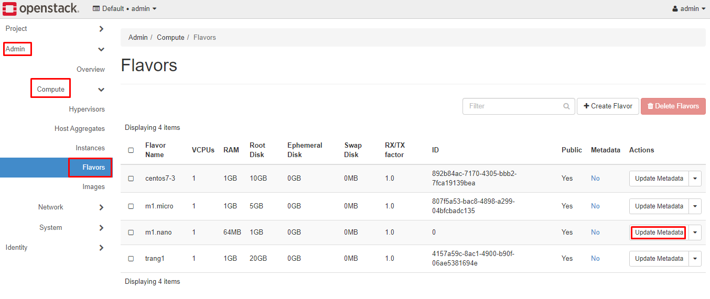
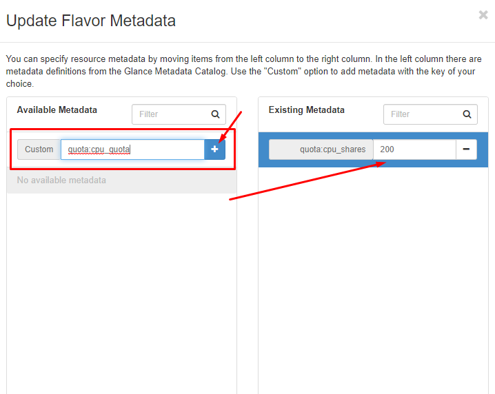

## Flavors

Trong Openstasck, một flavor định nghĩa compute, memory và storage capacity của các VM. Từ bản Neuton đã ko còn tự định nghĩa các flavor mặc định nữa, dưới đây là các flavor được khởi tạo mặc định từ bản mitaka trở về trước.

<table>
  <tr>
	<th>Flavor</th>
	<th>VCPUs</th>
	<th>Disk (in GB)</th>
	<th>RAM (in MB)</th>
  </tr>
  <tr>
	<td>m1.tiny</td>
	<td>1</td>
	<td>2</td>
	<td>512</td>
	
  </tr>
  <tr>
	<td>m1.small</td>
	<td>1</td>
	<td>20</td>
	<td>2048</td>
	
  </tr>
  <tr>
	<td>m1.medium</td>
	<td>2</td>
	<td>40</td>
	<td>4096</td>
  </tr>
  <tr>
	<td>m1.large</td>
	<td>4</td>
	<td>80</td>
	<td>8192</td>
  </tr>

  <tr>
	<td>m1.large</td>
	<td>8</td>
	<td>160</td>
	<td>16384</td>
  </tr>
</table>

### Tạo Flavor trên Dashboard

Các thông số về flavor

| Name| Enter the flavor name. |
| --- | ----|
| ID| Unique ID (integer or UUID) for the new flavor. If specifying ‘auto’, a UUID will be automatically generated. |
| VCPUs| Enter the number of virtual CPUs to use. |
| RAM (MB)| Enter the amount of RAM to use, in megabytes. |
| Root Disk (GB)| Enter the amount of disk space in gigabytes to use for the root (/) partition. |
| Ephemeral Disk (GB)| Enter the amount of disk space in gigabytes to use for the ephemeral partition. If unspecified, the value is 0 by default.  Ephemeral disks cung cấp cho VM local disk storage gắn liền với vòng đời của VM instance. When a VM is terminated, all data on the ephemeral disk is lost. Ephemeral disks are not included in any snapshots. |
| Swap Disk (MB)| Enter the amount of swap space (in megabytes) to use. If unspecified, the default is 0. |
| RX/TX Factor| Optional property allows servers with a different bandwidth to be created with the RX/TX Factor. The default value is 1. That is, the new bandwidth is the same as that of the attached network. |

**Update metadata**

* Login vào dashboard với quyền `admin`, chọn `Admin` -> `Compute` -> `Flavors`
* Thực hiên Update metadata cho các image

Optional metadata keys:

<table>
  <tr>
	<th rowspan="5">CPU limits</th>
	<td>quota:cpu_shares</td>
  </tr>
  <tr>
	<td>quota:cpu_period</td>
  </tr>
  <tr>
	<td>quota:cpu_limit</td>
  </tr>
  <tr>
	<td>quota:cpu_reservation</td>
  </tr>
  <tr>
	<td>quota:cpu_quota</td>
  </tr>
  <tr>
	<th rowspan="6">Disk tuning</th>
	<td>quota:disk_read_bytes_sec</td>
  </tr>
  <tr>
	<td>quota:disk_read_iops_sec</td>
  </tr>
  <tr>
	<td>quota:disk_write_bytes_sec</td>
  </tr>
  <tr>
	<td>quota:disk_write_iops_sec</td>
  </tr>
  <tr>
	<td>quota:disk_total_bytes_sec</td>
  </tr>
  <tr>
	<td>quota:disk_total_iops_sec</td>
  </tr>
  <tr>
	<th rowspan="6">Bandwidth I/O</th>
	<td>quota:vif_inbound_average</td>
  </tr>
  <tr>
	<td>quota:vif_inbound_burst</td>
  </tr>
  <tr>
	<td>quota:vif_inbound_peak</td>
  </tr>
  <tr>
	<td>quota:vif_outbound_average</td>
  </tr>
  <tr>
	<td>quota:vif_outbound_burst</td>
  </tr>
  <tr>
	<td>quota:vif_outbound_peak</td>
  </tr>
  <tr>
	<th>Watchdog behavior</th>
	<td>hw:watchdog_action</td>
  </tr>
  <tr>
	<th rowspan="3">Random-number generator</th>
	<td>hw_rng:allowed</td>
  </tr>
  <tr>
	<td>hw_rng:rate_bytes</td>
  </tr>
  <tr>
	<td>hw_rng:rate_period</td>
  </tr>
</table>

## Nova cli để thao tác với flavor

Để có thể thực hiện add metadata cho image trên dashboard, ví dụ làm theo các bước sau:

* Login vào giao diện, chọn Admin -> Compute -> Flavor, chọn Update Metadata cho image cụ thể:

* Sau khi add xong, Save lại để lưu lại 

**Lưu ý** về quota - một dạng metadata của flavor dạng `quota: option` để bắt buộc giới hạn cho các instance sử dụng flavor này. Với các option tham khảo thêm trong bảng 3.2 [tại đây](https://access.redhat.com/documentation/en-US/Red_Hat_Enterprise_Linux_OpenStack_Platform/6/html/Administration_Guide/section-flavors.html)

* Option `cpu_quota` và `cpu_period`

	* `cpu_period` Là một khoảng thời gian để enforcing cpu_period (tính bằng microseconds), với `cpu_period` cụ thể, mỗi vCPU không thể sử dụng nhiều hơn `cpu_quota` trong thời gian thực. Nhưng giá trị nằm trong khoảng từ 1000 tới 1000000, nếu để `0` nghĩa là không có giá trị.

	* `cpu_quota` bandwidth tối đa được cho phép (tính bằng microseconds) với vCPU trong mỗi `cpu_period`. Giá trị nằm trong khoảng [1000, 18446744073709551]. '0' nghĩa là `no value`, nếu được thiết lập là một giá trị âm thì vCPU sẽ không được controlled. `cpu_quota` và `cpu_period` có thể được sử dụng để đảm bảo tất cả các vCPUs đều chạy với tốc độ giống nhau.

	* `cpu_share`: Chia sẻ CPU time cho domain. Value chỉ có nghĩa khi weighted against khác với machine values trong cùng một domain. Một instance sử dụng một flavor với '200' sẽ nhận được gấp đôi much machine so với một instance với '100'

## Tham khảo

[1] https://access.redhat.com/documentation/en-US/Red_Hat_Enterprise_Linux_OpenStack_Platform/6/html/Administration_Guide/section-flavors.html
