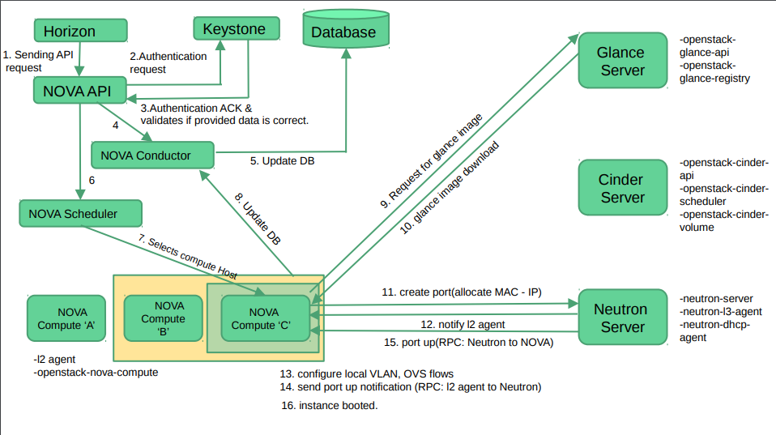
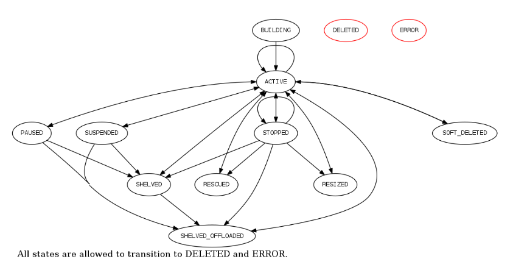
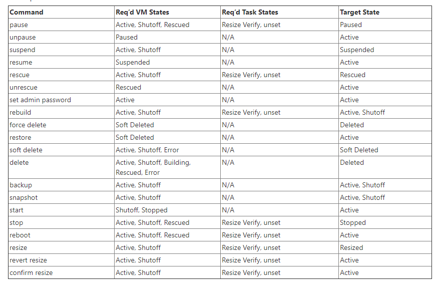
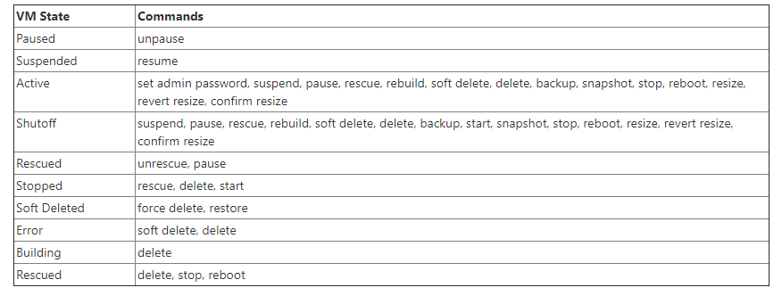
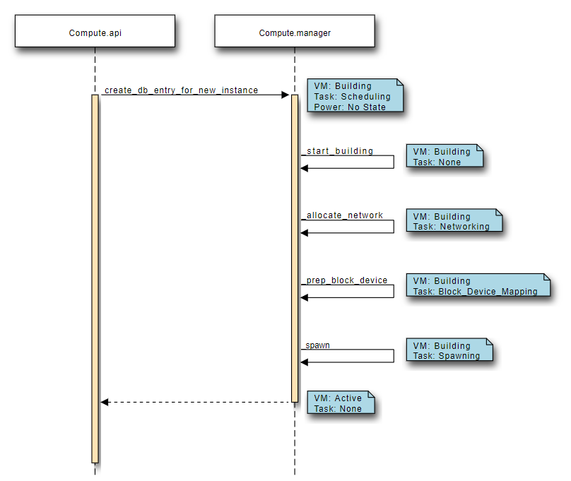

## Launch instance 

1. Horizon Dashboard hoặc Openstack CLI lấy thông tin đăng nhập và chứng thực của người dùng cùng với định danh service thông qua REST API để xác thực với Keystone sinh ra token.

2. Sau khi xác thực thành công, client sẽ gửi request khởi chạy máy ảo tới nova-api.

3. Nova service xác thực lại thông token với keystone-api và nhận header với roles và permission 

4. Nova API gửi lệnh tới nova conductor kiểm tra trong database conflicts hay không để khởi tạo một entry mới.

5. Nova-api gửi RPC tới nova-scheduler service để lập lịch tạo mấy ảo

6. Nova-scheduler lấy request từ message queue

7. Nova-scheduler service thông qua filters và weights để tìm compute host phù hợp nhất chạy máy ảo. Đồng thời trên database sẽ cập nhật lại entry của máy ảo với host ID nhận được từ scheduler. Sau đó nova-scheduler gửi RPC call tới nova-compute để khởi tạo máy ảo.

8. Nova-compute lấy request  từ message queue 

9. Nova-compute hỏi nova-conductor để lấy thông tin về máy ảo như host ID, flavor từ database. Việc sử dụng thông qua nova-conductor là vì lý do bảo mật, để tránh trường hợp nova-compute mang theo thông tin không hợp lệ tới database.

10. Nova-conductor lấy request từ message queue.

11. Nova-conductor lấy thông tin máy ảo từ database sau đó gửi về cho nova-compute

12. Nova-compute lấy thông tin máy ảo từ queue. Tại thời điểm này, compute host đã biết được image nào sẽ được sử dụng để chạy máy ảo. nova-compute sẽ hỏi tới glance-api để lấy url của image

13. Glance-api sẽ xác thực token và gửi lại metadata của image trong đó bao gồm cả url của nó.

14. Nova-compute sẽ đưa token tới neutron-api và hỏi nó về network cho máy ảo.

15. Sau khi xác thực token, neutron sẽ tiến hành cấu hình network.

16. Nova-compute tương tác với cinder-api để gán volume vào máy ảo.

17. Nova-compute sẽ generate dữ liệu cho Hypervisor và gửi thông tin thông qua libvirt.

## Virtual Machine States and Transitions

#### Virtual Machine States and Transitions

Sơ đồ về một số các trạng thái có thể chuyển đổi của Virtual machine (VM) 

#### Requirements for Commands

#### VM states and Possible Commands

#### Create Instance States

Sơ đồ dưới đây thể hiện trình tự các VM states, task states, và power states khi một VM instance mới được khởi tạo trong Nova

## Gather parameters to launch an instance

1. Create a flavor 

Thông thường thì chỉ có Admin mới có thể khởi tạo flavor, ví dụ tạo một flavor với tên `m1.tiny` và các thông số là ram: 512MB, disk: 1GB
	
	openstack flavor create --ram 512 --disk 1 --vcpus 1 m1.tiny

2. Liệt kê các flavor có thể:

Để xem thông tin về các Flavor, đặc biệt là để lấy thông tin về ID:

	openstack flavor list

3. List the available images

Lấy thông tin về ID của image để boot máy ảo:

	openstack image list

4. List the available security groups

Xem thông tin về các security groups hiện:

	openstack security group list

Xem các rules trong một group cụ thể:

	openstack security group rule list default

https://docs.openstack.org/nova/rocky/user/launch-instances.html

https://docs.openstack.org/liberty/install-guide-obs/launch-instance.html
