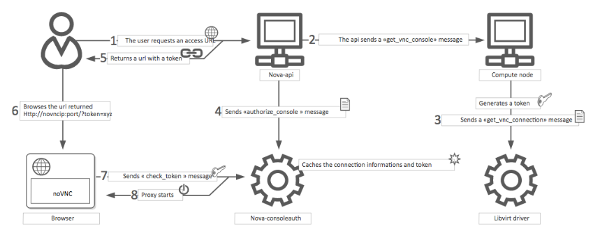

# Configure remote console access

Để cung cấp một remote console hoặc remote desktop access cho các máy ảo Openstack sử dụng VNC, SPICE HTML5 hoặc Serial thông qua OPS dashboard hoặc command line. 

### VNC console proxy

VNC proxy là một thành phần của openstack cho phép người dùng có thể truy cập vào các máy ảo của họ thông qua VNC clients.

Luồng hoạt động khi kết nối VNC console:

1. User kết nối API để lấy `access_url`, ví dụ: **http://ip:port/?token=xyz**

2. User gán URL laasya được đó vào browser của họ hoặc sử dụng nó như một client parameter.

3.  Browser hoặc client kết nối tới proxy

4. Proxy sẽ nói với **nova-consoleauth** để xác thực token của người dùng, và maps token với compute host và port của VNC server cho instance. Để cấu hình địa chỉ cho các host thì sửa tùy chọn `server_proxyclient_address` trong file cấu hình của nova là `nova.conf`

5. Proxy bắt đầu kết nối với VNC server và tiếp tục giữ kết nối đó cho tới khi kết thúc phiên.

## VNC configuration options

Để tùy chình VNC console có thể sử dụng một số các cấu hình sau trong file `nova.conf`

|Configuration option = Default value|	Description|
|---|--|
|[DEFAULT]	 ||
|daemon = False|	(BoolOpt) Become a daemon (background process)|
|key = None|	(StrOpt) SSL key file (if separate from cert)|
|novncproxy_host = 0.0.0.0	|(StrOpt) Host on which to listen for incoming requests|
|novncproxy_port = 6080|	(IntOpt) Port on which to listen for incoming requests|
|record = False|	(BoolOpt) Record sessions to FILE.[session_number]|
|source_is_ipv6 = False|	(BoolOpt) Source is ipv6|
|ssl_only = False|	(BoolOpt) Disallow non-encrypted connections
web = /usr/share/spice-html5	(StrOpt) Run webserver on same port. Serve files from DIR.|
|[vmware]	 ||
|vnc_port = 5900|	(IntOpt) VNC starting port|
|vnc_port_total = 10000|	vnc_port_total = 10000|
|[vnc]	 ||
|enabled = True|	(BoolOpt) Enable VNC related features|
|novncproxy_base_url = http://127.0.0.1:6080/vnc_auto.html	(StrOpt) Location of VNC console proxy, in the form http://127.0.0.1:6080/vnc_auto.html|
|server_listen = 127.0.0.1	(StrOpt) IP address on which instance vncservers should listen|
|server_proxyclient_address = 127.0.0.1	(StrOpt) The address to which proxy clients (like nova-xvpvncproxy) should connect|
|xvpvncproxy_base_url = http://127.0.0.1:6081/console	(StrOpt) Location of nova xvp VNC console proxy, in the form http://127.0.0.1:6081/console|

## nova-novncproxy (noVNC)

Cài đặt:

	yum install nova-novncproxy

Khởi động dịch vụ:

	service nova-novncproxy restart

## Tham khảo

https://docs.openstack.org/nova/rocky/admin/remote-console-access.html
