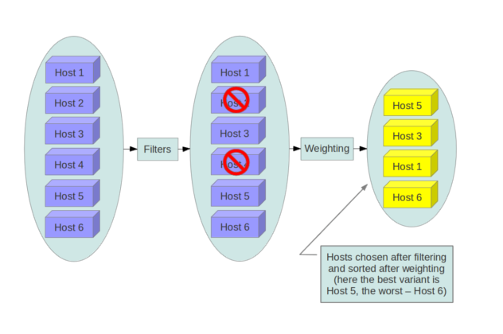
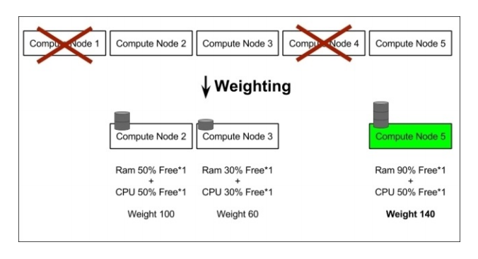
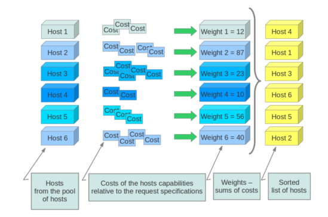

## 1. Host aggreate vs Availability zone

### 1.1 Host aggregate

Là một cơ chế tạo ra một nhóm logic để phân vùng availability zone, `host aggregate` trong OPS tập hợp các Compute Node được chỉ định và liên kết với metadata. Trong khi các availability zones được hiển thị cho các users,`host aggregate` chỉ hiển thị cho Administrator. 

Host aggregates bắt đầu như cách sử dụng Xen hypervisor resource pools, nhưng đã được khái quát hóa để cung cấp cơ chế cho phép admin chỉ định key-value pairs cho các group. Mỗi node có thể có nhiều aggregates, mỗi aggregates có thể có nhiều key-value pairs, và các key-calue giống nhau có thể chỉ định cho nhiều aggregate. Thông tin này có thể đươc sử dụng trong scheduler để cho phép scheduling nâng cao, để thiết lập các xen hypervisor resources pools hoặc định nghĩa các logical groups cho migration. 

Các metadata trong các host aggregate thường được dùng để cung cấp thông tin cho quá trình nova-scheduler để xác định được được host đặt các mảy ảo . Metadata quy định trong một host aggretate sẽ chỉ định host chạy các instance mà có falvor cùng metadata

Người quản trị sử dụng host aggregate để xử lý cân bằng tải, dự phòng, resource pool ,nhóm các server cùng thuộc tính. Các host aggregate sẽ không được public ra cho các end-user mà thay đó sẽ được gắn vào các flavor.

Ví dụ về Host aggregate : có thể tạo một tâp hợp các compute node tùy vào vị trí địa lý : "DC FPT HCM", hoặc các host trên rack 1 sử dụng disk SSD RACK 1 SSD

### 1.2 Availability Zones (AZs)

`Availability Zones` là  visible logical abstraction của end-user cho việc phân vùng một đám mây mà không biết về kiến trúc hạ tầng vật lý của nó. 

Availability zone là một metadata cụ thể được gắn vào một host aggregate. Việc thêm một metadata vào một host aggregate sẽ khiến cho các aggregate này bị nhìn thấy bởi các end-user, do đó cần nhờ nova-schedule làm việc với một host aggregate cụ thể

Avalibalitiy zone cho phép các các end-user chọn một host aggregate để chạy máy ảo . Ví dụ sử dụng availability zone , người dùng có thể khởi tạo một máy ảo chạy trên DC FPT ở HCM

Giữa Aggregates and Availability zones:

* Một host có thể nằm trong nhiều aggregates, nhưng chỉ có thể thuộc về một availability zone
* Mặc định thì một host sẽ là thành viên của  default availability zone ngay cả khi nó không thuộc aggregate nào (tùy chọn cấu hình là `default_availability_zone`)


### 1.3 Configure scheduler to support host aggregates

Một trường hợp sử dụng chung cho host aggregates là khi bạn muốn hỗ trợ scheduling instances để một tập gồm một số các compute hosts có cùng khả năng cụ thể. Ví dụ, bạn có thể muốn cho phép người dùng request compute host có SSD driver nếu họ cần tốc độ disk I/O nhanh hơn, hoặc cho phép compute host có GPU cards.

Để configure scheduler hỗ trợ host aggregates, thì **scheduler_default_filters** phải chứa **AggregateInstanceExtraSpecsFilter** ngoài các filters khác được sử dụng bởi scheduler. Thêm các dòng dưới đây vào `/etc/nova/nova.conf` trên host chạy **nova-scheduler** service để cho phép host aggregates filtering, cũng như các filter khác:

	enabled_filters=RetryFilter,AvailabilityZoneFilter,ComputeFilter,ComputeCapabilitiesFilter,ImagePropertiesFilter,ServerGroupAntiAffinityFilter,ServerGroupAffinityFilter


## 2. Nova-scheduler

Nova-scheduler service xác định compute node nào sẽ thực hiện chạy instance.

**filter scheduler**

* Scheduler sử dụng `filter scheduler` để lập kế hoạch cho việc khởi tạo máy ảo. Trong filter scheduler hỗ trợ 2 cơ chế filtering và weighting để có thể xác định được node compute chạy máy ảo.

* Khi filter scheduler nhận được một request sẽ thực hiện `filtering` các host compute, loại bỏ các host không phù hợp, sau đó sẽ thực hiện `weighting`, bằng cách dùng các thuật toán tính toán sẽ chọn ra được node compute phù hợp nhất (weight cao nhất) để tạo máy ảo.

### 2.1 Filtering



Trong quá trính làm việc, Filter Scheduler lặp đi lặp lại trên nodes Compute được tìm thấy, mỗi lần lặp sẽ đánh giá lại các host, tìm ra danh sách kết quả các node đủ điều kiện, sau đó sẽ được sắp xếp theo thứ tự bởi `weighting`. Scheduler sẽ dựa vào đó đê chọn một host có weight cao nhất để lauch instance.

Nếu Scheduler không thể tìm thấy host phù hợp cho instance, nó có nghĩa là không có hosts thích hợp cho việc tạo instance.

Filter scheduler khá linh hoạt, hỗ trợ nhiều cách *filtering* và *weighting* cần thiết. Nếu bạn vẫn chưa thấy linh hoạt thì bạn có thể tự định nghĩa một giải thuật filtering cho chính mình.

#### Có nhiều chuẩn filter classes có thể sử dụng (**nova.scheduler.filters**)

* **AllHostsFilter** - does no filtering. It passes all the available hosts.

* **ImagePropertiesFilter** - filters hosts based on properties defined on the instance’s image. It passes hosts that can support the properties specified on the image used by the instance.

* **AvailabilityZoneFilter** - filters hosts by availability zone. It passes hosts matching the availability zone specified in the instance properties. Use a comma to specify multiple zones. The filter will then ensure it matches any zone specified.

* **ComputeCapabilitiesFilter** - checks that the capabilities provided by the host compute service satisfy any extra specifications associated with the instance type. It passes hosts that can create the specified instance type.

Nếu một extra specs key bao gồm dấu hai chấm (:) thì trước dấu (:) được coi là một namespace, sau đó sẽ là một khóa phù hợp. Ngược lại, nếu một key không bao gồm dấu (:) thì nội dung của key đó rất quan trọng. Nếu key này là một thuộc tính thể hiện trạng thái của host như `free_disk_mb`, thì filter sẽ coi extra specs key như một key phù hợp (matched). Nếu không filter sẽ bỏ qua key này

Một vài các thuộc tính được sử dụng như useful key và giá trị của chúng gồm:

```sh
* free_ram_mb (compared with a number, values like ">= 4096")
* free_disk_mb (compared with a number, values like ">= 10240")
* host (compared with a string, values like: "<in> compute","s== compute_01")
* hypervisor_type (compared with a string, values like: "s== QEMU", "s== powervm")
* hypervisor_version (compared with a number, values like : ">= 1005003", "== 2000000")
* num_instances (compared with a number, values like: "<= 10")
* num_io_ops (compared with a number, values like: "<= 5")
* vcpus_total (compared with a number, values like: "= 48", ">=24")
* vcpus_used (compared with a number, values like: "= 0", "<= 10")
```

* **AggregateInstanceExtraSpecsFilter** - checks that the aggregate metadata satisfies any extra specifications associated with the instance type (that have no scope or are scoped with aggregate_instance_extra_specs). It passes hosts that can create the specified instance type. The extra specifications can have the same operators as ComputeCapabilitiesFilter. To specify multiple values for the same key use a comma. E.g., “value1,value2”. All hosts are passed if no extra_specs are specified.

* **ComputeFilter** - passes all hosts that are operational and enabled.

* **CoreFilter** - filters based on CPU core utilization. It passes hosts with sufficient number of CPU cores.

* **AggregateCoreFilter** - filters hosts by CPU core number with per-aggregate cpu_allocation_ratio setting. If no per-aggregate value is found, it will fall back to the global default cpu_allocation_ratio. If more than one value is found for a host (meaning the host is in two different aggregates with different ratio settings), the minimum value will be used.

* **IsolatedHostsFilter** - filter based on isolated_images, isolated_hosts and restrict_isolated_hosts_to_isolated_images flags.

* **JsonFilter** - allows simple JSON-based grammar for selecting hosts.

* **RamFilter** - filters hosts by their RAM. Only hosts with sufficient RAM to host the instance are passed.

[Xem thêm](https://docs.openstack.org/nova/rocky/user/filter-scheduler.html)


#### Cấu hình Filtering trong `/etc/nova/nova.conf`

Để sử dụng filter bạn sẽ có hai setting cụ thể:

* `filter_scheduler.available_filters` - Xác định các filter classes có sẵn cho scheduler. Setting này có thể được sử dụng nhiều lần.
* `filter_scheduler.enabled_filters` - Trong số các filter có sẵn, xác định các scheduler sử dụng mặc định.

Giá trị mặc định được thiết lập trong `nova.conf` là:

	--filter_scheduler.available_filters=nova.scheduler.filters.all_filters
	--filter_scheduler.enabled_filters=RetryFilter,AvailabilityZoneFilter,ComputeFilter,ComputeCapabilitiesFilter,ImagePropertiesFilter,ServerGroupAntiAffinityFilter,ServerGroupAffinityFilter

Với cấu hình như trên thì tất cả các filter trong `nova.scheduler.filters` đều sẵn sàng và mặc định sẽ là `ComputeFilter`, `AvailabilityZoneFilter`,` ComputeCapabilitiesFilter`, `ImagePropertiesFilter`, `ServerGroupAntiAffinityFilter` và `ServerGroupAffinityFilter` sẽ đưuọc sử dụng

[Xem thêm](https://docs.openstack.org/nova/rocky/admin/configuration/schedulers.html)

### 2.2 Weights 

Là cách chọn máy chủ phù hợp nhất từ một nhóm các máy chủ hợp lệ bằng cách tính toàn và đưa ra trọng số (weights) cho tất cả các máy chủ trong danh sách.

Để ưu tiên 1 weigher só với weigher khác, tất cả các weigher cần phải xác định multiplier sẽ được áp dụng trước khi tính toán weight cho node. Tất cả weights được chuẩn hóa trước khi multiplier có thể được áp dụng. Do đó, weight cuối dùng của object sẽ là:

	weight = w1_multiplier * norm(w1) + w2_multiplier * norm(w2) + ...





## 3. Thực hành Sheduler Filter

### 3.1 Host Aggregate Filter

Host Aggregate cho SSD Rack

```sh
openstack aggregate create ssd-rack1 --zone rack1
openstack aggregate set --property ssd=true  ssd-rack1
openstack aggregate add host  ssd-rack1 trang-40-72
```

Host Aggregate cho HDD Rack

```sh
openstack aggregate create hdd-rack2 --zone rack2
openstack aggregate set --property hdd=true hdd-rack2
openstack aggregate add host hdd-rack2 trang-40-73
```

Cấu hình filtering Host Aggregate `/etc/nova/nova.conf`

```sh
[scheduler]
driver = filter_scheduler

[filter_scheduler]
available_filters=nova.scheduler.filters.all_filters
enabled_filters=RetryFilter,AvailabilityZoneFilter,ComputeFilter,ComputeCapabilitiesFilter,ImagePropertiesFilter,ServerGroupAntiAffinityFilter,ServerGroupAffinityFilter
```

Khởi tạo flavor SSD:

```sh
openstack flavor create  --ram 1024 --disk 10 --vcpus 1 ssd.small
openstack flavor set --property aggregate_instance_extra_specs:ssd=true ssd.small
```

Khởi tạo flavor HDD

```sh
openstack flavor create  --ram 1024 --disk 10 --vcpus 1 hdd.small
openstack flavor set --property aggregate_instance_extra_specs:hdd=true hdd.small
```

Khởi taọ máy ảo bằng flavor ssd.small và hdd.small

```sh
openstack server create --image cirros --flavor ssd.small --nic net-id=997cbfd5-c0f9-4bca-8709-5775b665446a \
	--security-group e2db2ee9-8864-41d6-bed4-05dd1e1a9cea cirros-ssd 
openstack server create --image cirros --flavor hdd.small --nic net-id=997cbfd5-c0f9-4bca-8709-5775b665446a \
	--security-group e2db2ee9-8864-41d6-bed4-05dd1e1a9cea cirros-hdd
```

Kiểm tra:

```sh
nova show cirros-hdd | grep OS-EXT-AZ | awk '{print$2":"$4}'
nova show cirros-ssd | grep OS-EXT-AZ | awk '{print$2":"$4}'
```

Kết quả sẽ thấy đưuọc 2 instance đang nằm trên hai zone khác nhau:

```sh
[root@trang-40-71 ~(keystone)]# nova show cirros-hdd | grep OS-EXT-AZ | awk '{print$2":"$4}'
OS-EXT-AZ:availability_zone:rack2
[root@trang-40-71 ~(keystone)]# nova show cirros-ssd | grep OS-EXT-AZ | awk '{print$2":"$4}'
OS-EXT-AZ:availability_zone:rack1
```

### 3.2 ComputeCapabilitiesFilter Filter

Tạo một flavor mới

```sh
[root@trang-40-71 opt(keystone)]# openstack flavor create --disk 10 --ram 1024 --public linux_small
+----------------------------+--------------------------------------+
| Field                      | Value                                |
+----------------------------+--------------------------------------+
| OS-FLV-DISABLED:disabled   | False                                |
| OS-FLV-EXT-DATA:ephemeral  | 0                                    |
| disk                       | 10                                   |
| id                         | c938784c-3fa8-40bd-916b-a446b6217caf |
| name                       | linux_small                          |
| os-flavor-access:is_public | True                                 |
| properties                 |                                      |
| ram                        | 1024                                 |
| rxtx_factor                | 1.0                                  |
| swap                       |                                      |
| vcpus                      | 1                                    |
+----------------------------+--------------------------------------+
```

Cấu hình `extra_specs` cho flavor

```sh
openstack flavor set linux_small --property free_ram_mb=">= 1024"
openstack flavor set linux_small --property vcpus_total=">= 1"
openstack flavor show linux_small
```

Kết quả:

```sh
[root@trang-40-71 opt(keystone)]# openstack flavor show linux_small

+----------------------------+-------------------------------------------+
| Field                      | Value                                     |
+----------------------------+-------------------------------------------+
| OS-FLV-DISABLED:disabled   | False                                     |
| OS-FLV-EXT-DATA:ephemeral  | 0                                         |
| access_project_ids         | None                                      |
| disk                       | 10                                        |
| id                         | c938784c-3fa8-40bd-916b-a446b6217caf      |
| name                       | linux_small                               |
| os-flavor-access:is_public | True                                      |
| properties                 | free_ram_mb='>= 1024', vcpus_total='>= 1' |
| ram                        | 1024                                      |
| rxtx_factor                | 1.0                                       |
| swap                       |                                           |
| vcpus                      | 1                                         |
+----------------------------+-------------------------------------------+
```

Khởi tạo máy ảo từ flavor `linux_small`

	openstack server create --image centos --flavor linux_small centos_filter


## Tìm hiểu thêm

https://docs.openstack.org/nova/queens/user/aggregates.html

https://docs.openstack.org/nova/queens/admin/configuration/schedulers.html#host-aggregates

https://github.com/nguyenhungsync/Openstack_Research/blob/master/Advance/7.2%20.%20Nova-Scheduler-%26-Host-Aggreaggregate.md

https://docs.openstack.org/nova/rocky/admin/configuration/schedulers.html

https://docs.openstack.org/nova/rocky/user/filter-scheduler.html