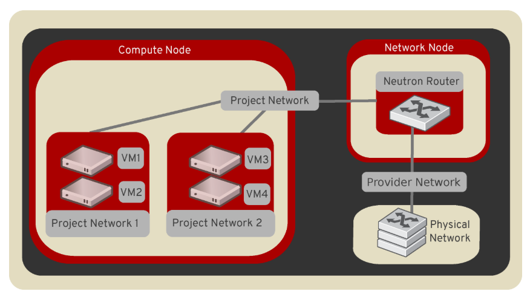

# Neutron - Openstack Networking service 

## 1. Tổng quan về Neutron

Neutron là một project cung cấp "networking as a service" giữa các thiết bị interface được quản lý bởi các Openstack service khác (ví dụ Nova).

Nó cung cấp một API để có thể định nghĩa các network và gán địa chỉ trong môi trường cloud và cho phép vận hành các công nghệ networking khác nhau cho phù hợp với mô hình điện toán đám mây của riêng họ.  

OpenStack Networking cho phép bạn tạo và quản lý network objects, như networks, subnets, và ports.

Networking service, tên là neutron, cung cấp API cho php bạn xác định kết nối mạng và địa chỉ trong cloud. Networking service cho phép các nhà vận hành vận dụng các công nghệ networking khác để cung cấp cho cloud networking của họ. Networking service cũng cung cấp API để cấu hình và quản lý nhiều dịch vụ mạng khác nhau, từ L3 forwarding và NAT đến load balancing, firewalls, và virtual private networks.

## 2. Các thành phần

Openstack Networking bao gồm các thành phần:

* **API server**

* **OpenStack Networking plug-in and agents**

* **Messaging queue**

## 3. Các khái niệm network trong Openstack Networking

### 3.1 Provider Network

Provider network cung cấp một network layer 2 tới các instance với sự hỗ trợ của DHCP và metadata. Mạng này kết nối hoặc map tới một network layer 2 có trong datacenter., thường kết hợp với 802.1Q (VLAN)

Provider network cung cấp sự đơn giản, hiều suất và độ tin cậy với chi phí linh hoạt. Mặc định thì chỉ có administrators mới có thể tạo và update loại mạng này, vì chúng đòi hỏi tới việc cấu hình physical network infrastructure. Nhưng vẫn có thể cho phép các user khác có quyển tạo và update loại mạng này bằng cách sửa trong file `policy.json`

```sh
create_network:provider:physical_network
update_network:provider:physical_network
```

Ngoài ra, các mạng của nhà cung cấp chỉ xử lý kết nối lớp 2 trong các trường hợp, do đó thiếu hỗ trợ cho các tính năng như route và floating IP address.

Trong nhiều trường hợp, người vẫn hành đã quen thuộc với kiến trúc mạng ảo dựa vào cơ sở hạ tầng mạng vật lý cho layer 2 và 3 hoặc các dịch vụ khác có thể triển khai cùng các dịch vụ mạng Openstack.

Đặc biệt, provider network thu hút các nhà triển khai di chuyển từ compute networking service (nova-network) sang Openstack networking service. 

Nhìn chung, các thành phần của OpenStack Networking xử lý layer-3 ảnh hưởng tới hệu năng và độ tin cậy rất nhiều. Để cải thiện hiệu suất và độ tin cậy, provider network di chuyển các hoạt động ở layer-3 tới physical network infrastructure.

Trong một trường hợp cụ thể, Openstack được triển khai trong một môi trường được kết hợp với conventional virtualization và bare-metal hosts (sở hữu một cơ sở hạ tầng vậy lý khá lớn). Các ứng dụng chạy trên Ops được triển khai phải truy cập trực tiếp với layer-2, thông thường sẽ sử dụng VLAN, cho phép các ứng dụng outside triển khai.

### 3.2 Routed provider networks

Routed provider networks cung cấp các kết nối layer-3 cho các instance. Những networks này sẽ map với các networks layer-3 trong data center. Cụ thể hơn, network sẽ map với nhiều segment layer-2, mỗi cái đó bản chất là một provider network. Mỗi một mạng sẽ có một router gateway đi kèm để nó có thể định tuyến traffic giữa chúng với bên ngoài. Networking service không cung cấp việc định tuyến.

Routed provider networks tất nhiên sẽ có hiệu suất thấp hơn so với provider networks.

### 3.3 Self-service network (tenant)

Self-service network cho phép các general (non-privileged) projects có thể quản lý networks mà không cần quyền admin. Các mạng này hoàn toàn ảo và yêu cấu các router ảo để tương tác với provider và external networks. Self-service networks thường sẽ tự cung cấp DHCP và metadata service cho instance.

Trong hầu hết các trường hợp, mạng self-service sẽ sử dụng các giao thức overlay như VXLAN hoặc GRE, vì chúng hỗ trợ nhiều network hơn layer-2 segmentation sử dụng VLAN tagging (802.1q) Hơn nữa VLANs thường yêu cầu cấu hình thêm physical network infrastructure.

IPv4 trong self-service thường sử dụng IP Private ( RFC 1918 ) và tương tác với provider network bằng Source NAT sử dụng router ảo. Floating IP address cho phép truy cập instance từ provider network bằng Destination NAT sử dụng Router ảo

IPv6 trong self-service sử dụng IP Public và tương tác với provider network sử dụng các static route thông qua các Router ảo

Trong openstack networking tích hợp một router layer-3 thường nằm ít nhất trên một node network. Trái ngược với provider network kết nối tới các instance thông qua hạ tầng mạng vật lý layer-2

Người dùng có thể tạo các selt-network theo từng project. Bởi vậy các kết nối sẽ không được chia sẻ với các project khác.

Người dùng tạo các kết nối project networks trong project. Mặc định, chúng sẽ hoàn toàn bị cô lập và không được chia sẽ với các projects khác. Openstack hỗ trợ một số kiểu mạng isolation và công nghệ overlay sau:

**Flat**

Tất cả các instance đều nằm trong một mạng, nó có thể được chia sẽ giữa các hosts. Không có VLAN tagging IDs (802.1Q tagged) và không có sự chia cắt mạng.

**VLAN**

Mạng cho phép khởi tạo nhiều provider hoặc tenant network2 sử dụng VLAN (801.2q) , tương ứng với VLAN đang có sẵn trên mạng vật lý. Điều này cho phép instance kết nối tới các thành phần khác trong mạng

**GRE and VXLAN**

VXLAN và GRE là giao thức đóng gói packet (encapsulation) tạo ra các overlay networks để kích hoạt và điều khiển giữa các máy ảo. Một router ảo để kết nối từ tenant network ra external network. Một router provider sử dụng để kết nối từ external network vào các instance trong tenant network sử dụng floating IP.



### 3.4 Một số các khái niệm khác

**Subnets**

**Subnet pools**

**Ports**

**Routers**

**Security groups**

**Extensions**

**DHCP**

**Metadata**

Optional metadata service cung cấp một API cho instance để lấy các metadate như SSH keys.

### 3.5 Service and component hierarchy

**Server**

**Plug-ins**

**Agents**

* Layer 2 (Ethernet and Switching)

	* Linux Bridge
	* OVS

* Layer 3 (IP and Routing)
	
	* L3
	* DHCP

* Miscellaneous

	* metadata

**Services**

* Routing services
* VPNaaS
* LBaaS
* FWaaS
