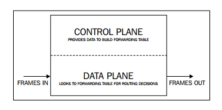
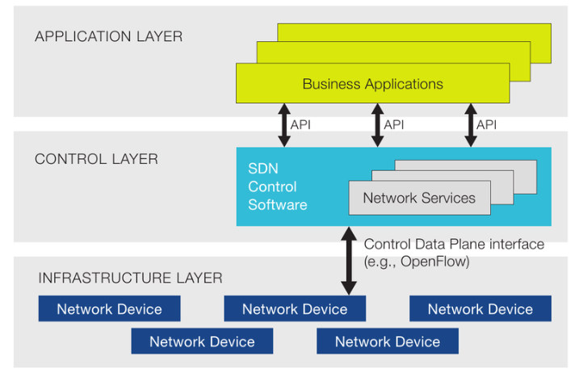
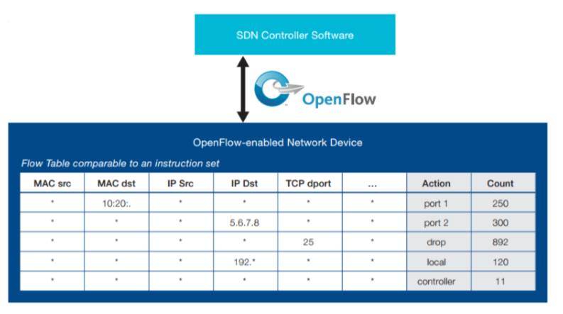
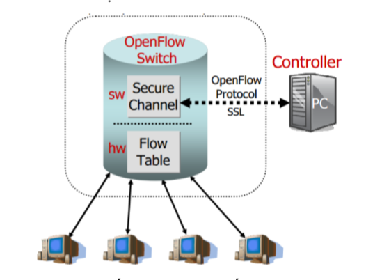
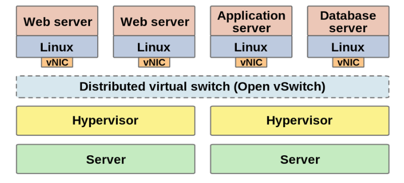
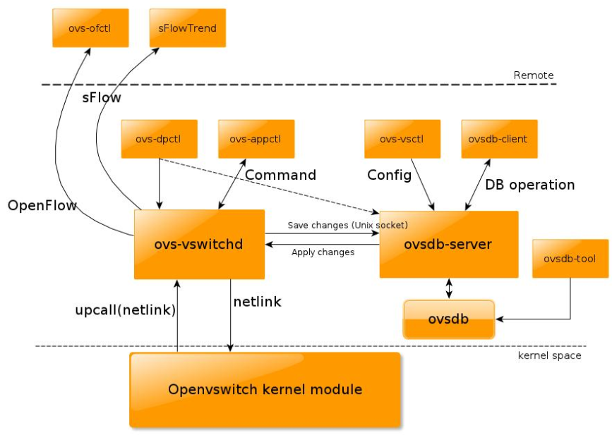

# Tìm hiểu Open vSwitch

**MỤC LỤC**

[1. Giới thiệu vể SDN và Openflow](#sdn)

[2. OpenvSwitch](#ovs)

[3. So sánh OpenvSwitch và Linux Bridge](#compare)

[4. Cài đặt KVM với OpenvSwitch](#install)

[5. Một số câu lệnh thường dùng với OpenvSwitch](#cli)

[Tham khảo](#ref)


<a name="sdn"></a>
## 1. Giới thiệu về SDN (Software Defined Networking) và Openflow

### SDN (Software Defined Networking) 

Software Defined Networking hay mạng điều khiển bằng phần mềm được dựa trên cơ chế tách riêng hai chức năng là quản lí và truyền tải dữ liệu. (control plane và data plane). Nó là một kiến trúc mang tới sự tự động, dễ dàng quản lý, tiết kiệm chi phí và có tính tương thích cao, đặc biệt phù hợp với những ứng dụng yêu cầu tốc độ băng thông cũng như sự tự động ngày nay. 

SDN dựa trên giao thức Open Flow, là kết quả nghiên cứu của Đại học Stanford và California Berkeley. SDN tách định tuyến và chuyển các luồng dữ liệu riêng rẽ và chuyển kiểm soát luồng sang mạng riêng có tên gọi là thiết bị kiểm soát luồng (Flow Controller).

Tóm lại SDN có 3 điểm chính và nổi bật đó là:

* Tách biệt phần quản lí (control plane) với phần truyền tải dữ liệu (data plane).
* Các thành phần trong network có thể được quản lí bởi các phần mềm được lập trình chuyên biệt.
* Tập trung vào kiểm soát và quản lí network.

Với các thiết bị mạng thông thường, thường sẽ có hai phần là Control plane và Data plane



Với SDN, các phần Control plane sẽ được tách ra khỏi thiết bị vật lý và tập chung tại một chỗ để điều khiển các thiết bị chỉ còn phần data plane. Điều này cho phép luồng các gói dữ liệu đi qua mạng được kiểm soát theo lập trình. 

Kiến trúc của SDN



Trong SDN, bộ điều khiển có thể nhìn thấy toàn bộ mạng lưới một cách tổng quan nhất, vì vậy các kỹ sư mạng có thể tối ưu chính sách chuyển tiếp dựa trên toàn bộ mạng. Bộ điều khiển sẽ được tách biệt khỏi phần cứng và được thực hiện bằng các phần mềm ứng dụng gọi là controller, và giao tiếp với phần cứng thông qua các giao thức truyền thông, nổi bật nhất là OpenFlow.

### Kiến trúc của SDN

Gồm 3 lớp:

* Lớp ứng dụng: Là các ứng dụng kinh doanh được triển khai trên mạng, được kết nối tới lớp điều khiển thông qua các API, cung cấp khả năng cho phép lớp ứng dụng lập trình lại (cấu hình lại) mạng (điều chỉnh các tham số trễ, băng thông, định tuyến, …) thông qua lớp điều khiển.

* Lớp điều khiển: Là nơi tập trung các bộ điều khiển thực hiện việc điều khiển cấu hình mạng theo các yêu cầu từ lớp ứng dụng và khả năng của mạng. Các bộ điều khiển này có thể là các phần mềm được lập trình.

* Lớp cơ sở hạ tầng: Là các thiết bị mạng thực tế (vật lý hay ảo hóa) thực hiện việc chuyển tiếp gói tin theo sự điều khiển của lớp điểu khiển. Một thiết bị mạng có thể hoạt động theo sự điều khiển của nhiều bộ điều khiển khác nhau, điều này giúp tăng cường khả năng ảo hóa của mạng.

Với kiến trúc như trên, SDN cung cấp các khả năng: 

* Lớp điều khiển có thể được lập trình trực tiếp. 
* Mạng được điều chỉnh, thay đổi một cách nhanh chóng thông qua việc thay đổi trên lớp điều khiển. 
* Mạng được quản lý tập trung do phần điều khiển được tập trung trên lớp điều khiển. 
* Cấu hình lớp cơ sở hạ tầng có thể được lập trình trên lớp ứng dụng và truyền đạt xuống các lớp dưới. 


### Giao thức OpenFlow

Để tách biệt hẳn phần điều khiển ra khỏi phần chuyển tiếp và cung cấp khả năng lập trình cho lớp điều khiển, ONF sử dụng giao thức OpenFlow. OpenFlow là tiêu chuẩn đầu tiên cung cấp khả nawnng truyền thông giữa các giao diện của lớp điều khiển và lớp chuyển tiếp trong kiến trúc của SDN.

OpenFlow cho phép truy cập trực tiếp và điều khiển mặt phẳng chuyển tiếp giữa các thiết bị mạng như switch và router, cả thiết bị vật lý và thiết bị ảo, do đó giúp di chuyển phần điểu khiển mạng ra khỏi các thiết bị chuyển mạch thực tế tới phần mềm điều khiển trung tâm.

Một thiết bị OpenFlow gồm ít nhất 3 thành phần:

* Flow Table: Là một liên kết hành động với mỗi luồng, giúp thiết bị xử lý các luồng thế nào. Ví dụ:



* Secure Channel: Kênh kết nối tới bộ điều khiển (controller), cho phép các lệnh và các gói tin được gửi giữa bộ điều khiển và thiết bị.

* OpenFlow Protocol: Giao thức cung cấp phương thức tiêu chuẩn và mở cho một bộ điều khiển truyền thông với thiết bị.

Cấu trúc của một thiết bị OpenFlow:



OpenFlow đang ngày càng được hỗ trợ rộng rãi bởi các nhà cung cấp cơ sở hạ tầng khác nhau, thông qua việc triển khai một firmware đơn giản hoặc nâng cấp phần mềm. Kiến trúc SDN trên cơ sở OpenFlow có thể tích hợp từ từ với cơ sở hạ tầng hiện có của doanh nghiệp hoặc nhà khai thác mạng, và cung cấp phương thức tích hợp đơn giản cho các phần của mạng cần đến các chức năng SDN nhất.

**Một số lợi ích khi sử dụng OpenFlow:**

Công nghệ SDN trên cơ sở OpenFlow cho phép nhân viên IT giải quyết các ứng dụng băng thông cao và biến đổi động hiện nay, khiến cho mạng thích ứng với các nhu cầu kinh doanh thay đổi, và làm giảm đáng kể các hoạt động và quản lý phức tạp. Những lợi ishc mà các doanh nghiệp cà nhà khai thác mạng có thể đạt được thông qua kiến trúc SDN trên cơ sở OpenFlow bao gồm:

* Tập trung hóa điều khiển trong môi trường nhiều nhà cung cấp thiết bị: phần mềm điều khiển SDN có thể điều khiển bất kỳ thiết bị mạng nào cho phép OpenFlow từ bất kỳ nhà cung cấp thiết bị nào, bao gồm switch, router, và các switch ảo. 
* Giảm sự phức tạp thông qua việc tự động hóa: kiến trúc SDN trên cơ sở OpenFlow cung cấp một framework quản lý mạng tự động và linh hoạt. Từ framework này có thể phát triển các công cụ tự động hóa các nhiệm vụ hiện đang được thực hiện bằng tay.  
* Tốc độ đổi mới cao hơn: việc áp dụng OpenFlow cho phép các nhà khai thác mạng lập trình lại mạng trong thời gian thực để đạt được các nhu cầu kinh doanh và yêu cầu người dùng cụ thể khi có sự thay đổi. 
* Gia tăng độ tin cậy và khả năng an ninh của mạng: các nhân viên IT có thể định nghĩa các trạng thái cấu hình và chính sách ở mức cao, và áp dụng tới cơ sở hạ tầng thông qua OpenFlow. Kiến trúc SDN trên cơ sở OpenFlow cung cấp điều khiển và tầm nhìn hoàn chỉnh trên mạng, nên có thể đảm bảo điều khiển truy nhập, định hình lưu lượng, QoS, an ninh, và các chính sách khác được thực thi nhất quán trên toàn bộ cơ sở hạ tầng mạng không dây và có dây, bao gồm cả các văn phòng chi nhánh, các cơ sở chính và DC. 
* Điều khiển mạng chi tiết hơn: mô hình điều khiển trên cơ sở flow của OpenFlow cho phép nhân viên IT áp dụng các chính sách tại mức chi tiết, bao gồm phiên, người dùng, thiết bị, và các mức ứng dụng, trong một sự trừu tượng hóa cao, tự động điều chỉnh thích hợp. 
* Tốt hơn với trải nghiệm người dùng: bằng việc tập trung hóa điều khiển mạng và tạo ra trạng thái thông tin có sẵn cho các ứng dụng mức cao hơn, kiến trúc SDN trên cơ sở OpenFlow có thể đáp ứng tốt hơn cho các nhu cầu thay đổi của người dùng


<a name="ovs"></a>
## 2. OpenvSwitch

OpenvSwitch (OVS) là một dự án về chuyển mạch ảo đa lớp (multilayer). Mục đích chính của OpenvSwitch là cung cấp lớp chuyển mạch cho môi trường ảo hóa phần cứng, trong khi hỗ trợ nhiều giao thức và tiêu chuẩn được sử dụng trong hệ thống chuyển mạch thông thường. OvS hỗ trợ nhiều công nghê ảo hóa dựa trên nền tảng Linux như Xen/XenServer, KVM và VirtualBox.



Các chức năng của Open vSwitch:

* Standard 802.1Q VLAN model with trunk and access ports
* NIC bonding with or without LACP on upstream switch
* NetFlow, sFlow(R), and mirroring for increased visibility
* QoS (Quality of Service) configuration, plus policing
* Geneve, GRE, VXLAN, STT, and LISP tunneling
* 802.1ag connectivity fault management
* OpenFlow protocol support
* Transactional configuration database with C and Python bindings
* High-performance forwarding using a Linux kernel module


Các thành phần chính của OpenvSwitch:
* ovs-vswitchd: thực hiện chuyển đổi các luồng chuyển mạch.
* ovsdb-server: là một lightweight database server, cho phép ovs-vswitchd thực hiện các truy vấn đến cấu hình.
* ovs-dpctl: công cụ để cấu hình các switch kernel module.
* ovs-vsctl: tiện ích để truy vấn và cập nhật cấu hình ovs-vswitchd.
* ovs-appctl: tiện ích gửi command để chạy OpenvSwitch.



Cơ chế hoạt động:

Nhìn chung OvS được chia làm hai phần Open vSwitch kernel module (Data Plane) và user space tools (Control Plane).

OVS kernel module sẽ dùng netlink socket để tương tác với vswitchd daemon để tạo và quản lí số lượng OVS switches trên hệ thống local. SDN Controller sẽ tương tác với vswitchd sử dụng giao thức OpenFlow. ovsdb-server chứa bảng dữ liệu. Các clients từ bên ngoài cũng có thể tương tác với ovsdb-server sử dụng json rpc với dữ liệu theo dạng file JSON.

Open vSwitch có 2 modes, normal và flow:

* Normal Mode: Ở mode này, Open vSwitch tự quản lí tất cả các công việc switching/forwarding. Nó hoạt động như một switch layer 2.

* Flow Mode: Ở mode này, Open vSwitch dùng flow table để quyết định xem port nào sẽ nhận packets. Flow table được quản lí bởi SDN controller nằm bên ngoài.


<a name="compare"></a>
## 3. Những hạn chế khi sử dụng Linux Bridge - So sánh OpenvSwitch và Linux Bridge

### Hạn chế của Linux Bridge 

Linux Bridge (LB) là cơ chế ảo hóa mặc định được sử dụng trong KVM. Nó rất dễ dàng để cấu hình và quản lý tuy nhiên nó vốn không được dùng cho mục đích ảo hóa vì thế bị hạn chế một số các chức năng.

LB không hỗ trợ tunneling và OpenFlow protocols. Điều này khiến nó bị hạn chế trong việc mở rộng các chức năng. Đó cũng là lí do vì sao Open vSwitch xuất hiện.

So sánh giữa hai công nghệ

|Open vSwitch|	Linux bridge|
|---|---|
|Được thiết kế cho môi trường mạng ảo hóa	|Mục đích ban đầu không phải dành cho môi trường ảo hóa|
|Có các chức năng của layer 2-4|Chỉ có chức năng của layer 2|
|Có khả năng mở rộng	|Bị hạn chế về quy mô|
|ACLs, QoS, Bonding	|Chỉ có chức năng forwarding|
|Có OpenFlow Controller	|Không phù hợp với môi trường cloud|
|Hỗ trợ netflow và sflow	|Không hỗ trợ tunneling|

**OVS:**

* Ưu điểm: các tính năng tích hợp nhiều và đa dạng, kế thừa từ linux bridge. OVS hỗ trợ ảo hóa lên tới layer4. Được sự hỗ trợ mạnh mẽ từ cộng đồng. Hỗ trợ xây dựng overlay network.

* Nhược điểm: Phức tạp, gây ra xung đột luồng dữ liệu

**LB:**

* Ưu điểm: Các tính năng chính của switch layer được tích hợp sẵn trong nhân. Có được sự ổn định và tin cậy, dễ dàng trong việc troubleshoot Less moving parts: được hiểu như LB hoạt động 1 cách đơn giản, các gói tin được forward nhanh chóng

* Nhược điểm: Để sử dụng ở mức user space phải cài đặt thêm các gói. VD vlan, ifenslave. Không hỗ trợ openflow và các giao thức điều khiển khác. Không có được sự linh hoạt


<a name="install"></a>
## 4. Hướng dẫn cài đặt KVM với OpenvSwitch

Mô hình:

> OS: CentOS 7<br>
> IP: 192.168.20.51/24

Cài đặt OpenvSwitch:

```sh
yum install pciutils

systemctl mask firewalld
systemctl stop firewalld

systemctl stop NetworkManager
systemctl disable NetworkManager 

vi /etc/selinux/config    #  SELINUX=disabled

yum install kvm libvirt python-virtinst qemu-kvm
systemctl start libvirtd 
systemctl enable libvirtd 
chkconfig libvirtd on
#service libvirtd restart
chkconfig network on
service network restart
yum -y erase NetworkManager
yum -y install virt-manager libvirt qemu-system-x86 openssh-askpass
virsh net-destroy default
virsh net-undefine default
service libvirtd restart

yum -y install wget openssl-devel kernel-devel
yum groupinstall "Development Tools"

adduser ovs
su - ovs
mkdir -p ~/rpmbuild/SOURCES
wget http://openvswitch.org/releases/openvswitch-2.4.0.tar.gz
cp openvswitch-2.4.0.tar.gz ~/rpmbuild/SOURCES/
tar xfz openvswitch-2.4.0.tar.gz
sed 's/openvswitch-kmod, //g' openvswitch-2.4.0/rhel/openvswitch.spec > openvswitch-2.4.0/rhel/openvswitch_no_kmod.spec
rpmbuild -bb --nocheck ~/openvswitch-2.4.0/rhel/openvswitch_no_kmod.spec
exit
yum localinstall /home/ovs/rpmbuild/RPMS/x86_64/openvswitch-2.4.0-1.x86_64.rpm
ovs-vsctl -V
systemctl start openvswitch
systemctl enable openvswitch
/usr/share/openvswitch/scripts/ovs-ctl start
init 6
```

Kiểm tra lại:

```sh
[root@trang-20-51 ~]# ovs-vsctl show
d3dab580-1a88-4181-85e0-8c431f94b2e6
    ovs_version: "2.4.0"
```

Chính sửa file cấu hình:

```sh
$ vim /etc/sysconfig/network-scripts/ifcfg-eth0 
DEVICE="eth0"
ONBOOT="yes"
TYPE="OVSPort"
DEVICETYPE="ovs"
OVS_BRIDGE="br-provider"

$ vim /etc/sysconfig/network-scripts/ifcfg-provider
DEVICE="br-provider"
TYPE="OVSBridge"
SLAVE="yes"
BOOTPROTO="static"
IPADDR=192.168.20.51
NETMASK=255.255.255.0
GATEWAY=192.168.20.1
DNS1=1.1.1.1
IPV6INIT="no"
NM_CONTROLLED="yes"
ONBOOT="yes"
DEFROUTE="yes"
PEERDNS="yes"
PEERROUTES="yes"
IPV4_FAILURE_FATAL="yes"
```

Khởi động lại các service;

	systemctl restart network openvswitch

Kiểm tra:

```sh
[root@trang-20-51 ~]# ovs-vsctl show
d3dab580-1a88-4181-85e0-8c431f94b2e6
    Bridge br-provider
        Port "eth0"
            Interface "eth0"
        Port br-provider
            Interface br-provider
                type: internal
    ovs_version: "2.4.0"

[root@trang-20-51 ~]# ip a
1: lo: <LOOPBACK,UP,LOWER_UP> mtu 65536 qdisc noqueue state UNKNOWN group default qlen 1000
    link/loopback 00:00:00:00:00:00 brd 00:00:00:00:00:00
    inet 127.0.0.1/8 scope host lo
       valid_lft forever preferred_lft forever
    inet6 ::1/128 scope host 
       valid_lft forever preferred_lft forever
2: eth0: <BROADCAST,MULTICAST,UP,LOWER_UP> mtu 1500 qdisc pfifo_fast master ovs-system state UP group default qlen 1000
    link/ether 52:54:00:70:ba:bd brd ff:ff:ff:ff:ff:ff
    inet6 fe80::5054:ff:fe70:babd/64 scope link 
       valid_lft forever preferred_lft forever
3: ovs-system: <BROADCAST,MULTICAST> mtu 1500 qdisc noop state DOWN group default qlen 1000
    link/ether e2:59:79:26:c2:a7 brd ff:ff:ff:ff:ff:ff
6: br-provider: <BROADCAST,MULTICAST,UP,LOWER_UP> mtu 1500 qdisc noqueue state UNKNOWN group default qlen 1000
    link/ether 1a:aa:39:14:06:4f brd ff:ff:ff:ff:ff:ff
    inet 192.168.20.51/24 brd 192.168.20.255 scope global br-provider
       valid_lft forever preferred_lft forever
    inet6 fe80::18aa:39ff:fe14:64f/64 scope link 
       valid_lft forever preferred_lft forever
```

Như vậy ta đã cài xong kvm với OVS, để kiểm tra xem có các network nào trong KVM

```sh
[root@trang-20-51 ~]# virsh net-list --all
 Name                 State      Autostart     Persistent
----------------------------------------------------------
```

Lúc này có thể thấy network default đã bị hủy, ta cần tạo network mới để sử dụng. Tạo file `ovsnet.xml` cho libvirt network:

```sh
cat <<EOF> ovsnet.xml
<network>
   <name>br-provider</name>
   <forward mode='bridge'/>
   <bridge name='br-provider'/>
   <virtualport type='openvswitch'/>
</network>
EOF
```

Thực hiện định nghĩa network mới:

```sh
virsh net-define ovsnet.xml
virsh net-start br-provider
virsh net-autostart br-provider
```

Kiểm tra lại network đã khai báo cho libvirt bằng lệnh `virsh net-list --all`, chúng ta sẽ nhìn thấy network có tên là `br-provider`, đây chính là network có type là `openvswitch` đã khai báo ở trên.

```sh
[root@trang-20-51 ~]# virsh net-list --all
 Name                 State      Autostart     Persistent
----------------------------------------------------------
 br-provider          active     yes           yes
```

Thử tạo nhanh một KVM guest sử dụng `virt-install`:

```sh
cd /var/lib/libvirt/images
wget http://download.cirros-cloud.net/0.3.4/cirros-0.3.4-x86_64-disk.img
virt-install \
      -n VM01 \
      -r 128 \
       --vcpus 1 \
      --os-variant=generic \
      --disk path=/var/lib/libvirt/images/cirros-0.3.4-x86_64-disk.img,format=qcow2,bus=virtio,cache=none \
      --network network=br-provider \
      --hvm --virt-type kvm \
      --vnc --noautoconsole \
      --import
```

Kết quả:
```sh
[root@trang-20-51 images]# virsh list --all
 Id    Name                           State
----------------------------------------------------
 2     VM01                           running
```

<a name="cli"></a>
## 5. Một số câu lệnh thường dùng với OpenvSwitch

ovs- : Bạn chỉ cần nhập vào ovs rồi ấn tab 2 lần là có thể xem tất cả các câu lệnh đối với Open vSwitch.

ovs-vsctl : là câu lệnh để cài đặt và thay đổi một số cấu hình ovs. Nó cung cấp interface cho phép người dùng tương tác với Database để truy vấn và thay đổi dữ liệu.

* ovs-vsctl show: Hiển thị cấu hình hiện tại của switch.
* ovs-vsctl list-br: Hiển thị tên của tất cả các bridges.
* ovs-vsctl list-ports : Hiển thị tên của tất cả các port trên bridge.
* ovs-vsctl list interface : Hiển thị tên của tất cả các interface trên bridge.
* ovs-vsctl add-br : Tạo bridge mới trong database.
* ovs-vsctl add-port : : Gán interface (card ảo hoặc card vật lý) vào Open vSwitch bridge.

ovs-ofctl và ovs-dpctl : Dùng để quản lí và kiểm soát các flow entries. OVS quản lý 2 loại flow:

* OpenFlows : flow quản lí control plane
* Datapath : là kernel flow.
* ovs-ofctl giao tiếp với OpenFlow module, ovs-dpctl giao tiếp với Kernel module.

ovs-ofctl show : hiển thị thông tin ngắn gọn về switch bao gồm port number và port mapping.

ovs-ofctl dump-flows : Dữ liệu trong OpenFlow tables

ovs-dpctl show : Thông tin cơ bản về logical datapaths (các bridges) trên switch.

ovs-dpctl dump-flows : Hiển thị flow cached trong datapath.

ovs-appctl bridge/dumpflows: thông tin trong flow tables và offers kết nối trực tiếp cho VMs trên cùng hosts.

ovs-appctl fdb/show: Hiển thị các cặp mac/vlan.

<a name="ref"></a> 
## Tham khảo

https://www.centos.org/forums/viewtopic.php?t=48362

http://prolinuxhub.com/374-2/

https://github.com/meditechopen/meditech-ghichep-openstack/blob/master/docs/04.Neutron/openvswitch.md