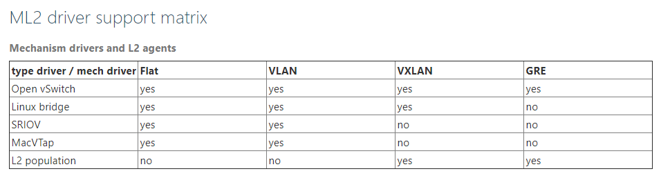
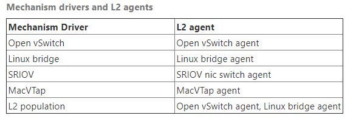
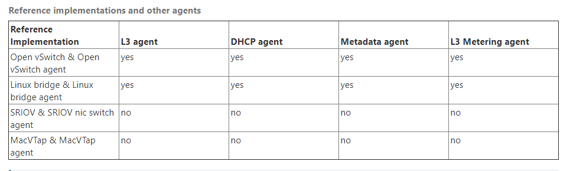

## Neutron agents

Các plugin thông thường sẽ yêu cầu đối với các phần mềm cụ thể phải đưuọc chạy trên mỗi node để xử lý các gói dữ liệu. Nghĩa là, bất kỳ một node nào chạy nova-compute và những node chạy Openstack Networking service như: **neutron-dhcp-agent**, **neutron-l3-agent**, **neutron-metering-agent** or **neutron-lbaasv2-agent**.

Node data-forwarding thường có một network interface với một IP thuộc management network và một interface khác thuộc data network.

### Configure DHCP agent

DHCP service agent tương thích với tất cả các plugins có sẵn và được yêu cầu trong khi triển khai, các VMs cần tự động nhận IP thông qua DHCP.

**Cài đặt và cấu hình DHCP agent**

1. Cần phải đưuọc cấu hình trên host chạy neutron-dhcp-agent như một data forwarding node theo như yêu cầu của plugin của bạn.

2. Install the DHCP agent

		apt-get install neutron-dhcp-agent

3. Cấu hình trong file `/etc/neutron/dhcp_agent.ini`

Networking dhcp-agent có thể sử dụng [dnsmasq](#) driver, dnsmasq hỗ trợ stateful and stateless DHCPv6, để có teher tạo subnet với `ipv6_address_mode` thiết lập `dhcpv6-stateful` or `dhcpv6-stateless`.

Ví dụ:

```sh
$ openstack subnet create --ip-version 6 --ipv6-ra-mode dhcpv6-stateful \
  --ipv6-address-mode dhcpv6-stateful --network NETWORK --subnet-range \
  CIDR SUBNET_NAME

$ openstack subnet create --ip-version 6 --ipv6-ra-mode dhcpv6-stateless \
  --ipv6-address-mode dhcpv6-stateless --network NETWORK --subnet-range \
  CIDR SUBNET_NAME
```

Nếu không có tiến trình dnsmasq cho việc tạo network của subnet thì Networking sẽ tạo một dhcp port mới của subnet trong **qdhcp-XXX** namespace. Nếu dnsmasq trước đó đã sẵn sàng thì khởi động lại dnsmasq với cấu hình mới.

**Cấu hình DHCP agent setup: OVS plug-in**

Chỉnh sửa file `/etc/neutron/dhcp_agent.ini`

```sh
[DEFAULT]
enable_isolated_metadata = True
interface_driver = openvswitch
```

**Cấu hình DHCP agent setup: NSX plug-in**

Chỉnh sửa file `/etc/neutron/dhcp_agent.ini`

```sh 
[DEFAULT]
enable_metadata_network = True
enable_isolated_metadata = True
interface_driver = openvswitch
```

**Cấu hình DHCP agent setup: Linux-bridge plug-in**

```sh
[DEFAULT]
enabled_isolated_metadata = True
interface_driver = linuxbridge
```

### Configure L3 agent

OpenStack Networking service được sử dụng rộng rãi API extension cho phép administrators và projects tạo routers kết nối tới L2 networks và floating IPs để làm cho các port trên private network có thể truy cập từ mạng bên ngoài.

**To install the L3 agent**

1. Cài đặt **neutron-l3-agent** trên network node

		# apt-get install neutron-l3-agent

2. Tạo một bridge tên **br-ex** và kết nối tới NIC có thể đi ra ngoài external network 

* Ví dụ tên card mạng thật đó là eth1:

		# ovs-vsctl add-br br-ex
		# ovs-vsctl add-port br-ex eth1

* Tiếp theo cấu hình hai file cấu hình card mạng:

		## External bridge
		$ vim /etc/sysconfig/network-scripts/ifcfg-br-ex
		auto br-ex
		iface br-ex inet static
		address 192.27.117.101
		netmask 255.255.240.0
		gateway 192.27.127.254
		dns-nameservers 8.8.8.8

		## External network interface
		$ vim /etc/sysconfig/network-scripts/ifcfg-eth1
		auto eth1
		iface eth1 inet manual
		up ifconfig $IFACE 0.0.0.0 up
		up ip link set $IFACE promisc on
		down ip link set $IFACE promisc off
		down ifconfig $IFACE down

* Sau đó lưu cấu hình và khởi động lại **br-ex**

		# ifdown br-ex && ifup br-ex


## Một số Config File của Neutron

### Modular Layer 2 (ml2) plug-in configuration options

The Modular Layer 2 (ml2) plug-in có hai thành phần là: network types and mechanisms. Bạn có thể cấu hình các  thành phần đó riêng biệt

Dưới đây sẽ miêu tả một số các option cấu hình **ml2** trong file `/etc/neutron/plugins/ml2/ml2_conf.ini`

|Configuration option = Default value|	Description|
|---|---|
|[ml2]| |
|extension_drivers =|	(List) For example: extension_drivers = port_security,qos |
|external_network_type = None|	(String) |
|mechanism_drivers =	|(List) mechanism_drivers = openvswitch,l2population|
|overlay_ip_version = 4|	(Integer) IP version of all overlay (tunnel) network endpoints. Use a value of 4 for IPv4 or 6 for IPv6.
|path_mtu = 0	|(Integer) |
|physical_network_mtus =	|(List)|
|tenant_network_types = local|	(List) tenant_network_types = vxlan|
|type_drivers = local, flat, vlan, gre, vxlan, geneve| For example: type_drivers = flat,vlan,vxlan <br> xác định công nghệ, kiểu network sẽ sử dụng|

Modular Layer 2 (ml2) Flat Type configuration options

```sh
[ml2_type_flat]
flat_networks = provider
```

Mặc định thì `flat_network` sẽ sử dụng `*` để cho phép flat networks tùy ý lấy tên physical_network name. Để trống để disable flat networks.



**Network type drivers** 

```sh
[ml2]
type_drivers = flat,vlan,vxlan,gre
```

* Một số loại driver có thể sử dụng:

	* Flat
	* VLAN
	* GRE
	* VXLAN

**Mechanism drivers**

```sh
[ml2]
mechanism_drivers = ovs,l2pop
```

Một số kiểu hỗ trợ:

* Linux bridge
* Open vSwitch 
* SRIOV
* MacVTap
* L2 population

**L2 agent**

* Open vSwitch agent: `openvswitch_agent.ini` 
* Linux bridge agent: `linuxbridge_agent.ini`
* SRIOV Nic Switch agent: `sriov_agent.ini`
* MacVTap agent: `macvtap_agent.ini`


**Reference implementations**

Sự kết hợp của mechanism driver và an L2 agent được gọi là ‘reference implementation’. Dưới đây là bảng một số sự kết hợp đó:



Bảng dưới đây sẽ cho thấy reference implementations hỗ trợ các non-L2 neutron agent nào




### DHCP agent

File cấu hình: `/etc/neutron/dhcp_agent.ini`

Cấu hình trình điều khiển sẽ đưuọc sử dụng để quản lý virtual interface, mặc định sẽ là `none`:

```sh
[DEFAULT]
interface_driver = openvswitch
```

Driver đưuọc sử dụng để quản lý DHCP server:
```sh
[DEFAULT]
dhcp_driver = neutron.agent.linux.dhcp.Dnsmasq
```

Cầu hình isolated metadata
```sh
[DEFAULT]
enable_isolated_metadata = true
```
### L3 agent

File cấu hình: `/etc/neutron/l3_agent.ini`

Cấu hình driver được sử dụng để virtual interface:

```sh
[DEFAULT]
interface_driver = openvswitch
external_network_bridge = 
```


## Tham khảo 

[1] https://docs.openstack.org/neutron/rocky/admin/config-ml2.html

[2] https://docs.openstack.org/neutron/pike/admin/archives/config-agents.html

[3] https://docs.openstack.org/ocata/config-reference/networking/networking_options_reference.html#dhcp-agent