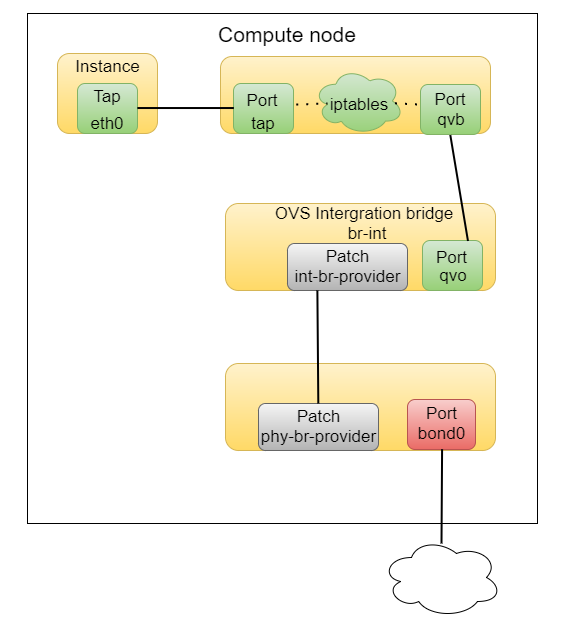
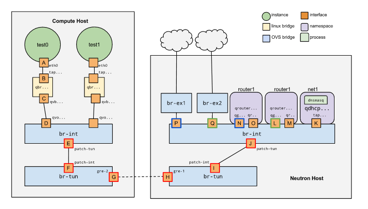
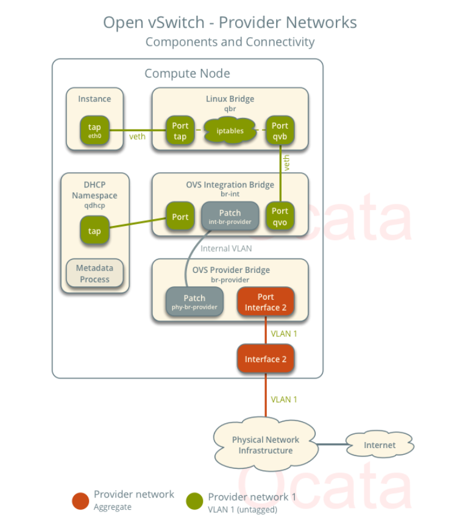
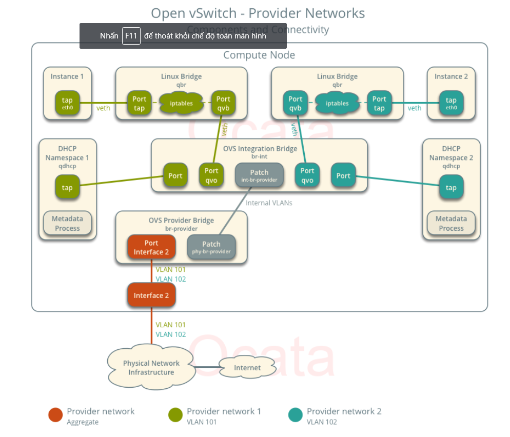
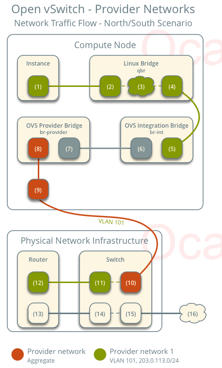
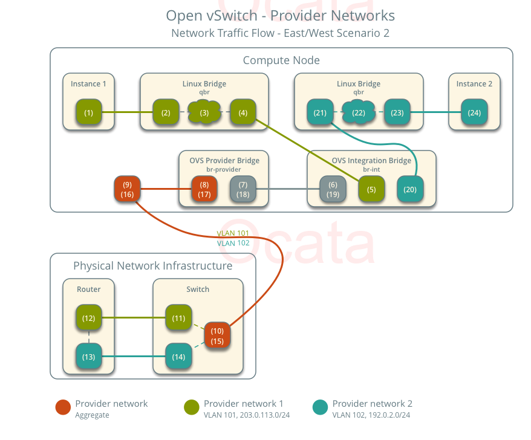
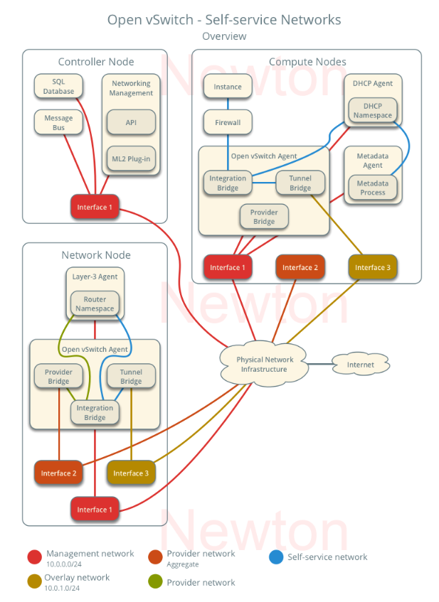
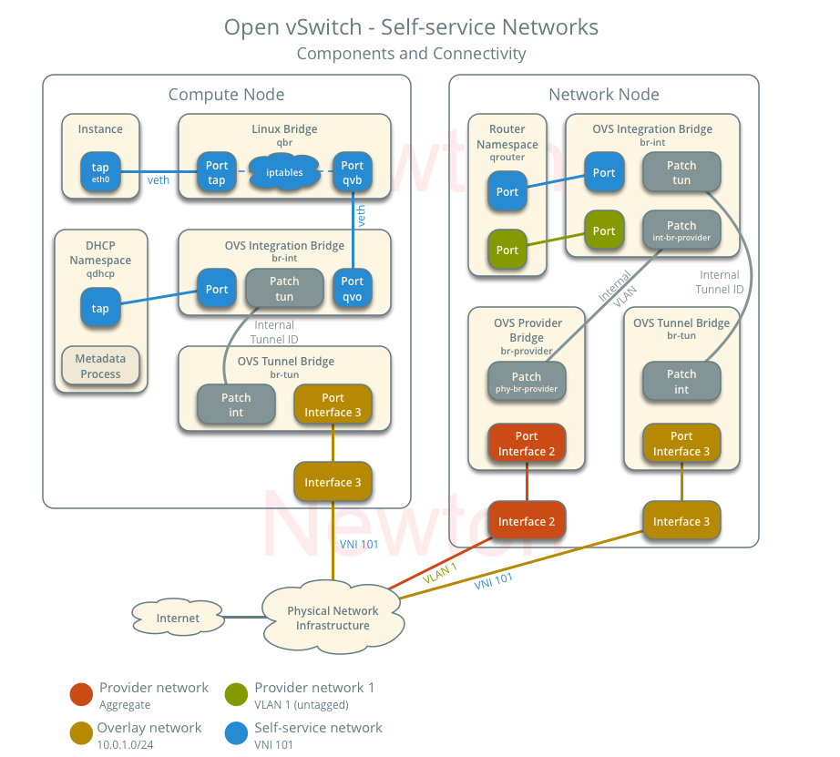

# Kiến trúc Network trong Openstack

**MỤC LỤC**

[1. Provider Network](#prov)

[2. Self-service Network](#self)

[3. Network traffic flow](#flow)


<a name="prov"></a>
## 1. Provider Network

Kiến trúc tổng quan của network trong Openstack sử dụng provider network:



**Instance Networking**

Đầu tiên gói tin sẽ đi ra từ card `eth0` của máy ảo, card này được kết nối tới `tap` device trên host compute. Tap device này ở trên Linux bridge. Sở dĩ có một layer Linux Bridge là vì OpenStack sử dụng các rules của iptables trên tap devices để thực hiện security groups. Trước đây, khi mà OvS chưa hỗ trợ iptables thì nó buộc phải sử dụng thêm một layer là Linux Bridge, nhưng lý tưởng nhất vẫn là các interface của VM gán trực tiếp vào bridge intergration (br-int) của OvS.

Với các phiên bản gần đây, OvS đã hỗ trợ iptables, vì thế nó sẽ không cần thêm một layer của LB nữa. Nhưng mô hình trước đó vẫn khá stable, nên mình vẫn sẽ tìm hiểu về mô hình này.

Một số các rule trên node compute chứa máy ảo liên quan tới `tap`:

```sh
[root@trang-40-72 ~]# iptables -S | grep tapb1d4911f-1f
-A neutron-linuxbri-FORWARD -m physdev --physdev-out tapb1d4911f-1f --physdev-is-bridged -m comment --comment "Direct traffic from the VM interface to the security group chain." -j neutron-linuxbri-sg-chain
-A neutron-linuxbri-FORWARD -m physdev --physdev-in tapb1d4911f-1f --physdev-is-bridged -m comment --comment "Direct traffic from the VM interface to the security group chain." -j neutron-linuxbri-sg-chain
-A neutron-linuxbri-INPUT -m physdev --physdev-in tapb1d4911f-1f --physdev-is-bridged -m comment --comment "Direct incoming traffic from VM to the security group chain." -j neutron-linuxbri-ob1d4911f-1
-A neutron-linuxbri-sg-chain -m physdev --physdev-out tapb1d4911f-1f --physdev-is-bridged -m comment --comment "Jump to the VM specific chain." -j neutron-linuxbri-ib1d4911f-1
-A neutron-linuxbri-sg-chain -m physdev --physdev-in tapb1d4911f-1f --physdev-is-bridged -m comment --comment "Jump to the VM specific chain." -j neutron-linuxbri-ob1d4911f-1
```

`neutron-openvswi-sg-chain` là nơi chứa các neutron-managed security groups. 

`neutron-openvswi-FORWARD` điều khiển các outbound traffic từ VM ra ngoài, trong khi đó `neutron-linuxbri-ib1d4911f-1` điều khiển các traffic từ ngoài vào VM.

Interface thứ 2 gán vào Linux Bridge có tên qvb..., interface này sẽ nối LB tới integration bridge (br-int).

**Linux bridge**

Chứa các rules dùng cho scurity group, có một đầu là tap interface có địa chỉ MAC trùng với địa chỉ MAC của card mạng trên máy ảo là một đầu là qvb... được nối với qvo... trên integration bridge.

**Integration Bridge**

Bridge này thường có tên là br-int thường được dùng để "tag" và "untag" VLAN cho traffic vào và ra VM. Lúc này br-int sẽ trông như sau:

```sh
# ovs-vsctl show
...........
Bridge br-int
            Interface int-br-provider
                type: patch
                options: {peer=phy-br-provider}
        Port br-int
            Interface br-int
                type: internal
        Port "qvo5652dd5f-cd"
            tag: 1
            Interface "qvo5652dd5f-cd"
```       

Interface qvo... là điểm đến của qvb... và nó sẽ chịu trách nhiệm với các traffic vào và ra khỏi layer LB. Nếu bạn sử dụng VLAN, sẽ có thêm tag:1. Interface int-br-provider kết nối tới phy-br-provider trên layer bridge external.


**External bridge** 

Bridge này sẽ được gán với interface external để đi ra ngoài internet (có thể dùng bond hoặc không). Nó sẽ trông như sau:

```sh
#ovs-vsctl show
.........
Bridge br-provider
        Controller "tcp:127.0.0.1:6633"
            is_connected: true
        fail_mode: secure
        Port phy-br-provider
            Interface phy-br-provider
                type: patch
                options: {peer=int-br-provider}
        Port br-provider
            Interface br-provider
                type: internal
        Port "bond0"
            Interface "bond0"
```


<a name="self"></a>
## 2. Self-service Network

Mô hình self-service Network sẽ phức tạp hơn khi mà traffic còn phải đi qua một router được đặt trên node controller. Dưới đây là mô hình:



**Tunnel Bridge**

Traffic tới từ node compute sẽ được chuyển tới node controller thông qua GRE/VXLAN tunnel trên bridge tunnel (br-tun). Nếu sử dụng VLAN thì nó sẽ chuyển đổi VLAN-tagged traffic từ intergration bridge sang GRE/VXLAN tunnels. Việc chuyển đỏi qua lại giữa VLAN IDs và tunnel IDs được thực hiện bởi OpenFlow rules trên `br-tun`.

Đối với GRE hoặc VXLAN-based network truyền tới từ patch-tun của br-int sang patch-int của br-tun. Bridge này sẽ chứa 1 port cho tunnel có tên "vxlan-..."

**DHCP Router on Controller**

DHCP server thường được chạy trên node controller hoặc compute. Nó là một instance của dnsmasq chạy trong một network namespace. Network namespace là một Linux kernel facility cho phép thực hiện một loạt các tiến trình tạo ra network stack (interfaces, routing tables, iptables rules).

Ví dụ:

```sh
[root@trang-40-71 ~(keystone)]# ip netns
qrouter-4d987d63-e949-4faa-be37-786a8d662101 (id: 2)
qdhcp-997cbfd5-c0f9-4bca-8709-5775b665446a (id: 1)
qdhcp-18357719-92f2-4273-9a16-9f5a287c19a4 (id: 0)

[root@trang-40-71 ~(keystone)]# ip netns exec qdhcp-997cbfd5-c0f9-4bca-8709-5775b665446a ip addr
1: lo: <LOOPBACK,UP,LOWER_UP> mtu 65536 qdisc noqueue state UNKNOWN group default qlen 1000
    link/loopback 00:00:00:00:00:00 brd 00:00:00:00:00:00
    inet 127.0.0.1/8 scope host lo
       valid_lft forever preferred_lft forever
    inet6 ::1/128 scope host 
       valid_lft forever preferred_lft forever
2: ns-750f2524-02@if6: <BROADCAST,MULTICAST,UP,LOWER_UP> mtu 1500 qdisc noqueue state UP group default qlen 1000
    link/ether fa:16:3e:f7:db:d7 brd ff:ff:ff:ff:ff:ff link-netnsid 0
    inet 169.254.169.254/16 brd 169.254.255.255 scope global ns-750f2524-02
       valid_lft forever preferred_lft forever
    inet 192.168.40.121/24 brd 192.168.40.255 scope global ns-750f2524-02
       valid_lft forever preferred_lft forever
    inet6 fe80::f816:3eff:fef7:dbd7/64 scope link 
       valid_lft forever preferred_lft forever
```

Trong đó: qdhcp.... là DHCP server namespace còn qrouter... là router.

**Router on Controller**

Router cũng là một network namespace với một loạt các routing rules và iptables rules để thực hiện việc định tuyến giữa các subnets.

Chúng ta cũng có thể xem cấu hình của router với câu lệnh ip netns exec. Mỗi router sẽ có 2 interface, một cổng sẽ kết nối tới gateway (được tạo bởi câu lệnh router-gateway-set), một cổng sẽ nối tới integration bridge.

Xem bảng định tuyến bên trong router

```sh
[root@trang-40-71 ~(keystone)]# ip netns exec qrouter-4d987d63-e949-4faa-be37-786a8d662101 ip route
default via 192.168.40.1 dev qg-d18d11bd-e2 
10.10.10.0/24 dev qr-a1a912be-dc proto kernel scope link src 10.10.10.1 
192.168.40.0/24 dev qg-d18d11bd-e2 proto kernel scope link src 192.168.40.125 
```

Hoặc xem bảng NAT 

```sh
[root@trang-40-71 ~(keystone)]# ip netns exec qrouter-4d987d63-e949-4faa-be37-786a8d662101 iptables -t nat -S
-P PREROUTING ACCEPT
-P INPUT ACCEPT
-P OUTPUT ACCEPT
-P POSTROUTING ACCEPT
-N neutron-l3-agent-OUTPUT
-N neutron-l3-agent-POSTROUTING
-N neutron-l3-agent-PREROUTING
-N neutron-l3-agent-float-snat
-N neutron-l3-agent-snat
-N neutron-postrouting-bottom
-A PREROUTING -j neutron-l3-agent-PREROUTING
-A OUTPUT -j neutron-l3-agent-OUTPUT
-A POSTROUTING -j neutron-l3-agent-POSTROUTING
-A POSTROUTING -j neutron-postrouting-bottom
-A neutron-l3-agent-POSTROUTING ! -i qg-d18d11bd-e2 ! -o qg-d18d11bd-e2 -m conntrack ! --ctstate DNAT -j ACCEPT
-A neutron-l3-agent-PREROUTING -d 169.254.169.254/32 -i qr-+ -p tcp -m tcp --dport 80 -j REDIRECT --to-ports 9697
-A neutron-l3-agent-snat -j neutron-l3-agent-float-snat
-A neutron-l3-agent-snat -o qg-d18d11bd-e2 -j SNAT --to-source 192.168.40.125
-A neutron-l3-agent-snat -m mark ! --mark 0x2/0xffff -m conntrack --ctstate DNAT -j SNAT --to-source 192.168.40.125
-A neutron-postrouting-bottom -m comment --comment "Perform source NAT on outgoing traffic." -j neutron-l3-agent-snat
```


<a name="flow"></a>
## 3. Network traffic flow


### 3.1 OpenvSwitch

#### Provider Network

Sau đây tôi sẽ mô tả một số các luồng của network traffic trong một số trường hợp phổ biến.

* North-south network traffic: di chuyển giữa các instance và external network. 
* East-west network traffic: di chuyển giữa các instance trên cùng một mạng hoặc giữa các mạng khác nhau.

Trong hầu hết các trường hợp, cwo sở hạ tầng mạng vật lý sẽ xử lý việc switching và routing giữa các provider và external network. Mỗi trường hợp sẽ có một hoặc nhiều các thành phần sau:

* Provider network 1 (VLAN)
    * VLAN ID 101 (tagged)
    * IP address ranges 203.0.113.0/24 and fd00:203:0:113::/64
    * Gateway (via physical network infrastructure)
        * IP addresses 203.0.113.1 and fd00:203:0:113:0::1
* Provider network 2 (VLAN)
    * VLAN ID 102 (tagged)
    * IP address range 192.0.2.0/24 and fd00:192:0:2::/64
    * Gateway
        * IP addresses 192.0.2.1 and fd00:192:0:2::1
* Instance 1
    * IP addresses 203.0.113.101 and fd00:203:0:113:0::101
* Instance 2
    * IP addresses 192.0.2.101 and fd00:192:0:2:0::101

Dưới đây là mô hình kiến trúc của provider network trong opensatck với OpenvSwitch


Hình dưới đây, ta có thể thấy các thành phần và sự liên kết của chúng cho một mạng không được đánh dấu (phẳng - flat network). trong một trường hợp cụ thể này, các instance nằm trên cùng một con compute với DHCP agent của network. Nếu DHCP agent nằm trên một con compute khác thì những cái sau chỉ chứa DHCP namespace với một port nằm trên OVS integration bridge.



Hình sau mô tả các kết nối ảo giữa các thành phần trong mạng được đánh dấu (VLAN). Thông thường, tất cả các mạng user dụng single OVS integration bridge sẽ khác nhau về internal VLAN tags. Hầu hết các internal VLAN tags sẽ khác với network VLAN assignment trong Networking service. Tương tự với  trường hợp mạng untagged, DHCP agent có thể đặt trên một con compute node khác.



**North-south**

* The Instance nằm trên compute node 1 and uses provider network 1
* Instance này sẽ gửi một packet ra ngoài mạng internet

The following steps involve compute node 1.

1. The instance interface (1) forwards the packet tới security group bridge instance port (2) qua cặp `veth` 
2. Security group rules (3) trên security group bridge xử lý firewalling và theo dõi kết nối của packet
3. The security group bridge OVS port (4) forwards the packet OVS integration bridge security group port (5) qua cặp `veth`
4. The OVS integration bridge adds an internal VLAN tag to the packet.
5. The OVS integration bridge `int-br-provider` patch port (6) forwards the packet tới OVS provider bridge `phy-br-provider` patch port (7).
6. The OVS provider bridge hoán đổi internal VLAN tag với VLan tag 101 thật
7. The OVS provider bridge provider network port (8) forwards the packet  to the physical network interface (9).
8. The physical network interface forwards the packet to the physical network infrastructure switch (10).

The following steps involve the physical network infrastructure:

1. The switch removes VLAN tag 101 from the packet and forwards it to the router (11).
2. The router routes the packet from the provider network (12) to the external network (13) and forwards the packet to the switch (14).
3. The switch forwards the packet to the external network (15).
4. The external network (16) receives the packet.



**East-west scenario 1: Instances on the same network**

Trường hợp instance nằm trên cùng một network giao tiếp trực tiếp với node compute có chứa instance đó

* Instance 1 năm trên compute node 1 và sử dụng provider network 1
* Instance 2 năm trên compute node 2 và sử dụng provider network 1
* Instance 1 send packet cho instance 2

Đầu tiên là các bước thực hiện trên compute 1:

1. The instance 1 interface (1) forwards the packet to the security group bridge instance port (2) via veth pair.
2. Security group rules (3) on the security group bridge xử lý tường lửa và theo dõi kết nối cho packet.
3. The security group bridge OVS port (4) forwards the packet to the OVS integration bridge security group port (5) via veth pair.
4. The OVS integration bridge adds an internal VLAN tag to the packet.
5. The OVS integration bridge `int-br-provider` patch port (6) forwards the packet to the OVS provider bridge `phy-br-provider` patch port (7).
6. The OVS provider bridge swaps the internal VLAN tag with actual VLAN tag 101.
7. The OVS provider bridge provider network port (8) forwards the packet to the physical network interface (9)
8. The physical network interface forwards the packet to the physical network infrastructure switch (10).

Trên physical network infrastructure:

1. The switch forwards the packet from compute node 1 to compute node 2 (11).

Các bước thực hiện tiếp theo trên compute 2

1. The physical network interface (12) forwards the packet to the OVS provider bridge provider network port (13).
2. The OVS provider bridge phy-br-provider patch port (14) forwards the packet to the OVS integration bridge int-br-provider patch port (15).
3. The OVS integration bridge swaps the actual VLAN tag 101 with the internal VLAN tag.
4. The OVS integration bridge security group port (16) forwards the packet to the security group bridge OVS port (17).
5. Security group rules (18) on the security group bridge handle firewalling and connection tracking for the packet.
6. The security group bridge instance port (19) forwards the packet to the instance 2 interface (20) via veth pair.


**East-west scenario 2: Instances on different networks**

Các instance giao tiếp với nhau qua router trên physical network infrastructure.

* Instance 1 nằm trên compute node 1 và sử dụng provider network 1
* Instance 1 nằm trên compute node 1 và sử dụng provider network 2
* Instance 1 gửi packet cho instance 2

Chú ý: Cả hai instance cùng năm trên một con compute để minh họa cho việc làm thế nào để VLAN tagging cho phép nhiều mạng logic layer 2 sử dụng cùng mạng physical layer-2.

Các bước trên compute node:

1. The instance 1 interface (1) forwards the packet to the security group bridge instance port (2) via veth pair.
2. Security group rules (3) on the security group bridge handle firewalling and connection tracking for the packet.
3. The security group bridge OVS port (4) forwards the packet to the OVS integration bridge security group port (5) via veth pair.
4. The OVS integration bridge adds an internal VLAN tag to the packet.
5. The OVS integration bridge int-br-provider patch port (6) forwards the packet to the OVS provider bridge phy-br-provider patch port (7).
6. The OVS provider bridge swaps the internal VLAN tag with actual VLAN tag 101.
7. The OVS provider bridge provider network port (8) forwards the packet to the physical network interface (9).
8. The physical network interface forwards the packet to the physical network infrastructure switch (10).

Trên physical network infrastructure:

1. The switch removes VLAN tag 101 from the packet and forwards it to the router (11).
2. The router routes the packet from provider network 1 (12) to provider network 2 (13).
3. The router forwards the packet to the switch (14).
4. The switch adds VLAN tag 102 to the packet and forwards it to compute node 1 (15).

Tiếp theo packet sẽ được chuyển về compute node:

1. The physical network interface (16) forwards the packet to the OVS provider bridge provider network port (17).
2. The OVS provider bridge phy-br-provider patch port (18) forwards the packet to the OVS integration bridge int-br-provider patch port (19).
3. The OVS integration bridge swaps the actual VLAN tag 102 with the internal VLAN tag.
4. The OVS integration bridge security group port (20) removes the internal VLAN tag and forwards the packet to the security group bridge OVS port (21).
5. Security group rules (22) on the security group bridge handle firewalling and connection tracking for the packet.
6. The security group bridge instance port (23) forwards the packet to the instance 2 interface (24) via veth pair.




#### Self-service Network

Mô hình kiến trúc mạng Self-service 



Hình dưới đây thể hiện các thành phần và kết nối trong một mạng self-service và một mạng provider untagged (flat). Trong trường hợp này, các instance nằm trên cùng con compute với DHCP client. Nếu DHCP client nằm trên một con compute khác thì các instance sau này chỉ bao gồm DHCP namespace và một port trên OVS integration bridge.



Dưới đây tôi sẽ mô tả về luồng network trafic trong một vài trường hợp phổ biến của mô hình này.

* North-south network traffic travels between an instance and external network such as the Internet
* East-west network traffic travels between instances on the same or different networks

Trong hầu hết các trường hợp thì physical network infrastructure sẽ xửa lý  việc switching và routing giữa các provider network và external networks. Mỗi trường hợp đều nó một hoặc nhiều các thành phần dưới đây:

* Provider network (VLAN)
    * VLAN ID 101 (tagged)
* Self-service network 1 (VXLAN)
    * VXLAN ID (VNI) 101
* Self-service network 2 (VXLAN)
    * VXLAN ID (VNI) 102
* Self-service router
    * Gateway on the provider network
    * Interface on self-service network 1
    * Interface on self-service network 2
* Instance 1
* Instance 2

**North-south scenario 1: Instance with a fixed IP address**

Cho một instance với fixed IPv4 address, các node mạng sẽ thực hiện SNAT khi north-south traffic đi từ self-service tới external networks. Với một instance có fixed IPv6 address, network node sẽ thực hiện định tuyến thông thường của các traffic giữa self-service và external networks.

* Instance nằm trên compute node 1 và sử dụng self-service network 1
* Instance send packet từ host ra ngoài internet.

Đầu tiên, trên compute node 1:

1. The instance interface (1) forwards the packet to the security group bridge instance port (2) via veth pair.
2. Security group rules (3) on the security group bridge handle firewalling and connection tracking for the packet.
3. The security group bridge OVS port (4) forwards the packet to the OVS integration bridge security group port (5) via veth pair.
4. The OVS integration bridge adds an internal VLAN tag to the packet.
5. The OVS integration bridge exchanges the internal VLAN tag for an internal tunnel ID.
6. The OVS integration bridge patch port (6) forwards the packet to the OVS tunnel bridge patch port (7).
7. The OVS tunnel bridge (8) wraps the packet using VNI 101.
8. The underlying physical interface (9) for overlay networks forwards the packet to the network node via the overlay network (10).

Trên Network node:

1. The underlying physical interface (11) for overlay networks forwards the packet to the OVS tunnel bridge (12).
2. The OVS tunnel bridge không mở packet mà chỉ add thêm internal tunnel ID cho nó
3. The OVS tunnel bridge exchanges the internal tunnel ID for an internal VLAN tag.
4. The OVS tunnel bridge patch port (13) forwards the packet to the OVS integration bridge patch port (14).
5. The OVS integration bridge port for the self-service network (15) removes the internal VLAN tag and forwards the packet to the self-service network interface (16) in the router namespace

    * Với IPv4, router sẽ thực hiện SNAT cho packet đã được thay đổi source IP thành IP trên provider network và gửi nó tới địa chỉ gateway của provider network qua gateway interface trên provider network(17).
    * Với IPv6, router sẽ gửi next-hop IP address, thông thường gateway IP address sẽ nằm trên provider network, qua provider gateway interface.(17).

6. The router forwards the packet to the OVS integration bridge port for the provider network (18).
7. The router forwards the packet to the OVS integration bridge port for the provider network (18).
8. The OVS integration bridge int-br-provider patch port (19) forwards the packet to the OVS provider bridge phy-br-provider patch port (20).
9. The OVS provider bridge swaps the internal VLAN tag with actual VLAN tag 101.
10. The OVS provider bridge provider network port (21) forwards the packet to the physical network interface (22).
11. The physical network interface forwards the packet to the Internet via physical network infrastructure (23).


**North-south scenario 2: Instance with a floating IPv4 address**

Đối với các trường hợp floating IPv4 address, Network node thực hiện SNAT cho north-south traffic khi đi từ instance tới external network và DNAT khi north-south traffic đi từ external networks tới instance. floating IP addresses và NAT không áp dụng cho IPv6. 

* Instance nằm trên compute node 1 và sử dụng self-service network 1.
* một host trên internet send một packet tới instance.

Thực hiện trên Network node:

1. The physical network infrastructure (1) forwards the packet to the provider physical network interface (2).
2. The provider physical network interface forwards the packet to the OVS provider bridge provider network port (3).
3. The OVS provider bridge swaps actual VLAN tag 101 with the internal VLAN tag.
4. The OVS provider bridge phy-br-provider port (4) forwards the packet to the OVS integration bridge int-br-provider port (5).
5. The OVS integration bridge port for the provider network (6) removes the internal VLAN tag and forwards the packet to the provider network interface (6) in the router namespace.
    * For IPv4, the router performs DNAT on the packet which changes the destination IP address to the instance IP address on the self-service network and sends it to the gateway IP address on the self-service network via the self-service interface (7).
    * For IPv6, the router sends the packet to the next-hop IP address, typically the gateway IP address on the self-service network, via the self-service interface (8).
6. The router forwards the packet to the OVS integration bridge port for the self-service network (9).
7. The OVS integration bridge adds an internal VLAN tag to the packet.
8. The OVS integration bridge exchanges the internal VLAN tag for an internal tunnel ID.
9. The OVS integration bridge patch-tun patch port (10) forwards the packet to the OVS tunnel bridge patch-int patch port (11).
10. The OVS tunnel bridge (12) wraps the packet using VNI 101.
11. The underlying physical interface (13) for overlay networks forwards the packet to the network node via the overlay network (14).

Trên compute node:

1. The underlying physical interface (15) for overlay networks forwards the packet to the OVS tunnel bridge (16).
2. The OVS tunnel bridge unwraps the packet and adds an internal tunnel ID to it.
3. The OVS tunnel bridge exchanges the internal tunnel ID for an internal VLAN tag.
4. The OVS tunnel bridge patch-int patch port (17) forwards the packet to the OVS integration bridge patch-tun patch port (18).
5. The OVS integration bridge removes the internal VLAN tag from the packet.
6. The OVS integration bridge security group port (19) forwards the packet to the security group bridge OVS port (20) via veth pair.
7. Security group rules (21) on the security group bridge handle firewalling and connection tracking for the packet.
8. The security group bridge instance port (22) forwards the packet to the instance interface (23) via veth pair.


**East-west scenario 1: Instances on the same network**


**East-west scenario 2: Instances on different networks**


### 3.2 Linux Bridge

#### Provider Network

**North-south scenario: Instance with a fixed IP address**


**East-west scenario 1: Instances on the same network**


**East-west scenario 2: Instances on different networks**


#### Self-service Network

**North-south scenario 1: Instance with a fixed IP address**


**North-south scenario 2: Instance with a floating IPv4 address**


**East-west scenario 1: Instances on the same network**


**East-west scenario 2: Instances on different networks**


## Tham khảo

https://docs.openstack.org/liberty/networking-guide/scenario-classic-ovs.html

https://docs.openstack.org/ocata/networking-guide/deploy-ovs-provider.html

https://docs.openstack.org/ocata/networking-guide/deploy-ovs-selfservice.html

https://docs.openstack.org/kilo/networking-guide/deploy_scenario4b.html

https://docs.openstack.org/ocata/networking-guide/deploy-lb-provider.html

https://docs.openstack.org/neutron/pike/admin/deploy-lb-selfservice.html

https://docs.openstack.org/ocata/networking-guide/deploy-lb-selfservice.html

https://docs.openstack.org/neutron/rocky/admin/intro-nat.html