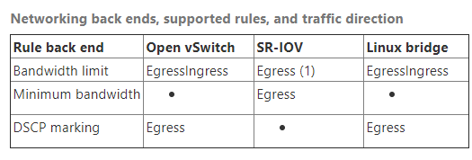

# Quality of Service (QoS) - Neutron

## 1. Giới thiệu

QoS được định nghĩa là khả năng đảm bảo các yêu cấu mạng nhất định như bandwidth, latency (độ trễ), jitter (độ giật) và reliability (độ tin cậy) để đáp ứng thỏa thuận về Service Level Agreement (SLA) giữa các nhà cũng cấp ứng dụng và end users.

Các thiết bị mạng như switches và routers có thể đánh dấu các traffic để nó được xử lý với priority cao hơn để đáp ứng các điều kiện đã thỏa thuận theo SLA. Trong trường hợp, các lưu lượng mạng nhất định như Voice over IP (VoIP) và video streaming cần được truyền với băng thông được hạn chế tối thiểu. Trên một hệ thống không có network QoS management, tất cả các trafic sẽ được truyền đi theo các nô lực nhất "best-efort" mà không thể đảm bảo được dịch vụ của khách hàng được chuyển đi.

QoS sẽ thể hiện rõ tác dụng ở những vị trí thường xảy ra hiện tượng bottleneck (nút thắt cổ chai), đồng thời quyết định trafic nào có độ ưu tiên cao hơn để quyết định thứ tự truyền đi. 

Trong môi trường Storage: Storage QoS cho phép admin có thể monitor và quản lý và thiết lập rule ưu tiên theo từng kiểu acces và resource sử dụng trong một Storage Cluster. Các policy giúp giới hạn các I/O storage và các VM đảm bảo không vượt qua ngưỡng cho phép.

QoS là một plug-in dịch vụ nâng cao. QoS được tách ra từ phần còn lại của Openstack Network code  ở nhiều levels và nó có thể thông qua trình driver mở rộng ml2.

## 2. QoS trong Neutron

Trong Neutron hiện đang hỗ trợ các rule QoS sau:

* banwitth_limit: hỗ trợ giới hạn băng thông tối đa trên từng network, port và IP floating
* dhcp_marking: hỗ trợ giới hạn băng thông dựa trên DSCP value. - Với QoS. Marking là 1 task nhỏ trong Classtifycation, (và tất nhiên marking lúc này là DSCP cho Difserv). Classtifycation có 2 task là identify gói tin và marking gói tin, sau đó đẩy vào các queuing, dùng scheduling để quyết định gói nào ra trước, gói nào phải chờ. 
* minimum_bandwidth: giới hạn băng thông tối đa dựa lên kiểu kết nối.

Bảng dưới đây là một số các backends, QoS rules được hỗ trợ và các hướng đi của trafic (nhìn từ VM)




## 3. Configuration

Để enable service, làm theo các bước dưới đây:

### 3.1 Trên Network nodes

Add QoS service vào `service_plugin` trong file `/etc/neutron/neutron.conf`, ví dụ:

```sh
[DEFAULT]
service_plugins = \
neutron.services.l3_router.l3_router_plugin.L3RouterPlugin,
neutron.services.metering.metering_plugin.MeteringPlugin,
neutron.services.qos.qos_plugin.QoSPlugin
```

Sửa file `/etc/neutron/plugins/ml2/ml2_conf.ini`

```sh
[ml2]
extension_drivers = port_security,qos
```

Nếu Open vSwitch agent được sử dụng, sửa file `/etc/neutron/plugins/ml2/openvswitch_agent.ini`

```sh
[agent]
extensions = qos
```

### 3.2 Trên compute node

Sửa file `/etc/neutron/plugins/ml2/openvswitch_agent.ini`

```sh
[agent]
extensions = qos
```

### 3.3 Cấu hình policy.json đáng tin cậy cho project

Nếu các dự ám được tin cậy để quản trị các chính sách QoS của chính chúng trong môi trường cloud của bạn, thì file `policy.json` của neutron sẽ được chỉnh sửa để cho phép điều đó.

Chỉnh sửa file `/etc/neutron/policy.json` 

```sh
"get_policy": "rule:regular_user",
"create_policy": "rule:regular_user",
"update_policy": "rule:regular_user",
"delete_policy": "rule:regular_user",
"get_rule_type": "rule:regular_user",
```

Để enable bandwidth giới hạn các rule:

```sh
"get_policy_bandwidth_limit_rule": "rule:regular_user",
"create_policy_bandwidth_limit_rule": "rule:regular_user",
"delete_policy_bandwidth_limit_rule": "rule:regular_user",
"update_policy_bandwidth_limit_rule": "rule:regular_user",
```

Để enable DSCP đánh dấu rule:

```sh
"get_policy_dscp_marking_rule": "rule:regular_user",
"create_dscp_marking_rule": "rule:regular_user",
"delete_dscp_marking_rule": "rule:regular_user",
"update_dscp_marking_rule": "rule:regular_user",
```

Để enable giá trị tối thiểu của banwidth rule:

```sh
"get_policy_minimum_bandwidth_rule": "rule:regular_user",
"create_policy_minimum_bandwidth_rule": "rule:regular_user",
"delete_policy_minimum_bandwidth_rule": "rule:regular_user",
"update_policy_minimum_bandwidth_rule": "rule:regular_user",
```

## 4. User workflow 

QoS policies chỉ được tạp ra bởi admin với file policy.json mặc định. Vì vậy, bạn nên yêu cầu người điều hành cloud thiết lập chúng thay mặt cho các cloud projects.

Nếu project được tin tưởng để tạp ra chính policies của chúng thì kiểm tra trusted projects policy.json configuration section.

Đầu tiên tạo một QoS policy và các rule giới hạn băng thông của chúng.

```sh
[root@trang-40-71 ~(keystone)]# openstack network qos policy create bw-limiter
+-------------+--------------------------------------+
| Field       | Value                                |
+-------------+--------------------------------------+
| description |                                      |
| id          | a150479c-2501-441e-b61e-15df4daf6b8a |
| is_default  | False                                |
| name        | bw-limiter                           |
| project_id  | 82ee8def450e47b29451b57b094addc8     |
| rules       | []                                   |
| shared      | False                                |
| tags        | []                                   |
+-------------+--------------------------------------+

[root@trang-40-71 ~(keystone)]# openstack network qos rule create --type bandwidth-limit --max-kbps 3000 \
>     --max-burst-kbits 300 --egress bw-limiter
+----------------+--------------------------------------+
| Field          | Value                                |
+----------------+--------------------------------------+
| direction      | egress                               |
| id             | f34dccc7-045e-46bf-9bd8-4dd2c8b7d737 |
| max_burst_kbps | 300                                  |
| max_kbps       | 3000                                 |
| name           | None                                 |
| project_id     |                                      |
+----------------+--------------------------------------+

[root@trang-40-71 ~(keystone)]# openstack network qos rule list bw-limiter
+--------------------+--------------------------------------+-----------------+----------+-----------------+----------+-----------+-----------+
| ID                 | QoS Policy ID                        | Type            | Max Kbps | Max Burst Kbits | Min Kbps | DSCP mark | Direction |
+--------------------+--------------------------------------+-----------------+----------+-----------------+----------+-----------+-----------+
| f34dccc7-045e-46bf-| a150479c-2501-441e-b61e-15df4daf6b8a | bandwidth_limit |     3000 |             300 |          |           | egress    |
+--------------------+--------------------------------------+-----------------+----------+-----------------+----------+-----------+-----------+
```

**Note** : QOS yêu cầu chỉ số burst để chắc chắn sự đúng đắncác các rule set bandwith trên các OpenvSwitch và Linux Bridge. Nếu không set trong quá trình đặt rule thì mặc định chỉ số này sẽ về 80% bandwidth của các gói TCP thông thường. Nếu giá trị burst quá thấp sẽ gây ra việc giảm băng thông so với thông số cấu hình

Các QoS policy có thể được gắn vào port hoặc network cụ thể:

```sh
[root@trang-40-71 ~(keystone)]# openstack port list
+---------------+------+-------------------+-------------------------------------------------------------------------------+--------+
| ID            | Name | MAC Address       | Fixed IP Addresses                                                            | Status |
+---------------+------+-------------------+-------------------------------------------------------------------------------+--------+
| 01e7ee7b-98b6-|      | fa:16:3e:54:93:88 | ip_address='192.168.40.121', subnet_id='f3ae12dc-bbfd-402b-b5e1-bd3917538e25' | ACTIVE |
| 335a7fdf-fa1c-|      | fa:16:3e:95:1a:af | ip_address='10.10.10.13', subnet_id='01524e15-805c-4ceb-8073-0e93781502d2'    | ACTIVE |
|               |      |                   | ip_address='10.10.10.19', subnet_id='01524e15-805c-4ceb-8073-0e93781502d2'    |        |
| 5f88fc7a-dd35-|      | fa:16:3e:d5:42:cf | ip_address='10.10.10.2', subnet_id='01524e15-805c-4ceb-8073-0e93781502d2'     | ACTIVE |
+---------------+------+-------------------+-------------------------------------------------------------------------------+--------+

[root@trang-40-71 ~(keystone)]# openstack port set --qos-policy bw-limiter 335a7fdf-fa1c-47ff-a33a-4625ca759f11

[root@trang-40-71 ~(keystone)]# openstack port show 335a7fdf-fa1c-47ff-a33a-4625ca759f11
+-----------------------+----------------------------------------------------------------------------+
| Field                 | Value                                                                      |
+-----------------------+----------------------------------------------------------------------------+
| admin_state_up        | UP                                                                         |
| allowed_address_pairs |                                                                            |
| binding_host_id       | trang-40-73                                                                |
| binding_profile       |                                                                            |
| binding_vif_details   | datapath_type='system', ovs_hybrid_plug='False', port_filter='True'        |
| binding_vif_type      | ovs                                                                        |
| binding_vnic_type     | normal                                                                     |
| created_at            | 2019-03-07T02:31:16Z                                                       |
| data_plane_status     | None                                                                       |
| description           |                                                                            |
| device_id             | db2ff7bd-4264-4a27-8d64-982a19bb3c78                                       |
| device_owner          | compute:nova                                                               |
| dns_assignment        | None                                                                       |
| dns_domain            | None                                                                       |
| dns_name              | None                                                                       |
| extra_dhcp_opts       |                                                                            |
| fixed_ips             | ip_address='10.10.10.13', subnet_id='01524e15-805c-4ceb-8073-0e93781502d2' |
|                       | ip_address='10.10.10.19', subnet_id='01524e15-805c-4ceb-8073-0e93781502d2' |
| id                    | 335a7fdf-fa1c-47ff-a33a-4625ca759f11                                       |
| mac_address           | fa:16:3e:95:1a:af                                                          |
| name                  |                                                                            |
| network_id            | fa212d72-7d59-4887-bf26-4a34ecf0858c                                       |
| port_security_enabled | True                                                                       |
| project_id            | 82ee8def450e47b29451b57b094addc8                                           |
| qos_policy_id         | a150479c-2501-441e-b61e-15df4daf6b8a                                       |
| revision_number       | 15                                                                         |
| security_group_ids    | e2db2ee9-8864-41d6-bed4-05dd1e1a9cea                                       |
| status                | ACTIVE                                                                     |
| tags                  |                                                                            |
| trunk_details         | None                                                                       |
| updated_at            | 2019-03-08T10:38:07Z                                                       |
+-----------------------+----------------------------------------------------------------------------+
```

Để detach a port from the QoS policy attached vào nó:

```sh
$ openstack port unset --no-qos-policy <id port>
```

**Sửa rule**

```sh
[root@trang-40-71 ~(keystone)]# openstack network qos rule list bw-limiter2 
+-----------------+--------------------------------------+-----------------+----------+-----------------+----------+-----------+-----------+
| ID              | QoS Policy ID                        | Type            | Max Kbps | Max Burst Kbits | Min Kbps | DSCP mark | Direction |
+-----------------+--------------------------------------+-----------------+----------+-----------------+----------+-----------+-----------+
| 0243fe59-e856-b | 8954d303-8cd0-43a6-9bd6-99615d634a8e | bandwidth_limit |       10 |             300 |          |           | egress    |
+-----------------+--------------------------------------+-----------------+----------+-----------------+----------+-----------+-----------+

[root@trang-40-71 ~(keystone)]# openstack network qos rule show bw-limiter2 0243fe59-e856-4f23-afc3-c94fdd554dfb
+----------------+--------------------------------------+
| Field          | Value                                |
+----------------+--------------------------------------+
| direction      | egress                               |
| id             | 0243fe59-e856-4f23-afc3-c94fdd554dfb |
| max_burst_kbps | 300                                  |
| max_kbps       | 10                                   |
| name           | None                                 |
| project_id     |                                      |
+----------------+--------------------------------------+

[root@trang-40-71 ~(keystone)]# openstack network qos rule set --max-kbps 1  --ingress bw-limiter2 0243fe59-e856-4f23-afc3-c94fdd554dfb
[root@trang-40-71 ~(keystone)]# openstack network qos rule set --max-burst-kbit 1  --ingress bw-limiter2 0243fe59-e856-4f23-afc3-c94fdd554dfb
[root@trang-40-71 ~(keystone)]# openstack network qos rule show bw-limiter2 0243fe59-e856-4f23-afc3-c94fdd554dfb
+----------------+--------------------------------------+
| Field          | Value                                |
+----------------+--------------------------------------+
| direction      | ingress                              |
| id             | 0243fe59-e856-4f23-afc3-c94fdd554dfb |
| max_burst_kbps | 1                                    |
| max_kbps       | 1                                    |
| name           | None                                 |
| project_id     |                                      |
+----------------+--------------------------------------+
```

Một số lệnh khác:

```sh
[root@trang-40-71 ~(keystone)]# openstack network qos policy show bw-limiter2
+-------------+--------------------------------------------------------------------------------------------+
| Field       | Value                                                                                      |
+-------------+--------------------------------------------------------------------------------------------+
| description |                                                                                            |
| id          | 8954d303-8cd0-43a6-9bd6-99615d634                                                          |
| is_default  | False                                                                                      |
| name        | bw-limiter2                                                                                |
| project_id  | 82ee8def450e47b29451b57b094addc8                                                           |
| rules       | [{u'max_kbps': 1, u'direction': u'ingress', u'qos_policy_id': u'8954d303-8cd0-43a6-9bd6-99615d634a8e', u'type': u'							  bandwidth_limit', u'id': u'0243fe59-e856-4f23-afc3-c94fdd554dfb', u'max_burst_kbps': 1}] |
| shared      | False                                                                                      |
| tags        | []                                                                                         |
+-------------+--------------------------------------------------------------------------------------------+
```


## 4. Thực hành

Giả sử có hai con VM cùng nằm trên mạng `self-service` có cấu hình như sau:

Intance 1: 
	
> IP: 10.10.10.6</br>
> OS: CentOS 7

Intance 2:

> IP: 10.10.10.17</br>
> OS: CentOS 7

Đều nằm trong một namesapces có tên là: **qdhcp-fa212d72-7d59-4887-bf26-4a34ecf0858c**

Để kiểm tra các namesapces có trong mạng, trên Controller thực hiện lệnh sau:

```sh
[root@trang-40-71 ~(keystone)]# ip netns list
qdhcp-c9fed510-f737-4e6d-ae6e-8b552fe739bf (id: 3)
qdhcp-2720a749-0377-4ebd-aa12-9d132f1fe450 (id: 2)
qdhcp-fa212d72-7d59-4887-bf26-4a34ecf0858c (id: 1)
qrouter-2ca23c47-9d00-4b9c-9246-aed05c19fe49 (id: 0)
```

Namespace thứ 2 là của `self-service`, thực hiện ssh vào các máy ảo theo lệnh sau:

	ip netns exec qdhcp-fa212d72-7d59-4887-bf26-4a34ecf0858c ssh -i trangkey.pem centos@10.10.10.17

Sau đó thực hiện cài đặt iperf trên hai VM này:

	yum install epel-release -y
	yum install iperf -y

Hoặc 

	yum install iperf3-devel.i686

**Trên Instance 1 chạy**

```sh
[root@trang2 tmp]# iperf3 -s
-----------------------------------------------------------
Server listening on 5201
-----------------------------------------------------------
Accepted connection from 10.10.10.17, port 57277
[  5] local 10.10.10.6 port 5201 connected to 10.10.10.17 port 57278
[ ID] Interval           Transfer     Bandwidth
[  5]   0.00-1.01   sec  22.4 MBytes   187 Mbits/sec                  
[  5]   1.01-2.01   sec  28.5 MBytes   240 Mbits/sec                  
[  5]   2.01-3.01   sec  27.9 MBytes   234 Mbits/sec                  
[  5]   3.01-4.00   sec  27.5 MBytes   231 Mbits/sec                  
[  5]   4.00-5.01   sec  28.2 MBytes   236 Mbits/sec                  
[  5]   5.01-6.01   sec  28.5 MBytes   238 Mbits/sec                  
[  5]   6.01-7.01   sec  29.5 MBytes   248 Mbits/sec                  
[  5]   7.01-8.01   sec  29.4 MBytes   245 Mbits/sec                  
[  5]   8.01-9.01   sec  25.5 MBytes   215 Mbits/sec                  
[  5]   9.01-10.01  sec  27.5 MBytes   231 Mbits/sec                  
[  5]  10.01-10.04  sec   512 KBytes   121 Mbits/sec                  
- - - - - - - - - - - - - - - - - - - - - - - - -
[ ID] Interval           Transfer     Bandwidth
[  5]   0.00-10.04  sec  0.00 Bytes  0.00 bits/sec                  sender
[  5]   0.00-10.04  sec   275 MBytes   230 Mbits/sec                  receiver
-----------------------------------------------------------
Server listening on 5201
-----------------------------------------------------------
```

**Trên Instance 2 chạy**

```sh
[root@trang1 tmp]# iperf3 -c 10.10.10.6
Connecting to host 10.10.10.6, port 5201
[  4] local 10.10.10.17 port 57278 connected to 10.10.10.6 port 5201
[ ID] Interval           Transfer     Bandwidth       Retr  Cwnd
[  4]   0.00-1.00   sec  26.2 MBytes   219 Mbits/sec    0    582 KBytes       
[  4]   1.00-2.02   sec  28.8 MBytes   237 Mbits/sec    0    608 KBytes       
[  4]   2.02-3.00   sec  27.5 MBytes   235 Mbits/sec    0    653 KBytes       
[  4]   3.00-4.04   sec  31.2 MBytes   252 Mbits/sec    0    653 KBytes       
[  4]   4.04-5.01   sec  27.5 MBytes   239 Mbits/sec    0    696 KBytes       
[  4]   5.01-6.03   sec  29.9 MBytes   246 Mbits/sec    0    696 KBytes       
[  4]   6.03-7.02   sec  28.8 MBytes   244 Mbits/sec    0    696 KBytes       
[  4]   7.02-8.01   sec  28.8 MBytes   243 Mbits/sec    0    725 KBytes       
[  4]   8.01-9.01   sec  26.2 MBytes   221 Mbits/sec    0    725 KBytes       
[  4]   9.01-10.00  sec  27.5 MBytes   231 Mbits/sec    0    725 KBytes       
- - - - - - - - - - - - - - - - - - - - - - - - -
[ ID] Interval           Transfer     Bandwidth       Retr
[  4]   0.00-10.00  sec   282 MBytes   237 Mbits/sec    0             sender
[  4]   0.00-10.00  sec   275 MBytes   231 Mbits/sec                  receiver

iperf Done.
```

**Thực hiện qos giới hạn băng thông cho port của Instance 1**

Liệt kê tất cả các port có trong mạng:

```sh
[root@trang-40-71 ~(keystone)]# openstack port list
+---------------+------+-------------------+-------------------------------------------------------------------------------+--------+
| ID            | Name | MAC Address       | Fixed IP Addresses                                                            | Status |
+---------------+------+-------------------+-------------------------------------------------------------------------------+--------+
| 335a7fdf-fa1c-|      | fa:16:3e:95:1a:af | ip_address='10.10.10.13', subnet_id='01524e15-805c-4ceb-8073-0e93781502d2'    | DOWN   |
|               |      |                   | ip_address='10.10.10.19', subnet_id='01524e15-805c-4ceb-8073-0e93781502d2'    |        |
| 501f1484-3bec-|      | fa:16:3e:bb:d3:25 | ip_address='10.10.10.17', subnet_id='01524e15-805c-4ceb-8073-0e93781502d2'    | ACTIVE |
| 5f88fc7a-dd35-|      | fa:16:3e:d5:42:cf | ip_address='10.10.10.2', subnet_id='01524e15-805c-4ceb-8073-0e93781502d2'     | ACTIVE |
| 624db8bc-bc11-|      | fa:16:3e:3a:c3:75 | ip_address='10.10.10.6', subnet_id='01524e15-805c-4ceb-8073-0e93781502d2'     | ACTIVE |
+---------------+------+-------------------+-------------------------------------------------------------------------------+--------+
```

Lấy ID của port, sau đó thực hiện QoS cho nó:

```sh
[root@trang-40-71 ~(keystone)]# openstack network qos policy create bw-limiter2
+-------------+--------------------------------------+
| Field       | Value                                |
+-------------+--------------------------------------+
| description |                                      |
| id          | 8954d303-8cd0-43a6-9bd6-99615d634a8e |
| is_default  | False                                |
| name        | bw-limiter2                          |
| project_id  | 82ee8def450e47b29451b57b094addc8     |
| rules       | []                                   |
| shared      | False                                |
| tags        | []                                   |
+-------------+--------------------------------------+

[root@trang-40-71 ~(keystone)]# openstack network qos rule create --type bandwidth-limit --max-kbps 1000 --max-burst-kbits 800 --ingress bw-limiter2
+----------------+--------------------------------------+
| Field          | Value                                |
+----------------+--------------------------------------+
| direction      | egress                               |
| id             | 0243fe59-e856-4f23-afc3-c94fdd554dfb |
| max_burst_kbps | 300                                  |
| max_kbps       | 10                                   |
| name           | None                                 |
| project_id     |                                      |
+----------------+--------------------------------------+


[root@trang-40-71 ~(keystone)]# openstack network qos rule list bw-limiter2
+-----------------+--------------------------------------+-----------------+----------+-----------------+----------+-----------+-----------+
| ID              | QoS Policy ID                        | Type            | Max Kbps | Max Burst Kbits | Min Kbps | DSCP mark | Direction |
+-----------------+--------------------------------------+-----------------+----------+-----------------+----------+-----------+-----------+
| 0243fe59-e856-b | 8954d303-8cd0-43a6-9bd6-99615d634a8e | bandwidth_limit |     1000 |             800 |          |           | ingress    |
+-----------------+--------------------------------------+-----------------+----------+-----------------+----------+-----------+-----------+


[root@trang-40-71 ~(keystone)]# openstack port set --qos-policy bw-limiter2 624db8bc-bc11-408d-ad34-508f4df0b22e
```

Hiện thị port để xem chi tiết: 

```sh
[root@trang-40-71 ~(keystone)]# openstack port show 624db8bc-bc11-408d-ad34-508f4df0b22e
+-----------------------+---------------------------------------------------------------------------+
| Field                 | Value                                                                     |
+-----------------------+---------------------------------------------------------------------------+
| admin_state_up        | UP                                                                        |
| allowed_address_pairs |                                                                           |
| binding_host_id       | trang-40-73                                                               |
| binding_profile       |                                                                           |
| binding_vif_details   | datapath_type='system', ovs_hybrid_plug='False', port_filter='True'       |
| binding_vif_type      | ovs                                                                       |
| binding_vnic_type     | normal                                                                    |
| created_at            | 2019-03-09T02:14:40Z                                                      |
| data_plane_status     | None                                                                      |
| description           |                                                                           |
| device_id             | 79fc26d0-ab0b-41d6-9c74-6dd677e57036                                      |
| device_owner          | compute:nova                                                              |
| dns_assignment        | None                                                                      |
| dns_domain            | None                                                                      |
| dns_name              | None                                                                      |
| extra_dhcp_opts       |                                                                           |
| fixed_ips             | ip_address='10.10.10.6', subnet_id='01524e15-805c-4ceb-8073-0e93781502d2' |
| id                    | 624db8bc-bc11-408d-ad34-508f4df0b22e                                      |
| mac_address           | fa:16:3e:3a:c3:75                                                         |
| name                  |                                                                           |
| network_id            | fa212d72-7d59-4887-bf26-4a34ecf0858c                                      |
| port_security_enabled | True                                                                      |
| project_id            | 82ee8def450e47b29451b57b094addc8                                          |
| qos_policy_id         | 8954d303-8cd0-43a6-9bd6-99615d634a8e                                      |
| revision_number       | 14                                                                        |
| security_group_ids    | e2db2ee9-8864-41d6-bed4-05dd1e1a9cea                                      |
| status                | ACTIVE                                                                    |
| tags                  |                                                                           |
| trunk_details         | None                                                                      |
| updated_at            | 2019-03-09T03:49:51Z                                                      |
+-----------------------+---------------------------------------------------------------------------+
```

**Thực hiên Iperf lại trên hai instance:**

Instance 1:

```sh
[root@trang1 tmp]# iperf3 -c 10.10.10.6
Connecting to host 10.10.10.6, port 5201
[  4] local 10.10.10.17 port 57288 connected to 10.10.10.6 port 5201
[ ID] Interval           Transfer     Bandwidth       Retr  Cwnd
[  4]   0.00-1.00   sec   175 KBytes  1.43 Mbits/sec    0   20.5 KBytes       
[  4]   1.00-2.00   sec   146 KBytes  1.20 Mbits/sec    0   25.9 KBytes       
[  4]   2.00-3.00   sec  91.5 KBytes   749 Kbits/sec    0   28.7 KBytes       
[  4]   3.00-4.00   sec   224 KBytes  1.83 Mbits/sec    0   42.3 KBytes       
[  4]   4.00-5.00   sec  91.5 KBytes   749 Kbits/sec    0   56.0 KBytes       
[  4]   5.00-6.00   sec   162 KBytes  1.33 Mbits/sec    0   71.0 KBytes       
[  4]   6.00-7.00   sec   314 KBytes  2.57 Mbits/sec    0    128 KBytes       
[  4]   7.00-8.00   sec   251 KBytes  2.06 Mbits/sec    0    188 KBytes       
[  4]   8.00-9.00   sec   314 KBytes  2.57 Mbits/sec    0    246 KBytes       
[  4]   9.00-10.00  sec  0.00 Bytes  0.00 bits/sec    0    304 KBytes       
- - - - - - - - - - - - - - - - - - - - - - - - -
[ ID] Interval           Transfer     Bandwidth       Retr
[  4]   0.00-10.00  sec  1.73 MBytes  1.45 Mbits/sec    0             sender
[  4]   0.00-10.00  sec  1.44 MBytes  1.21 Mbits/sec                  receiver

iperf Done.
```

Instance 2:

```sh
Server listening on 5201
-----------------------------------------------------------
Accepted connection from 10.10.10.17, port 57287
[  5] local 10.10.10.6 port 5201 connected to 10.10.10.17 port 57288
[ ID] Interval           Transfer     Bandwidth
[  5]   0.00-1.01   sec   117 KBytes   954 Kbits/sec                  
[  5]   1.01-2.00   sec   117 KBytes   968 Kbits/sec                  
[  5]   2.00-3.00   sec   115 KBytes   940 Kbits/sec                  
[  5]   3.00-4.00   sec   116 KBytes   951 Kbits/sec                  
[  5]   4.00-5.00   sec   119 KBytes   973 Kbits/sec                  
[  5]   5.00-6.00   sec   115 KBytes   939 Kbits/sec                  
[  5]   6.00-7.00   sec   117 KBytes   962 Kbits/sec                  
[  5]   7.00-8.00   sec   116 KBytes   951 Kbits/sec                  
[  5]   8.00-9.00   sec   116 KBytes   951 Kbits/sec                  
[  5]   9.00-10.00  sec   117 KBytes   962 Kbits/sec                  
[  5]  10.00-11.00  sec   117 KBytes   962 Kbits/sec                  
[  5]  11.00-12.00  sec   115 KBytes   939 Kbits/sec                  
[  5]  12.00-12.64  sec  73.7 KBytes   947 Kbits/sec                  
- - - - - - - - - - - - - - - - - - - - - - - - -
[ ID] Interval           Transfer     Bandwidth
[  5]   0.00-12.64  sec  0.00 Bytes  0.00 bits/sec                  sender
[  5]   0.00-12.64  sec  1.44 MBytes   954 Kbits/sec                  receiver
```

Đổi lại hướng server và client thì sẽ thấy băng thông vẫn bình thường và không bị giới hạn

**Note**: Nếu sửa rule, đổi lại chiều giới hạn băng thông (ingress thành egress) thì kết quả hai trường hợp (đổi vị trí server và client) sẽ ngược lại, một chiều bị giới hạn, một chiều thì không.


## Tham khảo thêm

[1] https://docs.openstack.org/neutron/pike/admin/config-qos.html

[2] https://docs.openstack.org/dragonflow/latest/specs/port_qos.html

[3] https://docs.openstack.org/python-openstackclient/pike/cli/command-objects/network-qos-rule.html

[4] https://docs.openstack.org/neutron/pike/contributor/internals/quality_of_service.html

[5] http://pystack.org/2017/11/26/enable-neutron-qos/