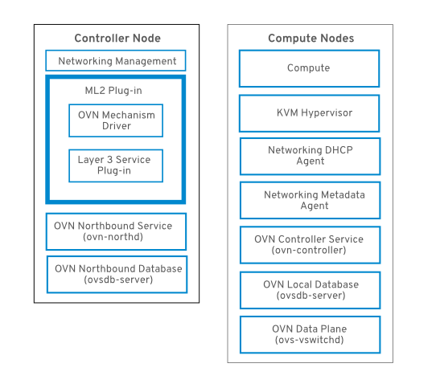

# Một số ghi chép về OVN - Open Virtual Network

## 1. Giới thiệu

Open Virtual Network (OVN) là một giải pháp Open vSwitch được dựa trên software-defined networking (SDN) để cung cấp các dịch vụ mạng cho các instance. OVN cung cấp các platform-agnostic hỗ trợ  full OpenStack Networking API. 

Yêu cầu phiên bản tối thiểu của OVS là 2.9

OVN chỉ được hỗ trợ trong môi trường HA, và nó được khuyến khích deploy cùng với distributed virtual routing (DVR).

Trong Openstack, OVN cung cấp các mạng ảo cho Open vSwitch và là một thành phần của Open vSwitch project. Project này cung cấp sự kết hợp giữa OpenStack Neutron và OVN.

Sự khác biệt cơ bản giữa ML2/OVS và ML2/OVN

| Detail | ml2/ovs | ml2/networking-ovn|
|---| ---| ---|
| agent/server communication | rabbit mq messaging + RPC. | ovsdb protocol on the NorthBound and SouthBound databases. |
| l3ha API | routers expose an “ha” field that can be disabled or enabled by admin with a deployment default. | routers don’t expose an “ha” field, and will make use of HA as soon as there is more than one network node available. |
| l3ha dataplane | qrouter namespace with keepalive process and an internal ha network for VRRP traffic. | ovn-controller configures specific OpenFlow rules, and enables BFD protocol over tunnel endpoints to detect connectivity issues to nodes. |
| DVR API | exposes the “distributed” flag on routers only modifiable by admin. | no “distributed” flag is shown or available on routers via API. |
| DVR dataplane | uses namespaces, veths, ip routing, ip rules and iptables on the compute nodes. | Uses OpenFlow rules on the compute nodes. |
| E/W traffic | goes through network nodes when the router is not distributed (DVR). | completely distributed in all cases. |
| Metadata Service | Metadata service is provided by the qrouters or dhcp namespaces in the network nodes. | Metadata is completely distributed across compute nodes, and served from the ovnmeta-xxxxx-xxxx namespace. |
| DHCP Service | DHCP is provided via qdhcp-xxxxx-xxx namespaces which run dnsmasq inside. | DHCP is provided by OpenFlow and ovn-controller, being distributed across computes. |
| Trunk Ports | Trunk ports are built by creating br-trunk-xxx bridges and patch ports. | Trunk ports live in br-int as OpenFlow rules, while subports are directly attached to br-int. |

## 2. Features

OVN cung cấp các virtual network services sau:

* Layer-2 (switching): Thay thế các thành phần tương tự với Open vSwitch agent
* Layer-3 (routing): Hỗ trợ distributed routing. Thay thế cho các thành phần Neutron L3 agent tương đương. Điều này hiển nhiên hỗ trợ L3HA :doc::routing dựa vào việc tích hợp giám sát BFD (Bidirectional Forwarding Detection) được tích hợp trong core của OVN.
* DHCP: Hỗ trợ distributed implementation, có thể triển khai trên nhiều server khác nhau. thay thế cho các Neutron DHCP agent. Mặc định thì sẽ không hỗ trợ tính năng DNS hoặc Metadata.
* DPDK: OVN và networking-ovn có thể sử dụng Linux kernel datapath hoặc DPDK datapath.
* Trunk driver: Sử dụng tính năng parent port và port tagging của OVN để hỗ trợ trunk service plugin. Bạn phải kích hoạt **trunk** service plugin để có thể sử dụng được tính năng này.
* VLAN tenant networks: networking-ovn driver hỗ trợ VLAN tenant networks khi sử dụng OVN bản 2.11 hoặc cao hơn.
* DNS: Mặc định đã được bật. Từ phiên bản 2.8 đã được tích hợp thêm DNS

Bidirectional Forwarding Detection (BFD) là một network protocol được sử dụng để phát hiện lỗi giữa hai ***forwarding engines*** được kết nối với nhau bởi một đường link. Nó cũng cấp khả năng phát hiện lỗi ngay cả trên các thiết bị vật lý không được hỗ trợ  failure detection với bất kỳ thể loại nào.

Các Neutron API extensions được hỗ trợ với OVN 
| Extension Name | Extension Alias |
|---|---|
| Allowed Address Pairs | allowed-address-pairs |
| Auto Allocated Topology Services | auto-allocated-topology |
| Availability Zone | availability_zone |
| Default Subnetpools | default-subnetpools |
| Multi Provider Network | multi-provider |
| Network IP Availability | network-ip-availability |
| Neutron external network | external-net |
| Neutron Extra DHCP opts | extra_dhcp_opt |
| Neutron Extra Route | extraroute |
| Neutron L3 external gateway | ext-gw-mode |
| Neutron L3 Router | router |
| Network MTU | net-mtu |
| Port Binding | binding |
| Port Security | port-security |
| Provider Network | provider |
| Quality of Service | qos |
| Quota management support | quotas |
| RBAC Policies | rbac-policies |
| Resource revision numbers | standard-attr-revisions |
| security-group | security-group |
| standard-attr-description | standard-attr-description |
| Subnet Allocation | subnet_allocation |
| Tag support | standard-attr-tag |
| Time Stamp Fields | standard-attr-timestamp |
| Domain Name System (DNS) | dns_integration |

## 3. Kiến trúc

Trong kiến trúc của OVN, OVS ML2 plugin sẽ được thay thế bởi OVN Modular Layer 2 (ML2) plugin để hỗ trợ Network API.

Kiến trúc của OVN bao gồm các thành phần và dịch vụ sau:

* **OVN ML2 plugin**

* **OVN Northbound (NB) database (ovn-nb)**: Lưu trữ các cấu hình logical OVN networking từ OVN ML2 plugin. DB này thường được chạy trên controller node và lắng nghe trên TCP port `6641`.

* **OVN Northbound service (ovn-northd)**: Converts các cấu hình logical networking từ OVN NB database tới logical data path flows và điền chúng vào OVN Southbound database. Service thường được chạy trên controller node.

* **OVN Southbound (SB) database (ovn-sb)**: Lưu trữ các logical data path flows đã được chuyển đổi. DB này thường được chạy trên Controller node và lắng nghe trên TCP port `6642`

* **OVN controller (ovn-controller)**: Kết nối với OVN SB database và hoạt động như  open vSwitch controller  để điều khiên và giám sát network traffic. Chạy trên tất cả các Compute và gateway node, nơi mà `OS::Tripleo::Services::OVNController` được định nghĩa.

* **OVN metadata agent (ovn-metadata-agent)**: Tạo các haproxy instances để quản lý OVS interfaces, network namespaces và HAproxy processes được sử dụng làm proxy cho các metadata API requests. Agent chạy trên tất cả các compute và gateway node, nơi mà `OS::TripleO::Services::OVNMetadataAgent` được định nghĩa.

Hardware layout khi triển khai với OVN

Service layout

Networking service with OVN integration

## Tham khảo 

[1] http://www.openvswitch.org/support/dist-docs/ovn-architecture.7.html

[2] https://docs.openstack.org/networking-ovn/latest/admin/routing.html

