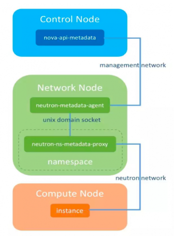
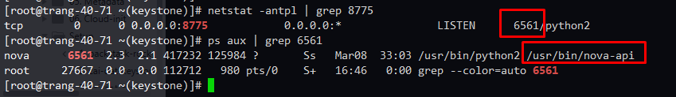
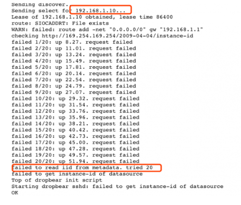
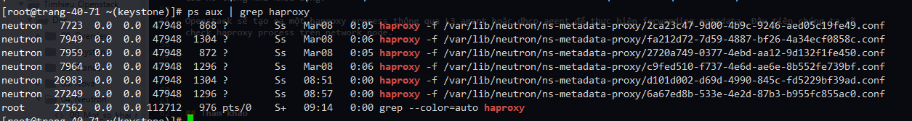
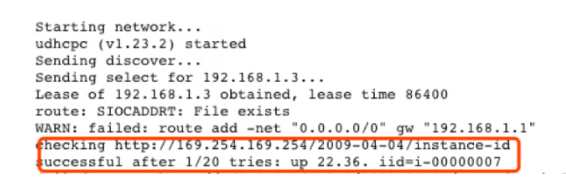
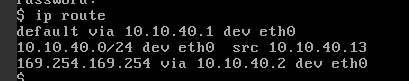
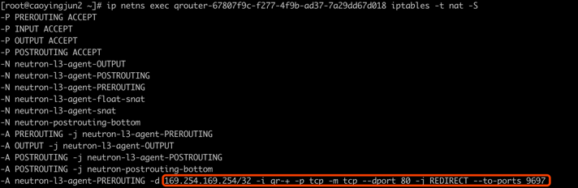

## OPENSTACK METADATA SERVICE ANALYSIS

### 1. Giới thiệu metadata

OpenStack Metadata Service là một dịch vụ cung cấp các thông tin cấu hình cho các instance (các thông tin này gọi chung là metadata). Khi instance khởi động, nó yêu cầu và thu thập các metadata của chính nó như IP, Hostname, SSH keys, thông tin routing,... từ Metadata Service. Cloud-init của instance được cá nhân hóa theo metadata.

Cloud-init là một dịch vụ trong Openstack hoàn toàn khác biệt với metadata service. Nó sẽ dùng metadata service để truyền cho máy ảo các tùy chọn cấu hình khi khởi động lần đầu.

### 2. Cấu trúc của Metadata Service 



**Nova-api-metadata**

Nova-api-metadata là một service con của service Nova-api. Nó là nơi cung cấp metadata. Khi một Vm được khởi động, bạn có thể chọn các metadata thông qua REST API của nova-api-metadata.

nova-api-metadata service chạy trên controller node với port là 8775 (có thể được sửa đổi bởi cấu hình của nova).



nova-api-metadata được gộp với nova-api service. Bạn có thể enable nova-api-metadata qua tùy chọn `enabled_apis`  trong file `nova.conf`

	enabled_apis = osapi_compute,metadata

**Neutron-metadata-agent**

Nova-api-metadata sẽ đi qua management network và virtual machine thì đi qua business network, vậy nên VM sẽ không thể kết nối trực tiếp được với nova-api-metadata. Lúc đó, nó sẽ cần sử dụng tới neutron-metadata-agent service đang chạy trên network node.

Trên network node chạy hai thành phần l3 agent và dhcp agent, chúng sẽ tạo ra một tiến trình haproxy, chạy trong các namespace tương ứng của chúng, nhận các metadata request từ các VM, và forward request tới Unix Domain Socket. Neutron-metadata-agent service sau đó sẽ chuyển tiếp tới nova-api-metadata.

Toàn bộ quá trình được tóm tắt như sau:

1. Instance gửi metadata request tới router hoặc haproxy process được tạo bởi dhcp agent.

2. Haproxy process gửi request tới neutron-metadata-agent qua Unix Domain Socket.

3. Neutron-metadata gửi request tới nova-api-metadata service thông qua internal management network

**Neutron-ns-metadata-proxy**

Neutron-ns-metadata-proxy được tạo bởi dhcp agent và l3 agent (nó chạy trên namespace nơi chứa dhcp-agent hoặc router). 

Neutron-ns-metadata-proxy được kết nối trực tiếp với neutron-metadata-agent thông qua unix domain socket.

### 3. L3 agent or DHCP agent

Như đã đề cập ở trên, cả L3 agent và dhcp agent có thể tạo một haproxy process để thực hiện chuyển tiếp metadata requests. Vậy làm thế nào để chọn một trong hai giải pháp này?

Trong thực tế, chúng có thể hoạt động độc lập hoặc cùng tồn tại. Nhưng việc thực hiện truy cập vào metadata của l3-agent và dhcp-agent là khác nhau. Ví dụ khi có metadata request, l3-agent sẽ thực hiện forwarded sử dụng iptables rule, còn dhcp-agnet sẽ cấu hình IP này vào một interface riêng của chúng.

### 4. L3 agent implementation analysis

Thực hiện tạo một mạng test1, bật dhcp, tạm thời sẽ không kết nối tới router, sau đó khởi động instance, và sau đó quan sát log của instance.



Từ log khởi động của máy ảo như trên, chúng ta có thể thấy, sau khi instance lấy ip từ dhcp, và gửi request request 169.254.169.254, nhưng fails 20 lần.

Vậy chính xác thì `169.254.169.254` là cái gì? Địa chỉ ip này chính là ip của metadata service, và instance sẽ gửi metadata request tới nó trong khi khởi động.

Openstack sẽ tạo ra một haproxy process thông qua L3 agent hoặc dhcp agent để thực hiện forwarding metadata. Đâu tiên chúng ta sẽ check haproxy process trên network node sẽ không tìm thấy tiến trình haproxy đang chạy, đều này sẽ giải thích nguyên nhân instance fail. Nhưng điều gì đã xảy ra?

Nguyên nhân sau xa: Mặc định thì haproxy process được tạo bởi L3 agent (dhcp agent đang tắt). Vì mạng hiện tại là `test1` đang không được kết nối với router nên haproxy process không được tạo ra

Tạo ra một router và gắn mạng `test1` vào router, sau đó kiểm tra lại thì thấy tiến trình haproxy đang chạy trên network node.



Khởi động lại instance, sau đó xem log của nó, ta sẽ thấy VM đã thu thập metadata thành công từ 169.254.169.254.



Quá trình lấy metadata của máy ảo:

1. Sau khi máy ảo khởi động xong, nó sẽ tạo ra một metadata request tới port 80 của địa chỉ `169.254.169.254`

Các bạn có thể xem định tuyến của máy ảo thì sẽ thấy nó được định tuyến như thế nào để có thể lấy được metadata.



Request sẽ được gửi đi từ eth0 của instance và gửi tới qr-device trên router.

2. Metadata request sẽ được định tuyến đi vào PREROUTING chain, và địa chỉ đích là 169.254.169.254, vào port `qr-port` port đích sẽ là 80 và được chuyển hướng tới 9697, vì khi haproxy process được tạo bởi router đang lắng nghe trên port 9697



3. Haproxy process chuyển tiếp các request tới neutron-metadata-agent qua Unix Domain Socket, lần lượt chuyển tiếp nó tới nova-api-metadata thông qua management gateway.

### 5. DHCP agent implementation analysis

Mặc định OpenStack quản lý các việc triển khai metadata thông qua L3-agent, và sau đó kết nối với nova-api-metadata. Tuy nhiên, không phải tất cả các môi trường đều có L3 agents. Các môi trường không có L3 agent có thể thực hiện lấy được metadata bằng cách sử dụng DHCP agent.

1. Đầu tiên, cấu hình tùy chọn `force_metadata = True` trong file `/etc/neutron-/dhcp_agent.ini`, sau đó khởi động lại dchp agent.

2. Kiểm tra haproxy process trên network node

```sh
[root@trang-40-71 ~(keystone)]# ps aux | grep haproxy
neutron   7723  0.0  0.0  47948   868 ?        Ss   Mar08   0:06 haproxy -f /var/lib/neutron/ns-metadata-proxy/2ca23c47-9d00-4b9c-9246-aed05c19fe49.conf
neutron   7949  0.0  0.0  47948  1304 ?        Ss   Mar08   0:06 haproxy -f /var/lib/neutron/ns-metadata-proxy/fa212d72-7d59-4887-bf26-4a34ecf0858c.conf
neutron   7959  0.0  0.0  47948   872 ?        Ss   Mar08   0:05 haproxy -f /var/lib/neutron/ns-metadata-proxy/2720a749-0377-4ebd-aa12-9d132f1fe450.conf
neutron   7964  0.0  0.0  47948  1296 ?        Ss   Mar08   0:06 haproxy -f /var/lib/neutron/ns-metadata-proxy/c9fed510-f737-4e6d-ae6e-8b552fe739bf.conf
neutron  26983  0.0  0.0  47948  1304 ?        Ss   08:51   0:00 haproxy -f /var/lib/neutron/ns-metadata-proxy/d101d002-d69d-4990-845c-fd5229bf39ad.conf
neutron  27249  0.0  0.0  47948  1296 ?        Ss   08:57   0:00 haproxy -f /var/lib/neutron/ns-metadata-proxy/6a67ed8b-533e-4e2d-87b3-b955fc855ac0.conf
root     28286  0.0  0.0 112712   980 pts/0    S+   10:06   0:00 grep --color=auto haproxy
```

Ở đây có thể tìm thấy network với dhcp được bật sẽ tạo ra một haproxy process tương ứng và cấu hình `169.254.169.254`  trên dhcp port tương ứng.

```sh
[root@trang-40-71 ~(keystone)]# ip netns exec qdhcp-2720a749-0377-4ebd-aa12-9d132f1fe450 ip a
1: lo: <LOOPBACK,UP,LOWER_UP> mtu 65536 qdisc noqueue state UNKNOWN group default qlen 1000
    link/loopback 00:00:00:00:00:00 brd 00:00:00:00:00:00
    inet 127.0.0.1/8 scope host lo
       valid_lft forever preferred_lft forever
    inet6 ::1/128 scope host 
       valid_lft forever preferred_lft forever
20: tap01e7ee7b-98: <BROADCAST,MULTICAST,UP,LOWER_UP> mtu 1500 qdisc noqueue state UNKNOWN group default qlen 1000
    link/ether fa:16:3e:54:93:88 brd ff:ff:ff:ff:ff:ff
    inet 169.254.169.254/16 brd 169.254.255.255 scope global tap01e7ee7b-98
       valid_lft forever preferred_lft forever
    inet 192.168.40.121/24 brd 192.168.40.255 scope global tap01e7ee7b-98
       valid_lft forever preferred_lft forever
    inet6 fe80::f816:3eff:fe54:9388/64 scope link 
       valid_lft forever preferred_lft forever
```

3. Khởi động lại máy ảo, máy ảo sẽ gửi metadata requests tới port 80 của `169.254.169.254`. Theo internal route của instance, request sẽ đi tới dhcp_port.

4. Metadata request tới dhcp namespace, ở đây nó sẽ được giám sát bởi haproxy process (haproxy process lắng nghe trên port 80 trong dhcp namespace)

5. Giống với L3 agent, haproxy process sẽ chuyển tiếp request tới neutron-metadata-agent qua Unix Domain Socket, và chuyển tiếp lần lượt tới nova-api-metadata thông qua management gateway.

### 6. Instance làm thế nào để có thể lấy metadata của chúng:

Để lấy được metadata từ nova-api-metadata, bạn sẽ cần phải có ID cụ thể của instance. Khi instance được khởi động, nó sẽ không thể biết ID của chính nó, vậy nên http request sẽ không bao gồm ID. instance ID sẽ đươc thêm vào từ neutron-metadata-agent, ví dụ L3 agent và DHCP agent.

**Quá trình lấy metadata của instance được miêu tả như sau:**

Instance -> haproxy-> neutron-metadata-agent -> nova-api-metadata

* **L3 agent:**

	* Haproxy process chấp nhận metadata request và add ip, router id vào http header trước khi chuyển tiếp nó đến neutron-metadata-agent.
	* Sau khi neutron-metadata-agent nhận được request, nó sẽ query ID của instance, sau đó thêm instance id vào http header và forward tới nova-api-metadata.
	* Nova-api-metadata phản hổi lại request tới instance.

* **DHCP agent**

	*  Haproxy process chấp nhận metadata request và add ip, network id vào http header trước khi chuyển tiếp nó tới neutron-metadata-agent.
	* Sau khi neutron-metadata-agent nhận được request, nó sẽ query ID của instance, sau đó thêm instance id vào http header và chuyển tiếp nó tới nova-api-metadata.
	* Nova-api-metadata phản hồi lại request cho instance

Với cách như này thì bất kể một instance nào gửi request tới l3-agent or dhcp-agent thì nova-api-metadata cũng đều có thể nhận ra ID của instance và trả về đúng metadata của instance đó.


## Tham khảo

[1] http://www.99cloud.net/10213.html%EF%BC%8F

[2] https://docs.openstack.org/nova/latest/admin/networking-nova.html#metadata-service

