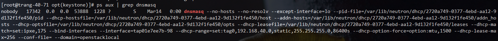
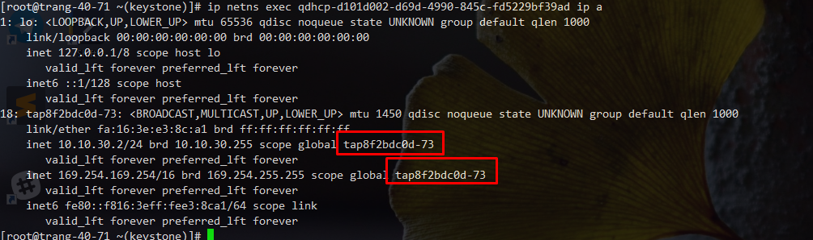
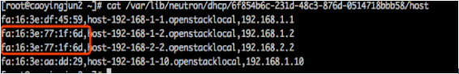
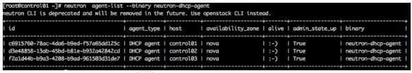
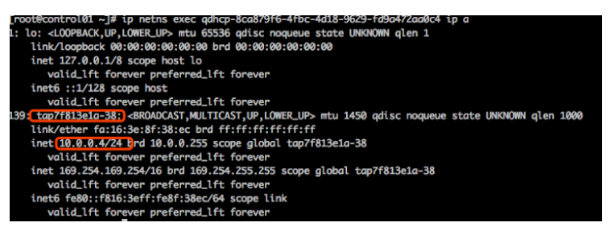
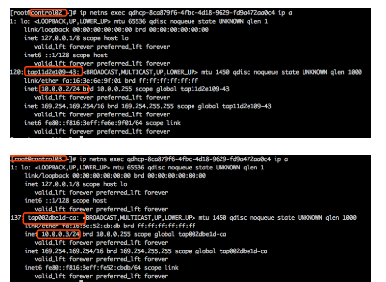
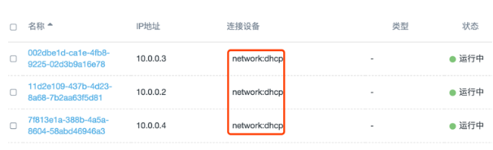

# DHCP trong Openstack

### 1. DHCP - Dynamic Host Configuration Protocol

DHCP là một giao thức mạng LAN. DHCP server điều khiển một khoảng các địa chỉ IP, và sẽ từ động cấp IP và subnetmask cho các client kết nối tới. 

### 2. Workflow

**Discover phase**: 

Khi DHCP client khởi động, ban đầu sẽ không có IP, client tự động gửi một gói tin `broadcast` ra toàn mạng (kèm theo thông tin về MAC). DHCP server nhận được sẽ phản hổi lại packet đó để client biết đâu là DHCP server.

**The Offer phase**:

Sau khi DHCP server lắng nghe DHCp discover broadcast packet được gửi bởi client, DHCP server sẽ kiểm tra một cái bảng (lease table) chứa các địa chỉ IP và địa chỉ MAC đã được cấp phát cho các client khác, để chọn ra một IP chưa được ai sử dụng và vẫn nằm trong vùng địa chỉ nó quản lý. Sau đó đóng gói vào một gói tin offer rồi gửi broadcast phản hồi lại cho client.

**Accepting the IP lease phase**

Nếu client nhận được nhiều phản hổi từ nhiều DHCP server trên mạng thì nó sẽ chọn một DHCP offer packet đầu tiên để mở gói và phân tích. Sau đó client sẽ gửi một gói tin ARP để check xem liệu rằng IP này đã tồn tại trong mạng chưa. Nếu nó đẫ được sử dụng thì client sẽ gửi lại một DHCP Decline message để từu chối tới DHCP server mà nó nhận được gói tin đó, và gửi lại một Discover message.

Nếu client check được Ip vẫn chưa được sử dụng, một tin nhắn Request message sẽ được broadcast để báo với tất cả các server biết là client đã chấp nhận IP của server nào.

**Confirmation phase**

Sau khi nhận được request message từ client, DHCP server sẽ gửi một DHCP ACK để xác nhận message bao gồm IP và các cài đặt khác được cung cấp bởi client, báo với client được sử dụng IP address được cung cấp bởi client, và client nhận message đó. Sau ACK packet, giao thức TCP/IP sẽ được liên kết với card mạng.

**Re-login**:

Khi một client vào lại mạng, nó sẽ broadcast trực tiếp request một yêu cầu chính địa chỉ IP trước đó của nó. Khi server nhận được message đó, nó sẽ cố gắng cho phép client sử dụng IP cũ đó và trả lời lại cho client một tin nhắn DHCP ACK confirmation. Nếu IP đó không thể cấp lại cho client, server sẽ phản hồi lại một NACK từ chối message tới client. Khi client nhận được phản hồi từ chối từ server, nó sẽ phải gửi lại một gói tin DHCP discover  để xin cấp lại một IP mới.

**Update lease:**

Địa chỉ IP được cung cấp bởi DHCP như một bản hợp động cho thuê (a lease), sau khi nó hết hạn, DHCP server sẽ thu hôi lại địa chỉ IP này. Vì vậy, nếu DHCP client muốn tiếp tục sử dụng IP đó, nó phải cập nhật thêm thời gian sử dụng IP như kiểu gia hạn thêm hợp động vậy. Khi sử dụng được một nửa thời gian, một DHCP request được phát hành. Nếu DHCP server không xác nhận trong khoảng thời gian này thì client có thể tiếp tục sử dụng IP trong thời gian thuê còn lại là một nửa còn lại. Lúc đó (tức là khoảng 75% của thời hạn), nếu nó không được xác nhận thì client sẽ không thể tiếp tục sử dụng IP sau khi hợp động của nó hết hạn.

### 3. neutron-dhcp-agent overview

Khi Openstack tạo một máy ảo, nó sẽ tự động cấp phát một địa chỉ IP cho  máy ảo thông qua neutron's DHCP service. Thành phần của Neutron cung cấp DHCP là neutron-dhcp-agent service chạy trên network node.

**The configuration file**

File cấu hình của DHCP service được đặt trên network node: `/etc/neutron/dhcp_agent.ini`

**Dhcp_driver**

Mặc định `dnsmasq` được sử dụng để thực hiện chức năng DHCP

`Ovs_integration_bridge`: Interface của DHCP được kết nối tới br-int của ovs

`Interface_driver`: Mặc định ovs đươc sử dụng để quản lý các interface của máy ảo.

Khi tạo network và kích hoạt tính năng dhcp của subnet tương ứng, neutron sẽ bắt đầu một tiến trình dnsmasq trên network node để cung cấp DHCP service cho network 



Giải thích một số tham số lệnh quan trong của dnsmasq:

* `interface`: dnsmasq được sử dụng để lắng nghe DHCP request/response port để cung cấp DHCP service.

* `dhcp-hostsfile`: File này để lưu trữ thông tin về DHCP host. Từ file này, dnsmasq sẽ biết được port nào tương đương với địa chỉ mac nào.

**Network namespace**

Neutron cung cấp DHCP cho mỗi network thông qua namespace, cho phép các tenants tạo ta các overlapping networks.

Các namespace tương ứng với mỗi DHCP được đặt tên là qdhcp-network_id và có thể xem thông qua lệnh `ip netns` trên network node. 

```sh
[root@trang-40-71 ~(keystone)]# ip netns
qrouter-2ca23c47-9d00-4b9c-9246-aed05c19fe49 (id: 5)
qdhcp-fa212d72-7d59-4887-bf26-4a34ecf0858c (id: 4)
qdhcp-6a67ed8b-533e-4e2d-87b3-b955fc855ac0 (id: 3)
qdhcp-d101d002-d69d-4990-845c-fd5229bf39ad (id: 2)
qdhcp-2720a749-0377-4ebd-aa12-9d132f1fe450 (id: 0)
qdhcp-c9fed510-f737-4e6d-ae6e-8b552fe739bf (id: 1)

[root@trang-40-71 ~(keystone)]# ip netns exec qdhcp-d101d002-d69d-4990-845c-fd5229bf39ad ip a
1: lo: <LOOPBACK,UP,LOWER_UP> mtu 65536 qdisc noqueue state UNKNOWN group default qlen 1000
    link/loopback 00:00:00:00:00:00 brd 00:00:00:00:00:00
    inet 127.0.0.1/8 scope host lo
       valid_lft forever preferred_lft forever
    inet6 ::1/128 scope host 
       valid_lft forever preferred_lft forever
18: tap8f2bdc0d-73: <BROADCAST,MULTICAST,UP,LOWER_UP> mtu 1450 qdisc noqueue state UNKNOWN group default qlen 1000
    link/ether fa:16:3e:e3:8c:a1 brd ff:ff:ff:ff:ff:ff
    inet 10.10.30.2/24 brd 10.10.30.255 scope global tap8f2bdc0d-73
       valid_lft forever preferred_lft forever
    inet 169.254.169.254/16 brd 169.254.255.255 scope global tap8f2bdc0d-73
       valid_lft forever preferred_lft forever
    inet6 fe80::f816:3eff:fee3:8ca1/64 scope link 
       valid_lft forever preferred_lft forever
```

Ở đây bạn có thể thấy địa chỉ ip đưuọc cấu hình cho `tap8f2bdc0d-73` trong namespace của network. Device `tap8f2bdc0d-73` là port được kết nối với `br-int` và `dnsmasq` lắng nghe port để cung cấp dịch vụ dhcp cho các mạng tương ứng.


### 4. OpenStack DHCP acquisition ip process analysis

Khi tạo một máy ảo mới VM1, Neutron sẽ chỉ định port cho VM và đồng bộ thông tin về địa chỉ MAC, IP tới host file của dnsmasq. Ví dụ một host file: 

```sh
[root@trang-40-71 ~(keystone)]# cat /var/lib/neutron/dhcp/c9fed510-f737-4e6d-ae6e-8b552fe739bf/host 
fa:16:3e:af:b2:4d,host-10-10-20-1.openstacklocal,10.10.20.1
fa:16:3e:65:1c:64,host-10-10-20-2.openstacklocal,10.10.20.2
```

Cùng lúc đó, nova-compute sẽ sinh ra một file xml của instance đó, trong đó cấu hình mạng như sau:

```sh
[root@trang-40-72 ~]# virsh edit instance-00000043
...
<interface type='bridge'>
      <mac address='fa:16:3e:ed:e8:9b'/>
      <source bridge='qbr226cbd2d-8c'/>
      <target dev='tap226cbd2d-8c'/>
      <model type='virtio'/>
      <driver name='qemu'/>
      <mtu size='1500'/>
      <address type='pci' domain='0x0000' bus='0x00' slot='0x03' function='0x0'/>
    </interface>
...
```

### 5. The virtual machine starts for the first time

1. Khi máy ảo VM1 khởi động, nó sẽ gửi một dhcpdiscover broadcast packet, gửi tới toàn bộ các máy trong mạng (VLAN)

2. dhcpdiscover broadcast message sẽ đi tới tap8f2bdc0d-73, nơi dnsmasq đang lắng nghe trên đó, dnsmasq sẽ kiểm tra host file của network đó và tìm option tương ứng, dnsmasq sẽ dử dụng dhcpoffer message với thông tin về ip, netmask gửi cho VM1.

3. Máy ảo VM1 sẽ gửi một dhcprequest broadcast message để xác nhận rằng mình đã đồng ý với dhcpoffer message.

4. dnsmasq gửi một dhcpack message để thông báo dhcprequest message của VM1 đã được xác nhận. Sau đó VM1 sẽ nhận dhcpack message, nó bắt đầu sử dụng ip đó và kết thúc toàn bộ quá trình.

5. Vm1 sẽ tạo ra một arp broadcast, để tìm địa chỉ mac của gateway (địa chỉ gateway được chỉ định khi mạng được tạo ra, thường sẽ là x.x.x.1, có thể sẽ không giống với gateway được binds vào route của VM)

6. VM1 kết nối với địa chỉ 169.254.169.254 (metadata service)

7. VM1 gửi một icmp tới gateway, sau khi xác nhận thành công sẽ kết thúc quá trình.


### 6. Virtual machine restart process

1. Khi máy ảo khởi động lại, VM1 sẽ sử dụng địa chỉ cuối cùng broadcast trực tiếp và gửi dhcprequest message để có thể tiếp tục sử dụng IP tương ứng. Sau khi dnsmasq đồng ý yêu cầu, nó sẽ gửi một dhcpack message để xác nhận, vm1 nhận dhcpack message và tiếp tục sử dụng lại IP đó.

2. Vm1 sẽ tạo ra một arp broadcast, để tìm địa chỉ mac của gateway

3. VM1 kết nối với địa chỉ 169.254.169.254 (metadata service)

4. VM1 gửi một icmp tới gateway, sau khi được xác nhận thì kết thúc toàn bộ quá trình.

### 7.  There are multiple subnet scenarios in the Network

1. Trong trường hợp có nhiều subnets trong mạng và chức năng dhcp được bật, neutron sẽ cấu hình nhiều địa chỉ ip tương ứng cho các tap device của nó (network:dhcp port) trong network namespace.



2. Cùng lúc đó, cập nhật lại dhcp host file thông qua neutron database (2 địa chỉ ips được cấu hình trên có cùng địa chỉ mac)



3. Cuối cùng khởi động lại tiên trình dnsmasq trên network node, cập nhật lại các thông số về dhcp-range, dhcp hostfile, và làm cho tiến trình chạy trên nhiều dhcp-range để chạy trên một mạng, nhiều subnet dhcp service

### 8. the virtual machine access through the domain name

Dnsmasq là một phần mềm mã nguồn mở, hô trợ cả DHCP và DNS. Neutron cung cấp Dnsmasq để hỗ trợ phân giải domain name của máy ảo trong network đó.

1. Khi tạo VM1, Neutron sẽ chỉ định port cho nó và đồng bộ domain name và địa chỉ ip lên host file của dnsmasq.

```sh
[root@trang-40-71 ~(keystone)]# cat /var/lib/neutron/dhcp/2720a749-0377-4ebd-aa12-9d132f1fe450/host 
fa:16:3e:54:93:88,host-192-168-40-121.openstacklocal,192.168.40.121
fa:16:3e:d4:aa:0b,host-192-168-40-125.openstacklocal,192.168.40.125
fa:16:3e:4d:d2:19,host-192-168-40-128.openstacklocal,192.168.40.128
fa:16:3e:98:34:07,host-192-168-40-123.openstacklocal,192.168.40.123
fa:16:3e:ed:e8:9b,host-192-168-40-124.openstacklocal,192.168.40.124
fa:16:3e:64:4c:a3,host-192-168-40-126.openstacklocal,192.168.40.126
fa:16:3e:48:aa:77,host-192-168-40-122.openstacklocal,192.168.40.122
```

2. Ví dụ, ta có thể thấy domain name tương ứng với 192.168.40.121 là `host-192-168-40-121.openstacklocal`, suffix name mặc định là openstacklocal. Nếu bạn muốn thay đổi nó, bạn phải thay đổi trong neutron.conf.

```sh
# Domain to use for building the hostnames (string value)
#dns_domain = openstacklocal
```

3. Khi máy ảo khởi động, neutron sẽ cập nhật file `/etc/resolv.conf` của máy ảo và sử dụng địa chỉ IP của dhcp port như domain name server address (dnsmasq lắng nghe từ địa chỉ này), vì vậy có thể thực hiện chức năng dns.

### 9. DHCP HA implementation analysis

Yêu cầu:

* Đã triển khai DHCP agent. DHCP đang được chạy trên network node và có status OK (lấy 3 node mạng để ví dụ):



1. Tạo một mạng, neutron sẽ tạo một network namesapce tương ứng trên tất cả các network node (các node chạy dhcp-agent), tap device, cấu hình ip của dhcp port, mỗi network node sẽ khởi chạy một chương trình dnsmasq để monitoring các tap device tương ứng, được sử dụng để cung cấp dhcp service.





2. Trên horizon bạn cũng có thể nhìn thấy network được khởi chạy với 3 dhcp port



3. Khi tạo một VM, Neutron sẽ chỉ định port cho nó. Với trường hợp HA, thông tin về mac và ip sẽ được cập nhật trong host file của tất cả các node. Hay nói các khác, host file sẽ được sử dụng bởi tất cả các network node là hoàn toàn giống nhau.

4. Khi một VM được khởi động, nó broadcasts và gửi dhcpdiscover packets vào mạng. Tap devices của mạng sẽ nhận packet, vậy nên tất cả các dnsmasq sẽ phản hồi dhcpoffer response.

* Trường Yiaddr trong dhcpoffer message là một địa chỉ được chỉ định cho VM.

* Tùy chọn trong dhcpoffer packet sẽ được đặt trong địa chỉ ip của dnsmasq.

5. VM gửi một dhcprequest reply trả lời lại dhcpoffer message đầu tiên mà nó nhận được trong khi broadcast. dhcprequest message sẽ bao gồm dnsmasq ip, vậy nên chỉ dnsmasq tương ứng mới gửi dhcpack message. Thông tin về việc thuê ip sẽ được xác nhận. Sau đó nếu dnsmasq nhận được message thì nó sẽ không xử lý.

6. Sau khi nhận được dhcpack acknowledgment message, VM sẽ kiểm tra xem ip nhận được có thể sử dụng hay không. Nếu có thể thì cập nhật thông tin và bắt đầu xử dụng ip


## Dịch từ bài:

http://www.99cloud.net/10262.html%EF%BC%8F