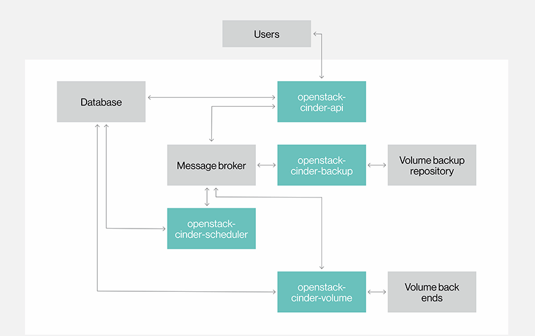

# Cinder - OpenStack Block Storage

**MỤC LỤC**

[1. Tổng quan về Cinder](#overview)

[2. Kiến trúc của Cinder](#arch)

[3. Các thành phần](#tp)

[4. Ephemeral Boot Disk và Volume Boot Disk](#disk)

[Tham khảo](#refer)

## 1. Tổng quan về Cinder

Cinder hay Block Storage service là một dịch vụ cung cấp các thiết bị lưu trữ các block cho các máy instance. Cách thức lưu trữ được quy định bởi một Block Storage driver hoặc nhiều drivers trong trường hợp multi-backend được cấu hình. Một số các drivers có sẵn như: NAS/SAN, NFS, iSCSI, Ceph,...

Nó được thiết kế với khả năng lưu trữ dữ liệu mà người dùng cuối có thể sử dụng bởi NOVA. Nó có thể được sử dụng thông qua các reference implementation (LVM) hoặc các plugin driver dành cho lưu trữ.

Cinder có các tính năng lưu trữ cơ bản như replication, quản lý snapshot và volume clone. Tuy nhiên, OpenStack Cinder là một lớp trừu tượng để quản lý lưu trữ, một người dùng sẽ không thể thực hiện một tính năng hay chức năng của một driver hoặc một hệ thống lưu trữ nhất định trừ khi các nhà cung cấp làm cho cho các tính năng đó khả dụng thông qua các trình điều khiển của riêng nó.

## 2. Kiến trúc của Cinder

OpenStack Block Storage service duy trì việc lưu trữ liên tục vào một máy ảo. Block Storage cung cấp một hạ tầng cho việc quản lý các volumes và kết nối tới Compute để cung cấp các volumes cho instances. Cinder cũng cung cấp việc quản lý các volume snapshots và volume types.

Block Storage service bao gồm các thành phần:

* **cinder-api**: Là một ứng dụng WSGI chấp nhận các api request tới và định tuyến chúng tới cinder-volume

* **cinder-volume**: Kết nối trực tiếp tới Block Storage service và các quy trình như **cinder-scheduler**, tương tác với các thành phần khác thông qua message queue. **cinder-volume** service phản hồi lại để đọc, ghi các requests được gửi tới cho Block Storage để duy trì trạng thái. Nó cũng có thể liên kết với nhiểu nhà cung cấp storage thông qua kiến trúc driver.

* **cinder-scheduler daemon**: Chọn ra storage provider node tối ưu.để tạo volume trên đó. Tương tự như thành phần của Nova là nova-scheduler.

* **cinder-backup daemon**: **cinder-backup** service cung cấp việc backup volume cho bất cứ loại backup storage provider. Tương tự như **cinder-volume**

* **Messaging queue**: định tuyến thông tin giữa các tiến trình của Block Storage 

## 3. Các thành phần

Block Storage service bao gồm các thành phần sau:

* **Back-end Storage Devices**: Block Storage service yêu cầu một vài thứ từ back-end storage, dịch vụ sẽ được built lên từ đó. Mặc định sẽ sử dụng LVM trên local volume group có tên là `cinder-volumes`. Ngoài ra, Block Storage  service cũng cung cấp cách để hỗ trợ thêm các storage device khác sẽ đưuọc sử dụng như các external Raid Arrays hoặc các thiết bị storage khác. Các back-end storage devices có thể phải custom block sizes khi sử dụng KVM hoặc QEMU như hypervisor.

* **User và Project** Cinder được dùng bởi các người dùng hoặc khách hàng khác nhau, sử dụng để chỉ định các truy cập dựa vào role (role-based access). Các role kiểm soát các hành động mà người dùng được phép thực hiện. Trong cấu hình mặc định, phần lớn các hành động không yêu cấu một role cụ thể, nhưng người quản trị có thể cấu hình trong file `policy.json` để quản lý các rule. Một truy cập của người dùng có thể bị hạn chế bởi project, nhưng username và pass đưuọc chỉ định gán cho mỗi user. Key pairs cho phép truy cập tới một volume được mở cho mỗi user, nhưng quota để kiểm soát sự tiêu thụ tài nguyên trên các phần cứng có sẵn là cho một project. Với các project, quota controls có thể giới hạn:

	* Số lượng volume có thể được tạo
	* Số lượng snapshot có thể được tạo
	* Tổng số lượng tính bằng GB được cho phép trên một tenant (tính cho cả các snapshots và volumes).

* **Volume, Snapshot và backup**

	* **Volume**: Các tài nguyên block storage được phân phối có thể gán vào máy ảo như một ổ lưu trữ thứ 2 hoặc có teher dùng như vung lưu trữ cho root để boot máy ảo. Volume là các thiết bị block storage R/W bền vững thường được dùng để gán vào compute node thông qua iSCSI. 

	* **Snapshot**: Một bản copy trong một thời nhất định của một volume. Snapshot có thể được tạo từ một volume mà mới được dùng gần đây trong trạng thái sẵn sàng. Snapshot có thể được sử dụng để tạo một volume mới thông qua việc tạo từ snapshot.

	* **Backup**: Một bản copy lưu trữ 

## 4. Ephemeral Boot Disk và Volume Boot Disk

### 4.1 Các cách boot một máy ảo

Trong openstack có nhiều cách để tạo ổ đĩa cho máy ảo:

* Image : Khởi chạy instance sử dụng image chạy trên ephemeral disk hoặc volume disk
* Instance Shapshoot : khởi chạy instance từ một bản snapshot trên một ephermeral disk hoặc volume disk
* Volume : Khởi chạy instance từ một bootable volume đã tồn tại
* Volume Snapshot : Khởi tạo một volume mới từ volume snapshot và chạy instance mới sử dụng bootable volume mới

### 4.2 Ephemeral boot disk

**Ephemeral boot disk** là một disk ảo cho mục đích duy nhất là để boot máy ảo hay còn được coi là disk tạm thời. Nó được sử dụng trong trường hợp không quan trọng về việc mất dữ liệu hay không khi máy ảo bị xóa. 

Đặc tính của ephemeral disk: 

* Không sử dụng tới volume quota, số lượng ephemeral disk không bị giới hạn về số lượng, bạn có thể thoải mái boot máy ảo từ kiểu disk này ngay cả khi volume quota đã hết.

* Bị xóa khi VM bị xóa, dữ liệu trong disk này sẽ bị mất khi xóa máy ảo

* Có thể snapshot ()

### 4.3 Volume boot disk

**Volume** là dạng lưu trữ bền vững hơn **ephemeral disk** và có thể dùng để boot như là một block device có thể mount được.

**Volume boot disk** hữu dụng khi bạn cần duplicate một vm hoặc backup chúng bằng cách snapshot, cần có đủ quota cho các vm cần boot.

Đặc tính của Volume disk:

* Có thể snapshot
* Không bị xóa khi xóa máy ảo, bạn có thể xóa máy ảo nhưng dữ liệu lưu trữ trên volume vẫn còn.
* Có sử dụng volume quota: volume quota sẽ được sử dụng khi sử dụng volume disk.

## Tham Khảo

[1] https://searchstorage.techtarget.com/definition/Cinder-OpenStack-Block-Storage

[2] https://docs.openstack.org/cinder/rocky/configuration/block-storage/block-storage-overview.html

[3] https://docs.openstack.org/cinder/rocky/drivers.html
