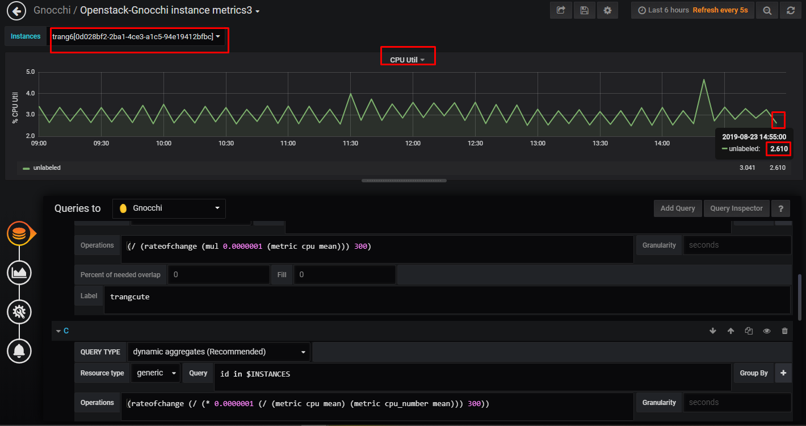

## Ghi chú một số câu lệnh thường dùng

Các câu lệnh liệt kê và xem chi tiết các metric, resources

```sh
[root@trang-40-71 ~(openstack)]$ openstack metric resource list --type instance -c id -c type
+--------------------------------------+----------+
| id                                   | type     |
+--------------------------------------+----------+
| d4c31e31-a22b-4c31-8448-8575338acff1 | instance |
| 8e99315c-dd44-47b6-be9d-bcaded1f7777 | instance |
| 227a1235-b968-45ff-ac22-8f767a88dcb1 | instance |
| e729aa60-1a9a-417c-999e-8e5f0014fdb2 | instance |
| 211b4ce8-4764-4aec-8c50-b41ac32302b6 | instance |
| 9208c1f0-2f14-4bf9-8e6e-706fc47a0391 | instance |
| 130afa65-40de-4f1f-bd81-9c5cc1ea33a4 | instance |
+--------------------------------------+----------+
[root@trang-40-71 ~(openstack)]$ openstack metric resource show 130afa65-40de-4f1f-bd81-9c5cc1ea33a4
+-----------------------+---------------------------------------------------------------------+
| Field                 | Value                                                               |
+-----------------------+---------------------------------------------------------------------+
| created_by_project_id | ec8e8a9ebc554743aadb551a64466c98                                    |
| created_by_user_id    | e3404957dd1849b288efb0b1fa96efbf                                    |
| creator               | e3404957dd1849b288efb0b1fa96efbf:ec8e8a9ebc554743aadb551a64466c98   |
| ended_at              | None                                                                |
| id                    | 130afa65-40de-4f1f-bd81-9c5cc1ea33a4                                |
| metrics               | compute.instance.booting.time: 6e24def2-e72f-4b3d-b3ce-213cf3ddb073 |
|                       | cpu: 659c40bb-d256-49fa-ab7e-e2974a015f51                           |
|                       | disk.ephemeral.size: 518b1c39-6358-4234-a41a-bb435a203c53           |
|                       | disk.root.size: 6f24dd9b-160e-40e0-b979-f4e8f43f3f39                |
|                       | memory.resident: 149fcd43-a26f-4b54-9fa9-fdf3f2f03442               |
|                       | memory.usage: 9f856665-c53c-4521-8149-0e984276d567                  |
|                       | memory: 0319fba3-bed4-4a1d-8a0b-8b39c1e62e24                        |
|                       | vcpus: a217b04c-391e-4182-89a4-daea060e2c92                         |
| original_resource_id  | 130afa65-40de-4f1f-bd81-9c5cc1ea33a4                                |
| project_id            | ad159bee793b4235990125e45cea9037                                    |
| revision_end          | None                                                                |
| revision_start        | 2019-05-24T04:05:26.846184+00:00                                    |
| started_at            | 2019-05-24T04:05:26.846154+00:00                                    |
| type                  | instance                                                            |
| user_id               | 04714ff2e0904d9d9fa3341f1ca9e97a                                    |
+-----------------------+---------------------------------------------------------------------+
```


Để xem các metric thu thâp được từ tất các các resources và xem các đơn vị của chúng ta dùng lệnh sau:

```sh
[root@trang-40-71 ~(openstack)]$ gnocchi metric list -c archive_policy/name -c name -c unit
+---------------------+-------------------------------+---------+
| archive_policy/name | name                          | unit    |
+---------------------+-------------------------------+---------+
| ceilometer-low-rate | network.outgoing.bytes        | B       |
| ceilometer-low      | memory                        | MB      |
| ceilometer-low      | disk.device.capacity          | B       |
| ceilometer-low      | disk.root.size                | GB      |
| ceilometer-low      | memory                        | MB      |
| ceilometer-low-rate | network.outgoing.packets      | packet  |
| ceilometer-low-rate | network.incoming.bytes        | B       |
| ceilometer-low-rate | network.outgoing.packets      | packet  |
| ceilometer-low      | memory.resident               | MB      |
| ceilometer-low-rate | disk.device.read.bytes        | B       |
| ceilometer-low-rate | disk.device.write.requests    | request |
| ceilometer-low-rate | network.incoming.packets      | packet  |
| ceilometer-low-rate | network.incoming.bytes        | B       |
| ceilometer-low-rate | network.outgoing.packets      | packet  |
| ceilometer-low      | disk.ephemeral.size           | GB      |
| ceilometer-low      | memory.resident               | MB      |
| ceilometer-low      | memory.resident               | MB      |
| ceilometer-low-rate | network.incoming.packets      | packet  |
| ceilometer-low-rate | network.outgoing.bytes        | B       |
| ceilometer-low      | disk.root.size                | GB      |
| ceilometer-low      | memory.usage                  | MB      |
| ceilometer-low      | disk.device.allocation        | B       |
| ceilometer-low-rate | network.incoming.bytes        | B       |
| ceilometer-low-rate | disk.device.read.bytes        | B       |
| ceilometer-low      | memory                        | MB      |
| ceilometer-low-rate | disk.device.write.bytes       | B       |
| ceilometer-low      | vcpus                         | vcpu    |
| ceilometer-low      | disk.device.capacity          | B       |
| ceilometer-low-rate | disk.device.write.bytes       | B       |
| ceilometer-low      | disk.root.size                | GB      |
| ceilometer-low      | vcpus                         | vcpu    |
| ceilometer-low      | vcpus                         | vcpu    |
| ceilometer-low      | disk.device.capacity          | B       |
| ceilometer-low      | memory.usage                  | MB      |
| ceilometer-low      | memory.resident               | MB      |
| ceilometer-low      | memory                        | MB      |
| ceilometer-low-rate | network.outgoing.bytes        | B       |
| ceilometer-low-rate | network.incoming.packets      | packet  |
| ceilometer-low-rate | disk.device.write.requests    | request |
| ceilometer-low      | disk.device.usage             | B       |
| ceilometer-low-rate | disk.device.read.requests     | request |
| ceilometer-low-rate | disk.device.read.requests     | request |
| ceilometer-low-rate | network.incoming.bytes        | B       |
| ceilometer-low-rate | disk.device.write.bytes       | B       |
| ceilometer-low      | memory.usage                  | MB      |
| ceilometer-low      | disk.ephemeral.size           | GB      |
| ceilometer-low-rate | network.incoming.bytes        | B       |
| ceilometer-low      | disk.root.size                | GB      |
```

## Một vài sự lưu ý về cpu util

The way Ceilometer get cpu_util: 1. obtain a VM CPU use time by libvirt dominfo. 2. calculate the real use time between the two polling interval. 3. then use the following formula to get cpu_util: cpu_real_use_time * 100.0 /poll_interval * (10 ** 9 * (resource_metadata.cpu_number or 1))


Metric `cpu` (unit ns) mà ceilometer lấy được có thể khác với `cpu time` (unit ns) mà collectd lấy được, và khác với `CPU time` (unit s) dùng câu lệnh `virsh dominfo` lấy được 

Với ceilometer, `cpu` là khoảng thời gian tích lũy (gần giống với `CPU time`) -> `cpu util` = rateofchange (cpu * 100 / (granularity * 10^9 * vcpu))

Với collectd, `cpu time` có thể chính bằng `rateofchange (cpu / granularity)` -> `cpu time` = cpu time * 100 / (vcpu * 10^9)

> note `cpu time` là `virt_cpu_total`


### Test tính CPU util


```sh
[root@trang-40-71 ~(openstack)]# openstack server list
+--------------------------------------+--------+--------+------------------------+-----------+----------+
| ID                                   | Name   | Status | Networks               | Image     | Flavor   |
+--------------------------------------+--------+--------+------------------------+-----------+----------+
| 0f086fe8-2bd5-47e4-a7c7-44e9fdd0d9d9 | trang8 | ACTIVE | provider=192.168.68.93 | my-centos | m1.micro |
| 520bfda2-52c6-4157-85b5-3de5759cc19d | trang7 | ACTIVE | provider=192.168.68.92 | my-centos | m1.micro |
| 0d028bf2-2ba1-4ce3-a1c5-94e19412bfbc | trang6 | ACTIVE | provider=192.168.68.87 | my-centos | m1.micro |
| 0e42fb57-3aad-4f13-8f4a-f5aecea791fd | trang3 | ACTIVE | provider=192.168.68.86 | my-centos | m1.micro |
| de6e2a14-7012-4ed2-9c34-15627250a70a | trang1 | ACTIVE | provider=192.168.68.91 | my-centos | m1.micro |
| b59aaf88-1e21-40c2-b577-c3ea88a29e0f | trang5 | ACTIVE | provider=192.168.68.96 | my-centos | m1.trang |
| 2ef6885a-d19e-46d4-93ef-9a1a8f631652 | trang4 | ACTIVE | provider=192.168.68.82 | my-centos | m1.trang |
| 48365bdb-c92d-4afe-a4e9-eacf5d78d5d5 | trang2 | ACTIVE | provider=192.168.68.83 | my-centos | m1.micro |
+--------------------------------------+--------+--------+------------------------+-----------+----------+
[root@trang-40-71 ~(openstack)]# gnocchi resource show 0d028bf2-2ba1-4ce3-a1c5-94e19412bfbc
+-----------------------+---------------------------------------------------------------------+
| Field                 | Value                                                               |
+-----------------------+---------------------------------------------------------------------+
| created_by_project_id | 46f7dedbbaf843049cd5a5e72e6dc752                                    |
| created_by_user_id    | 7976b26f78db49eeb4679ddacc5f8597                                    |
| creator               | 7976b26f78db49eeb4679ddacc5f8597:46f7dedbbaf843049cd5a5e72e6dc752   |
| ended_at              | None                                                                |
| id                    | 0d028bf2-2ba1-4ce3-a1c5-94e19412bfbc                                |
| metrics               | compute.instance.booting.time: 55934ade-c63f-44cd-aef6-70f39e3f17c6 |
|                       | cpu.delta: 89035aab-81da-453e-ab1e-76d417b6f3d1                     |
|                       | cpu: 3f600c07-8127-4965-8454-3118243d90e6                           |
|                       | cpu_number: 1e36c400-8c3a-447a-a3e3-aadabfed0ea5                    |
|                       | cpu_util: f1839b9a-356a-43d7-9697-9f5a6cf2543e                      |
|                       | disk.ephemeral.size: 29ef75db-a30b-4aca-b28a-06a6234a30a6           |
|                       | disk.root.size: 4c36ce06-e576-4363-84a4-9452a745b4c3                |
|                       | memory.usage: 3a661936-2ea0-4ff0-9e1f-89831fbdae64                  |
|                       | memory: f8c34340-5c92-4f98-b6b9-d854c5166829                        |
|                       | vcpus: 50970458-2d13-4cbf-89a9-58bbcc07d6bf                         |
| original_resource_id  | 0d028bf2-2ba1-4ce3-a1c5-94e19412bfbc                                |
| project_id            | db93189111d44af1b22d43e849de6e34                                    |
| revision_end          | None                                                                |
| revision_start        | 2019-08-19T09:00:13.122057+00:00                                    |
| started_at            | 2019-08-19T08:16:04.946545+00:00                                    |
| type                  | instance                                                            |
| user_id               | 4c9b0a695e294ad3b9615e36f75858e7                                    |
+-----------------------+---------------------------------------------------------------------+
You have mail in /var/spool/mail/root
[root@trang-40-71 ~(openstack)]# gnocchi measures show 3f600c07-8127-4965-8454-3118243d90e6 | head
+---------------------------+-------------+---------------+
| timestamp                 | granularity |         value |
+---------------------------+-------------+---------------+
| 2019-08-19T15:15:00+07:00 |       300.0 |  6800000000.0 |
| 2019-08-19T15:20:00+07:00 |       300.0 | 65730000000.0 |
| 2019-08-19T15:25:00+07:00 |       300.0 | 89630000000.0 |
| 2019-08-19T15:30:00+07:00 |       300.0 |    1.0311e+11 |
| 2019-08-19T15:35:00+07:00 |       300.0 |    1.1168e+11 |
| 2019-08-19T15:40:00+07:00 |       300.0 |    1.2233e+11 |
| 2019-08-19T15:45:00+07:00 |       300.0 |    1.2474e+11 |

# ID instance (resource)
[root@trang-40-71 ~(openstack)]# gnocchi measures show --resource-id 0d028bf2-2ba1-4ce3-a1c5-94e19412bfbc --aggregation rate:mean cpu | head
+---------------------------+-------------+---------------+
| timestamp                 | granularity |         value |
+---------------------------+-------------+---------------+
| 2019-08-19T15:20:00+07:00 |       300.0 | 58930000000.0 |
| 2019-08-19T15:25:00+07:00 |       300.0 | 23900000000.0 |
| 2019-08-19T15:30:00+07:00 |       300.0 | 13480000000.0 |
| 2019-08-19T15:35:00+07:00 |       300.0 |  8570000000.0 |
| 2019-08-19T15:40:00+07:00 |       300.0 | 10650000000.0 |
| 2019-08-19T15:45:00+07:00 |       300.0 |  2410000000.0 |
| 2019-08-19T15:50:00+07:00 |       300.0 | 23080000000.0 |

[root@trang-40-71 ~(openstack)]# gnocchi aggregates '(metric cpu rate:mean)' id=0d028bf2-2ba1-4ce3-a1c5-94e19412bfbc | head
+----------------------------------------------------+---------------------------+-------------+---------------+
| name                                               | timestamp                 | granularity |         value |
+----------------------------------------------------+---------------------------+-------------+---------------+
| 0d028bf2-2ba1-4ce3-a1c5-94e19412bfbc/cpu/rate:mean | 2019-08-19T08:20:00+00:00 |       300.0 | 58930000000.0 |
| 0d028bf2-2ba1-4ce3-a1c5-94e19412bfbc/cpu/rate:mean | 2019-08-19T08:25:00+00:00 |       300.0 | 23900000000.0 |
| 0d028bf2-2ba1-4ce3-a1c5-94e19412bfbc/cpu/rate:mean | 2019-08-19T08:30:00+00:00 |       300.0 | 13480000000.0 |
| 0d028bf2-2ba1-4ce3-a1c5-94e19412bfbc/cpu/rate:mean | 2019-08-19T08:35:00+00:00 |       300.0 |  8570000000.0 |
| 0d028bf2-2ba1-4ce3-a1c5-94e19412bfbc/cpu/rate:mean | 2019-08-19T08:40:00+00:00 |       300.0 | 10650000000.0 |
| 0d028bf2-2ba1-4ce3-a1c5-94e19412bfbc/cpu/rate:mean | 2019-08-19T08:45:00+00:00 |       300.0 |  2410000000.0 |
| 0d028bf2-2ba1-4ce3-a1c5-94e19412bfbc/cpu/rate:mean | 2019-08-19T08:50:00+00:00 |       300.0 | 23080000000.0 |

[root@trang-40-71 ~(openstack)]# gnocchi aggregates '(* (/ (metric cpu rate:mean) 300000000000) 100)' id=0d028bf2-2ba1-4ce3-a1c5-94e19412bfbc | head
+----------------------------------------------------+---------------------------+-------------+----------------+
| name                                               | timestamp                 | granularity |          value |
+----------------------------------------------------+---------------------------+-------------+----------------+
| 0d028bf2-2ba1-4ce3-a1c5-94e19412bfbc/cpu/rate:mean | 2019-08-19T08:20:00+00:00 |       300.0 |  19.6433333333 |
| 0d028bf2-2ba1-4ce3-a1c5-94e19412bfbc/cpu/rate:mean | 2019-08-19T08:25:00+00:00 |       300.0 |  7.96666666667 |
| 0d028bf2-2ba1-4ce3-a1c5-94e19412bfbc/cpu/rate:mean | 2019-08-19T08:30:00+00:00 |       300.0 |  4.49333333333 |
| 0d028bf2-2ba1-4ce3-a1c5-94e19412bfbc/cpu/rate:mean | 2019-08-19T08:35:00+00:00 |       300.0 |  2.85666666667 |
| 0d028bf2-2ba1-4ce3-a1c5-94e19412bfbc/cpu/rate:mean | 2019-08-19T08:40:00+00:00 |       300.0 |           3.55 |
| 0d028bf2-2ba1-4ce3-a1c5-94e19412bfbc/cpu/rate:mean | 2019-08-19T08:45:00+00:00 |       300.0 | 0.803333333333 |
| 0d028bf2-2ba1-4ce3-a1c5-94e19412bfbc/cpu/rate:mean | 2019-08-19T08:50:00+00:00 |       300.0 |  7.69333333333 |
...
| 0d028bf2-2ba1-4ce3-a1c5-94e19412bfbc/cpu/rate:mean | 2019-08-23T07:25:00+00:00 |       300.0 |           2.72 |
| 0d028bf2-2ba1-4ce3-a1c5-94e19412bfbc/cpu/rate:mean | 2019-08-23T07:30:00+00:00 |       300.0 |  3.36333333333 |
| 0d028bf2-2ba1-4ce3-a1c5-94e19412bfbc/cpu/rate:mean | 2019-08-23T07:35:00+00:00 |       300.0 |  2.79666666667 |
| 0d028bf2-2ba1-4ce3-a1c5-94e19412bfbc/cpu/rate:mean | 2019-08-23T07:40:00+00:00 |       300.0 |  3.29666666667 |
| 0d028bf2-2ba1-4ce3-a1c5-94e19412bfbc/cpu/rate:mean | 2019-08-23T07:45:00+00:00 |       300.0 |           2.85 |
| 0d028bf2-2ba1-4ce3-a1c5-94e19412bfbc/cpu/rate:mean | 2019-08-23T07:50:00+00:00 |       300.0 |           3.25 |
| 0d028bf2-2ba1-4ce3-a1c5-94e19412bfbc/cpu/rate:mean | 2019-08-23T07:55:00+00:00 |       300.0 |           2.61 |
+----------------------------------------------------+---------------------------+-------------+----------------+
```



Cách này tính vẫn sai, cần phải chia cho số lượng vcpu của instance nữa, công thức trên chỉ đúng với trường hợp instance có một vcpu, nếu có nhiều hơn sẽ không còn đúng nữa.


## Update database

```sh
use gnocchi;
SELECT * from archive_policy;
UPDATE archive_policy SET definition='[{"granularity": 60.0, "points": 43200, "timespan": 2592000.0}]' where name="ceilometer-low-rate";
UPDATE archive_policy SET definition='[{"granularity": 60.0, "points": 43200, "timespan": 2592000.0}]' where name="ceilometer-low";

Hoặc:
use gnocchi
UPDATE archive_policy SET definition='[{"granularity": 300.0, "points": 8640, "timespan": 2592000.0}]' where name="ceilometer-low-rate";
UPDATE archive_policy SET definition='[{"granularity": 300.0, "points": 8640, "timespan": 2592000.0}]' where name="ceilometer-low";
```
```sh
gnocchi-upgrade
ceilometer-upgrade
systemctl restart  openstack-ceilometer-notification.service   openstack-ceilometer-central.service openstack-gnocchi-metricd
```


## Tham khảo

[1] https://access.redhat.com/documentation/en-us/red_hat_openstack_platform/13/html/logging_monitoring_and_troubleshooting_guide/monitoring_using_the_telemetry_service

