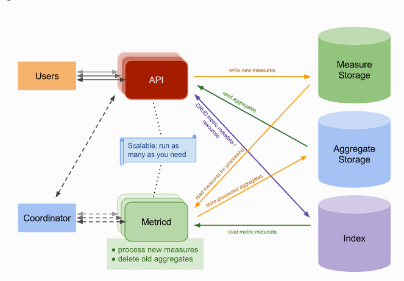

# Gnocchi

## 1. Tổng quan về kiên trúc của Gnocchi

Gnocchi là một open source time series database được tạo ra từ năm 2014, khi mà Openstack đang tìm kiếm một cơ sở dữ liệu time series có khả năm mở rộng và chịu lỗi cao, không phụ thuộc vào một số các database cụ thể (như Hadoop, Cassandra,...)

Ban đầu nó được xây dựng bên trong Openstack, nhưng sau đó đã được tách ra để được xây dựng thành một nền tảng riêng. Mặc dù vậy nó vẫn được sử dụng làm time series database chính trong nền tảng cloud, ví dụ Openstack ceilometer tận dụng khả năng mở rộng cà tính sẵn sàng cao của Gnocchi để đảm bảo telemetry sẽ luôn luôn hoạt động và nhanh.

Gnocchi có thể storage và indexing time series data và resource với quy mô lớn. 

Gnocchi bao gồm một vài các service sau: a HTTP REST API, ptional statsd-compatible daemon và một daemon xử lý không đồng bộ (được gọi là gnocchi-metricd). Data được nhận qua HTTP REST API hoặc statsd daemon. `gnocchi-metricd` thực hiện các hoạt động (statistics computing, metric cleanup,...) trên các data nhận được.




Tất cả các dịch vụ này đều là stateless nên đều có thể mở rộng theo chiều ngang. Không giống với nhiều các time series databases khác, gnocchi không giới hạn số lượng các endpoint của các gnocchi-metricd hoặc gnocchi-api. Nếu tải bắt đâu tăng hoặc nếu muốn HA thì cần tạo thêm nhiều daemons để xử lý các luồng requets mới, bằng cách chạy nhiều tiến trình gnocchi trên các máy chủ độc lập.

Như sơ đồ bên trên, gnocchi cần đến 3 thành phần ngoài để hoạt động:

* An incoming measure storage
* An aggregated metric storage
* An index

### Incoming and storage drivers

Gnocchi có thể tận dụng các hệ thống lưu trữ khác như các incoming measures và aggregated metric của nó như:

* File (mặc định)
* Ceph (được ưa thích)
* OpenStack Swift
* Amazon S3
* Redis

Tùy vào từng kích thước kiến trúc của bạn, sử dụng file driver và lưu trữ dữ liệu của bạn trên đĩa cũng có thể đã đủ. Nếu bạn muốn mở rộng thêm số lượng các server với các file driver, bạn có thể export và chia sẻ chúng qua NFS giữ các tiến trình gnocchi. Các driver con lại như S3, Ceph và swift sẽ cho nhiều tùy chọn mở rộng. Ceph cũng cung cấp tính nhất quán tốt hơn, và vì thế nó được khuyến khích sử dụng nhiều.

Một trường hợp điển hình được sử dụng phổ biến hiện nay được dùng cho việc triển khai quy mô vừa và lớn là sử dụng redis cho incoming measure storage và Ceph làm một aggregate storage.


### Indexer driver

Bạn cũng sẽ cần một database để index các resources và metric để gnocchi xử lý. Hai driver được hỗ trợ:

* PostgreSQL (được ưa thích hơn)
* MySQL (hỗ trợ phiên bản thấp nhất là 5.6.4)

Indexer chịu trách nhiệm cho việc storing các index của tất cả các resources, archive policies and metrics, cùng với các definitions, types và properties của chúng. Indexer cũng chịu trách nhiệm liên kết các resources với metric và các resources liên quan khác.

### Understanding aggregation 

Cách để thu thập các data points được cấu hình dựa trên per-metric basis, sử dụng một archive policy.

Một archive policy sẽ định nghĩa cách gom lại cái gì để tính toán và làm thế nào giữ lại các aggregates. Gnocchi nhiều phương pháp tổng hợp như: minimum, maximum, average, Nth percentile, standard deviation,... Các aggregation này được tính toán trong một khoảng tời gian (được gọi là granularity) và được giữ trong một khoảng thời gian nhất định. Các aggregates được lưu trữ và được nén lại để đảm bảo các data point chiếm ít không gian bộ nhớ nhất có thể.
 
Gnocchi sử dụng ba back-ends khác nhau để lưu trữ dữ liệu: một để lưu trữ các incoming measures mới (incoming driver), một  time series aggregates (the storage driver) và một để indexing data (index driver). Măc định thì incoming driver sẽ được cấu hình sử dụng giống với storage driver.

Vì Gnocchi tính toán tất cả các aggregation ngay từ khi nhập chúng nên việc lấy dữ liệu là vô cùng nhanh, nó chỉ cần đọc lại các kết quả đã được tính trước đó.

Ví dụ, bạn định nghĩa một archive policy để giữa average, minimum và maximum của time series với 5 phút granularity trong 30 ngày. Trong trường hợp này Gnocchi sẽ tính toán average, minimum và maximum của các giá trị trong vòng 5 phút, giữ lại 8640 points (số lượng các data point có thể có được tổng hợp mỗi 5 phút trong khoảng thời gian là 30 ngày).

## 2. Configuration 

### 2.1 Configuration file
 
Mặc định thì file config sẽ được đặt tại một số vị trí sau:

* `~/.gnocchi/gnocchi.conf`
* `~/gnocchi.conf`
* `/etc/gnocchi/gnocchi.conf`
* `/etc/gnocchi.conf`
* `~/gnocchi/gnocchi.conf.d`
* `~/gnocchi.conf.d`
* `/etc/gnocchi/gnocchi.conf.d`
* `/etc/gnocchi.conf.d`

Nếu không tìm thấy file config, bạn có thể tạo ra một file cấu hình mẫu như sau:

	gnocchi-config-generator > /path/to/gnocchi.conf

Một số các cấu hình cơ bản;

| Option name	| Help |
|---|---|
| storage.driver	| The storage driver for metrics. |
| indexer.url	| URL to your indexer. |
| storage.file_*| 	Configuration options to store files if you use the file storage driver. |
| storage.swift_*| 	Configuration options to access Swift if you use the Swift storage driver. |
| storage.ceph_*| 	Configuration options to access Ceph if you use the Ceph storage driver. |
| storage.s3_*| 	Configuration options to access S3 if you use the S3 storage driver. |
| storage.redis_*| 	Configuration options to access Redis if you use the Redis storage driver. |

### 2.2 Archive policies

Archive policies định nghĩa cách mà các metrics được tổng hợp lại và giữ chúng trong bao lâu. Mỗi archive policy định nghĩa bằng số lượng các point trong một khoảng thời gian timespan.

Nếu `archive policy` định nghĩa một policy là 10 points với `granularity` là 1 giây, thì time series archive sẽ giữ chúng trong 10 giây, mỗi một điểm sẽ đại diện cho việc tổng hợp trong 1 giây. Điều này nghĩa là time series sẽ giữ lại dữ liệu tối đa trong 10 giây giữ điểm gần đây nhất và điểm cũ nhất. Điều đó không có nghĩa là 10 giây liên tiếp, có thể sẽ có một khoảng cách nếu dữ liệu không được cấp thường xuyên.

Không có thời hạn cho dữ liệu liên quan đến timestamp hiện tại. Data sẽ chỉ hết hạn theo timespan.


Ví dụ:

	(* 5 (rolling mean 3 (aggregate sum (metric (metric1 mean) (metric2 mean)))))

Tình CPU util:

```sh
(/ (* 100 (metric cpu mean)) (* 1000000000 (metric vcpus mean)))
(/ (metric cpu mean) (* 10000000 ((metric vcpus mean) or 1)))
(div (metric cpu mean) (mul 10000000 (metric vcpus mean)))

(div (mul 1000000000 (metric vcpus mean)) (metric cpu mean))
(* (div 1 (mul 1000000000 (metric vcpus mean))) (metric cpu mean))
(mul (pow (mul 1000000000 (metric vcpus mean)) -1) (metric cpu mean))
(rateofchange (mul 0.000000001 (metric cpu mean)))

(/ (rateofchange (mul 0.0000001 (metric cpu mean))) 300) =>> được (trùng với cpu-util mà ceilo tính với vcpu = 1 và granularity = 300)


========> công thức đã tính được cho một hoặc nhiều vcpu
(rateofchange (/ (* 0.0000001 (/ (metric cpu mean) (metric cpu_number mean))) 300))

trong đó: `cpu_number` là thông số được cấu hình thêm
```


## Tham khảo

[1] https://docs.openstack.org/ceilometer/stein/admin/

[2] https://docs.openstack.org/ceilometer/stein/install/install-base-rdo.html

[3] https://opensource.com/article/17/11/getting-started-gnocchi