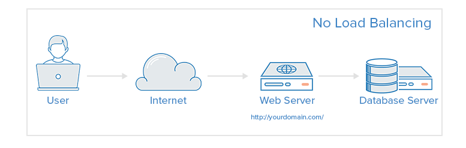
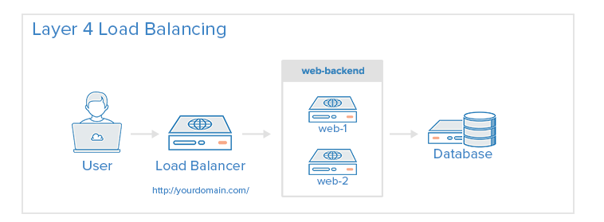
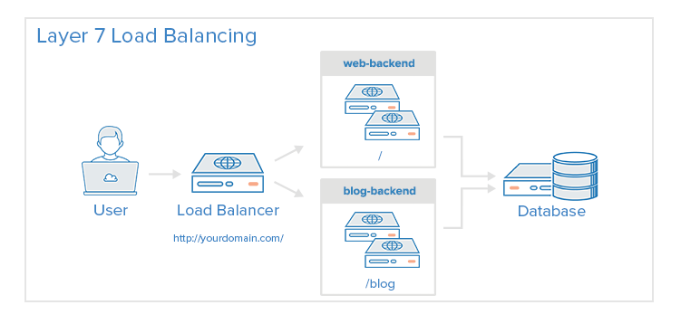

# Tông quản về HAProxy và Keepalived

## 1. Tổng quan Load Balancer

Load Balancer là một tập hợp các thành phần được tích hợp để cân bằng lưu lượng IP trên một tập hợp các máy chủ thực. Nó bao gồm hai công nghệ chính để monitor các cluster members và cluster services là Keepalived và HAProxy.

Keepalived sử dụng *Linux virtual server (LVS)* để thực hiện load balancing và nhiệm vụ failover giữ active và passive routers, trong khi HAProxy thực hiện load balancing và High-availability service cho TCP và HTTP applications.


### 1.1 Keepalived

`keepalived` daemon chạy trên cả active và passive LVS routers. Tất cả các router đang chạy keepalived sử dụng Virtual Redundancy Routing Protocol (VRRP). Active router gửi VRRP quảng bá định kỳ theo một khoảng thời gian nhất định, nếu acitve router nhận thông tin quảng bá thất bại thì một active router mới sẽ được bầu chọn.

Trên active router, `keepalived` cũng có thể thực hiện các nhiệm vụ cân bằng tải cho các máy chủ thật.

Keepalived điều khiển các tiến trình liên quan đến LVS routers. Khi khởi động, daemon được bắt đầu bởi `systemctl` command, nó sẽ đọc cấu hình trong file `/etc/keepalived/keepalived.conf`. Trên active router, `keepalived` daemon starts LVS service và monitors health của service dựa trên mô hình cấu hình.

Sử dụng VRRP, active router sẽ gửi các thông tin quảng bá định kỳ tới các backup routers. Trên backup router, VRRP instance xác nhận trạng thái `running` của active router. Nếu active router fails to advertise sau một khoảng thời gian được cấu hình bởi người dùng thì keepalived sẽ bắt đầu failover. 

Trong khi failover, virtual server sẽ bị xóa. active router mới sẽ kiểm soát địa chỉ VIP, gửi đi một ARP message, thiết lập IPVS table entries (virtual server), bắt đầu health checks, và bắt đầu gửi đi VRRP quảng bá.

Keepalived thực hiện failover trên layer 4 hay Transport layer, trên đó, TCP tiến hành truyền dữ liệu dựa trên các kêt nối. Khi một server thật fails reply một timeout TCP connection đơn giản, `keepalived` sẽ phát hiện server bị fails đó và xóa nó ra khởi server pool.


### 1.2 HAProxy

HAProxy (High Availability Proxy) là một phần mềm mã nguồn mở phổ biến cung cấp các dịch vụ cân bằng tải cho các dịch vụ dựa trên TCP/HTTP service, giải pháp proxy có thể chạy trên nhiểu nền tảng như Linux, FreeBSD và Solaris. HAProxy giúp cải thiện hiệu suất và độ tin cậy của môi trường máy chủ bằng cách phân phối khối lượng công việc đều trên các server ví dụ (web, application, database)

High Availability (HA) nghĩa là "tính sẵn sàng cao", với những hệ thống lớn luôn luông cần những server, thiết bị có độ sẵn sàng cao, giúp hệ thống vẫn có thể hoạt động bình thường, không bị gián đoạn khi có một vài trục trặc, sự cố. Vì vậy, hệ thông luôn luôn cần tối thiểu một cặp server, thiết bị chạy song song để có thể backup cho nhau.


## 2. Một số các khái niệm cơ bản

**Access Control list (ACL)**

Là một danh sách các điều kiện để kiểm soát truy cập, vơi Load Balanceing, ACL được sử dụng để kiểm tra một số điều kiện và thực hiện hành động (ví dụ chọn server hoặc block một request) dựa trên kết quả kiểm tra. Việc sửa dụng ACL cho phép linh hoạt chuyển tiếp các lưu lượng mạng dựa trên nhiều yếu tố khác nhau, ví dụ như pattern-matching và số lượng kết nối với một backend.

**Backend**

Là một tập các servers nhận các requests đưuọc chuyển tiếp. Các backend có thể được định nghĩa bởi:

* Thuật toàn LB được sử dụng
* Danh sách các server và các port

Một backend có thể chứa một hoặc nhiều các server, ta có thể tăng khả năng tải bằng các mở rộng tải trên nhiều server.

Ví dụ một cấu hình backend, web-backend và blog-backend với hai webservers cho mỗi loại trên port 80:

```sh
backend web-backend  
	balance roundrobin   
	server web1 web1.yourdomain.com:80 check   
	server web2 web2.yourdomain.com:80 check 
backend blog-backend   
	balance roundrobin   
	mode http   
	server blog1 blog1.yourdomain.com:80 check   
	server blog1 blog1.yourdomain.com:80 check
```

* `balance roundrobin` xác định thuật toán trong load balance
* `mode http` xác định layer 7 proxying sẽ đưuọc sử dụng

Tùy chọn `check` ở đoạn cuối dòng chỉ định server chỉ định rằng chỉ thực hiện health check trên các backend server đó.


**Frontend**

Một Frontend định nghĩa cách requests nên được forwarded tới backends. Frontend được định nghĩa trong `frontend` sction của HAproxy config. Chúng định nghĩa ra các thành phần như sau:

* một tập IP addresses và port (Ví dụ: 10.1.1.7:80, \*:443,...)
* ACLs
* use_backend rules, định nghĩa các rule cho backends để sử dụng phụ thuộc vào ACL conditions được matched, và/hoặc một default_backend rule sẽ xử lý mọi trường hợp khác. 

Một frontend có thể được cấu hình với nhiều kiểu của network traffic.

**Load Balancer (LB)**

Load Balancer (LB) hay còn được gọi là cân bằng tải

Dưới đây là mô hình không có Load Balancing 



* Như vậy  user sẽ kết nối trực tiếp với webserver và không có load balancing. Mô hình chỉ có một webserver duy nhất, nếu nó down thì tất các các user đều không thể truy cập được nữa. Hơn nữa nếu có qua nhiều user cùng truy cập vào một lúc thì có thể webserver sẽ không thể xử lý hết, có thể dẫn đến không thể kết nối.

**Layer 4 Load Balancing**

Cách đơn giản nhất để lb network traffic tới nhiều server để sử dụng layer 4 (transport layer) load balancing. Load balancing sẽ forward user traffic dựa trên IP  range và port



* User sẽ truy cập vào load balance, chuyển tiếp các request của user tới web-backend group của backend servers. Bất cứ cái backend nào được lựa chọn sẽ xử lý yêu cầu và trả về response trực tiếp cho user. Nhìn chung tất cả các server trong web-backend phải phục vụ các nội dung y hệt nhau. Chú ý các web server kết nối đều sample database server.

**Layer 7 Load Balancing**

Một cách khác phức tạp hơn để lb network traffic là sử dụng layer 7 (application layer) load balancing. Sử dụng layer 7 cho phép load balancer forward requests tới các backend server khác dựa trên nội dung requests của user. Ở chế độ này của load balancing sẽ cho phép bạn chạy nhiều web application servers giống như domain và port. 



* Trong ví dụ trên, người dùng requests tới `domain.com/blog`, nó sẽ được chuyển tiếp với blog backend, server được đang chạy blog app. Các blog khác sẽ chuyển tiếp tới web-backend, server chạy các app khác. cả hai backend đều sử dụng chung một database.

Ví dụ một đoạn cấu hình frontend:

```sh
frontend http
  bind *:80
  mode http

  acl url_blog path_beg /blog
  use_backend blog-backend if url_blog

  default_backend web-backend
```

* Frontend này có tên là http xử lý các metric đến từ port 80.
* `acl url_blog path_beg /blog` matched với request từ user nếu có path muôn truy cập bắt đầu bằng `/blog`

* `use_backend blog-backend if url_blog` sử dụng ACL để proxy trafic tới blog-backend.
* `default_backend web-backend` chỉ định tất cả các traffi khác sẽ được đẩy tới web-backend.


**Sticky Sessions**

Một vài applications yêu cầu một user liên tục kết nối tới cùng một backends server. Sự duy trì kết nối này gọi là Sticky Sessions, sử dụng tham số `appsession` trong phần backend để yêu cầu nó. 


**Health check**

HAProxy sử dụng Health Check để xác định nếu backend server có sẵn sàng xử lý request không. Điều này tránh được việc phải xóa bằng tay các server đã ngưng hoạt động, không còn khả dụng nữa. Mặc định health check sẽ cố gắng thiết lập kết nối TCP tới server, nó check xem liệu rằng backend server có còn lắng nghe trên IP và port được cấu hình không.

Nếu server fails một health check, và do đó không thể phục vụ các yêu cầu, nó sẽ tự động disabled trong backend, traffic sẽ không được chuyển tiếp cho tới khi health trở lại. Nếu tất cả các server trong backend fail, các service sẽ trở thành unavailable cho tới khi có ít nhất một backend server health trở lại.

Đối với một số backends nhất định, giống như database servers trông tinh huống nhất định, mặc định thì health check không đủ để xác định xem một máy chủ có còn health không.


## 3. Load Balancing Algorithms

[link](https://www.digitalocean.com/community/tutorials/an-introduction-to-haproxy-and-load-balancing-concepts)

Load Balancing Algorithms sử dụng để xác định server trong một backend sẽ được chọn khi load balancing. HAProxy cung cấp một số tùy chọn cho các thuật toán. Ngoài thuật toán load balancing, server có thể sử dụng tham số `weight` để chỉ ra tầm suất server được chọn so với các server khác.

HAProxy cung cấp nhiều load balancing algorithms, nhưng dưới đây tôi sẽ chỉ miêu tả một số thuật toán thường được sử dụng trong số chúng. 

* **roundrobin**: lựa chọn lần lượt các server. Mặc định sẽ sử dụng thuật toán này. Được sử dụng khi thời gian xử lý của các server được phân bổ đều. Nó được thiết kế giới hạn 4095 active server cho mỗi backend. 
* **leastconn**: Lựa chọn server ít số lượng kết nối hơn, nó được khuyến khích cho các session dài hơn. Các server trong cùng một backend cũng được rotated theo kiểu round-robin để đảm bảo tất cả các server đều được sử dụng. Giải thuật này được khuyến khích cho các session dài như LDAP, SQL, TSE,...  Nhưng nó lại không phù hợp với các sessions ngắn như HTTP.
* **source**: Lựa chọn server dựa trên sự phân tích source IP (địa chỉ IP của người sử dụng). Đây là method đảm bảo các client same địa chỉ ip được kết nối tới cùng một server miễn là server không ngừng hoạt động. Nếu kết quả băm thay đổi trong khi số lượng các server đang chạy bị thay đổi, các clients có thể sẽ kết nối tới các server khác. Giải thuật này thông thường được sử dụng trong TCP mode. 

## 4. Một số giải pháp khác

Nếu bạn cảm thấy HAProxy quá phực tạp so với những gì bàn cần, thì có thể tham khảo một số giải pháp dưới đây, có thể sẽ tốt hơn:

* **Linux Virtual Servers (LVS)** một giải pháp cân bằng tải layer 4 đơn giản, nhanh được đi kèm trong nhiều bản phần phối của linux

* **Nginx**: Một web server nhanh và đáng tin cậy cũng có thể được sử dụng cho proxy và mục đích load-balancing

## 5. High Availability

Load Balancing layer 4 và layer 7 được thiết lập trước khi cả hai được sử dụng như một load balancer để điều khiển các luồng traffic tới một hoặc nhiều backend server. Tuy nhiên, load balancer là một single point of failure được thiết lập, nếu nó down hoạt quá tải các yêu cầu, sẽ gây ra độ trễ cao hoặc downtime cho service của bạn.

Thiết lập một High Availability (HA) để nó một hạ tầng không có single point of failure. Để ngăn chặn một single server failure dẫn đến downtime thì cần thêm ít nhất một server nữa trong kiến trúc của bạn.


Trong ví dụ trên, bạn có thể có nhiều load balancer (một active và nhiều passive) đằng sau một static ip có thể ánh xạ (remapped) từ server này sang server khác. Khi user kết nối tới website của bạn, request thông qua external IP trên active load balancer. Nếu lb lỗi, cơ chế chuyển đổi dự phòng (failover) của bạn sẽ tự phát hiện ra nó và tự động phân IP cho một passive server khác. Có một số cách khác để triển khai active/passive HA. [Đọc thêm How To Use Floating IPs.](https://www.digitalocean.com/docs/networking/floating-ips/#how-to-implement-an-ha-setup)


## 6. Access Control List (ACL)

Có hai cách để định nghĩa một ACL: một là `named acl` hai là `anonymous` hay `in-line ACL`

* Đầu tiên là form named ACL:

		acl is_static path -i -m beg /static

	* Chúng ta sẽ bắt đầu với `acl` keyword, tiếp theo lần lượt là tên gọi, điều kiện. Ở đây chúng ta sẽ có một ACL có tên là `is_static`. Tên ACL này sau đó có thể được sử dụng với các statement `if` hoặc `unless` ví dụ: `use_backend be_static if is_static`. Cách này được khuyến khích trong trường hợp bạn dự định sử dụng một điều kiện nhất định cho nhiều actions.
		
		```sh
		acl is_static path -i -m beg /static
		use_backend be_static if is_static
		```


	* Điều kiện `path -i -m beg /static` kiểm tra xem nếu URL bắt đầu bằng `/static` 

* Thứ hai là một anonymous or in-line ACL:	
	
		use_backend be_static if { path -i -m beg /static }

	* Dòng này làm tương tự với việc hai dòng trên sẽ làm, tất cả chỉ trong một dòng. Đối với in-line ACL, điều kiện sẽ được chứa trong dấu ngoặc nhọn `{}`

Trong cả hai trường hợp, bạn có thể dử dùng nhiều chuối điều kiện cùng nhau. ACLs được liệt kê lần lượt mà không có bất cứ thứ gì ở giữa sẽ đưuọc join với nhau theo kiểu **and**. Điều kiện chỉ đúng nếu thỏa mãn cả hai điều kiện.

Ví dụ: 

	http-request deny if { path -i -m beg /api } { src 10.0.0.0/16 }

* Dòng trên sẽ ngăn chặn bất cứ một client nào trong dải 10.0.0.0/16 truy cập vào các đường dẫn bắt đầu bằng **/api**.

* Thêm một dấu chấm than `!` để đảo ngược điều kiện, ví dụ muốn chặn tất cả các client không phải từ dải `10.0.0.0/16` truy cập tới các đường dẫn bắt đầu bằng **/api**

		http-request deny if { path -i -m beg /api } !{ src 10.0.0.0/16 }

* Các địa chỉ cũng có thể được nhập từ một file:

		http-request deny if { path -i -m beg /api } { src -f /etc/hapee-1.8/blacklist.acl }

	* Trong	file `blacklist.acl` có thể là một danh sánh các target IP cụ thể hoặc một range các IP sử dụng CIDR để giới hạn. Ví dụ nội dung sau:

		192.168.122.3
		192.168.122.0/24

* Bạn cũng có thể định nghĩa một ACL cho phép đúng nếu thỏa mãn một trong hai điều kiện:

		http-request deny if { path -i -m beg /evil } || { path -i -m end /evil }

* Bạn cũng có thể làm điều tương tự với dòng trên bằng cách kết hợp các named ACLs như sau:

		acl starts_evil path -i -m beg /evil
		acl ends_evil path -i -m end /evil
		http-request deny if starts_evil || ends_evil	

* Với named ACLs, được chỉ định nhiều ACL name nhiều lần sẽ kết hợp các điều kiện theo kiểu `OR`, vì vậy có thể biểu diễn acls trên như sau

		acl evil path_beg /evil
		acl evil path_end /evil
		http-request deny if evil

* Điều này cho phép kết hợp ANDs và ORs (như named và in-line ACLs) để xây dừng nhiều biểu thức điều kiện phức tạp hơn, ví dụ:

		http-request deny if evil !{ src 10.0.0.0/16 }

	Nếu các client nằm ngoài range `10.0.0.0/16` thì sẽ không được truy cập vào path bắt đầu hoặc kết thúc bằng **/evil** 

**Tóm lại:** Mỗi một điều kiện của ACL đều được chia làm hai phần là nguồn thông tin (hoặc một fetch) như path, src, string phù hợp. Giữa hai phần, có thể chỉ định một cờ (như `-i` cho một case-insensitive match) và một phần là cơ chế matching (`beg` để match với bắt đầu của một chuỗi). 


### 6.1 Fetches

Bây giờ bạn đã hiểu cách cơ bản để định dạng ACL, giờ bạn muốn tìm hiểu những nguồn nào của thông tin mà bạn có thể sử dụng để đưa ra quyết định. Một source của information trong HAProxy được biết đến như một **fetch**. Nó cho phép ACLs lấy được một phần của thông tin để làm việc với nó.

Bạn có thể xem toàn bộ danh sách các fetches có sẵn [ở đây](https://www.haproxy.com/documentation/hapee/1-8r1/onepage/#7.3)

Dưới đây có một số các fetches thường được sử dụng:

|fetches| |
|--|--|
|src|	Returns the client IP address that made the request|
|path	|Returns the path the client requested|
|url_param(foo)|	Returns the value of a given URL parameter|
|req.hdr(foo)|	Returns the value of a given HTTP request header (e.g. User-Agent or Host)|
|ssl_fc	|A boolean that returns true if the connection was made over SSL and HAProxy is locally deciphering it|

### 6.2 Converters

Khi bạn đã có một thông tin thông qua fetches, bạn sẽ muốn biến đổi (transform) nó. Các converters được phân tách vơi nhau với dấu phẩy từ fetches, hoặc các converters khác nếu bạn có nhiều hơn một, và có thể dùng nó nhiều lần.

Một vài converters (như lower và upper) được chỉ định bởi chính chúng trong khi chúng có các arguments được passed qua cho chúng. Nếu một argument được yêu cầu thì nó sẽ được đặt trong một dấu ngoặc đơn. Ví dụ, để lấy gia trị của path **/static** bị khỏi sự bắt đầu của nó, bạn có thể sử dụng `regsub` converter với một regex và thay thế nó như một arguments:

	path,regsub(^/static,/)

Như với fetches, có rất nhiều bộ converters, nhưng dưới đây là một số converters phổ biến:

|Converter| |
|---|----|
|lower|	Changes the case of a sample to lowercase|
|upper|	Changes the case of a sample to uppercase|
|base64|	Base64 encodes the specified string (good for matching binary samples)|
|field|	Allows you to extract a field similar to awk. For example if you have "a\|b\|c" as a sample and run field(\|,3) on it you will be left with "c" |
|bytes|	Extracts some bytes from an input binary sample given an offset and length as arguments|
|map|	Looks up the sample in the specified map file and outputs the resulting value|


### 6.3 Flags

Bạn có thể thêm nhiều Flag từ một ACL đơn, ví dụ:

	path -i -m beg -f /etc/hapee/paths_secret.acl


Dòng này sẽ thực hiện một case insensitive match dừa trên beginning của path và matching với các pattern được lưu trữ trong file cụ thể. Không có quá nhiều flag như việc có nhiều fetch /converter types, nhưng nó lại rất đa dạng.

Dưới đây là một số các flags thường được dùng:

|Flags | |
|----|---|
|-i|	Perform a case-insensitive match (so a sample of FoO will match a pattern of Foo)|
|-f	|Instead of matching on a string, match from an ACL file. This ACL file can have lists of IP’s, strings, regexes, etc. As long as the list doesn’t contain regexes, then the file will be loaded into the b-tree format and can handle lookups of millions of items almost instantly|
|-m|	Specify the match type. This is described in detail in the next section.|

### 6.4 Matching methods

Bây giợ bạn có một sample từ converters và fetches, như một requested URL path qua `path` và một số thứ match qua hardcoded path `/evil`. Để so sánh các trước với cái sau bạn có thể sử dụng một vài matching methods. Một số các matching methods được sử dụng phổ biến như:

|Matching methods| |
|---|---|
| str|	Perform an exact string match|
| beg|	Check the beginning of the string with the pattern, so a sample of “foobar” will match a pattern of “foo” but not “bar”.|
| end|	Check the end of a string with the pattern, so a sample of foobar will match a pattern of bar but not foo.|
| sub|	A substring match, so a sample of foobar will match patterns foo, bar, oba.|
| reg|	The pattern is compared as a regular expression against the sample.Warning: This is CPU hungry compared to the other matching methods and should be avoided unless there is no other choice.
found	This is a match that doesn’t take a pattern at all. The match is **true** if the sample is found, **false** otherwise. This can be used to (as a few common examples) see if a header (req.hdr(x-foo) `-m` found) is present, if a cookie is set (cook(foo) `-m` found), or if a sample is present in a map (src,map(/etc/hapee-1.8/ip_to_country.map) `-m` found).|
| len|	Return the length of the sample (so a sample of `foo` with `-m len 3` will match)|


### 6.5 Những thứ có thể làm với ACLs

Bây giờ bạn đã bết được cách để định nghĩa ACLs, dưới đây sẽ là một só các trường hợp, điều kiện hoặc các mà các rules được sử dụng.

**Redirecting a request with http-request redirect** 

Có một số biến thể cho rule này, nhưng tất cả đều trả về mã 301/302 response cho client. Tất cả nhưng điều này đêu cho phép log-format rules, sử dụng `%[]` syntax, được sử dụng trong các chuỗi string để cho phép dynamic rediects. 

Command `http-request redirect location` sẽ thiết lập URI đầu vào. Ví dụ để redirect `non-www domains` thành `www` bạn có thể sử dung:

	http-request redirect location http://www.%[hdr(host)]%[capture.req.uri] unless { hdr_beg(host) -i www }

Trong trường hợp này ACL là `hdr_beg(host) -i www`, đảm bảo là client đã được redirected nếu Host HTTP header của chính bắt đầu với `www`.

Command `http-request redirect scheme` thay đổi 

Tham khảo thêm [ở đây](https://www.haproxy.com/blog/introduction-to-haproxy-acls/)

### 6.6 Updating ACL Lists

**Sử dụng lb-update**

ACL files sẽ được updated khi HAproxy được reloaded để đọc cấu hình mới, nhưng cũng có thể update nội dung trong khi runtime, với bản enterprise

**Sử dụng runtime api**

Để update cấu hình trong khi runtime, đơn giản là sử dụng Runtime API: 

	echo "add acl /etc/hapee-1.8/whitelist.acl 1.2.3.4" | socat stdio /var/run/hapee-lb.sock


## Tham khảo

[1] https://www.haproxy.com/blog/introduction-to-haproxy-acls/

[2] https://www.haproxy.com/documentation/hapee/1-8r1/onepage/#7.1

[3] https://www.digitalocean.com/community/tutorials/an-introduction-to-haproxy-and-load-balancing-concepts

[4] https://access.redhat.com/documentation/en-us/red_hat_enterprise_linux/7/html/load_balancer_administration/ch-keepalived-overview-vsa

