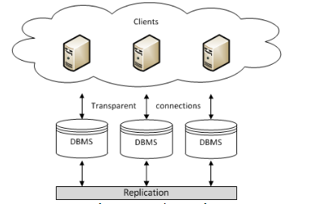
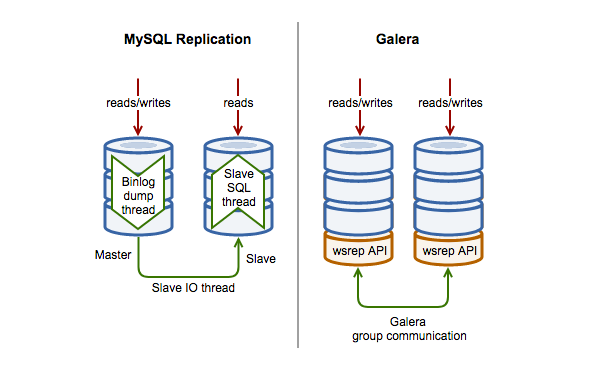

# MariaDB Galera Cluster

## 1. MariaDB Galera Cluster là gì?

**Galera Cluster** là một giải pháp mutil master cho database, tất cả các node đều là master. Khi sử dụng galera cluster, các application có thể read/write trên bất cứ node nào. Các node thành viên của thể được thêm vào hoặc tách ra một các dễ dàng mà không có downtime. Cluster có 2 mode hoạt động là Active - Passive và Active - Active

**MariaDB Galera Cluster** là một ***synchronous multi-master cluste***, có khả năng tự đồng bộ dữ liệu giữa các node MariaDB trong cụm. Nó chỉ khả dụng trên Linux, và chỉ hỗ trợ  XtraDB/InnoDB storage engines. Từ bản MariaDB 10.1 thì mặc định đã có wsrep API cho Galera Cluster. 

**Features**

* Synchronous replication 
* Mô hình Active - Active mutil-master 
* Cho phép thực hiện đọc và ghi lên bất cứ node nào.
* Kiểm soát các thành viên trong cluster tự động, node failed sẽ drop khỏi cluster.
* Node tự động joining.
* Replica theo hàng
* Kết nối trực tiếp với client

**Benifits**

* Multi thread slave cho phép apply writeset nhanh hơn
* Không cần failover vì node nào cũng là master
* No slave lag, tất cả các server đều có thể liên tục update
* No lost transactions
* Có khả năng mở rộng cả việc đọc ghi
* Độ trễ nhỏ

**Limitations**

* Chỉ hỗ trợ InnoDB or XtraDB storage engine
* Với việc tăng trưởng số lượng các writeable masters, tỉ lệ transaction rollback có thể cũng sẽ tăng, đặc biệt là nếu thực hiệc ghi trên cùng một dataset (hotspot). Điều này sẽ làm tăng độ trễ của các transaction.
* Một master node nếu bị chậm hoặc quá tải sẽ làm ảnh hưởng tới hiệu năng của cả Galera Cluster, vì vậy các server master nên được đồng nhất trong một cluster.

## 2. Sự khác biệt giữa MySQL Replication and Galera Cluster

Hình dưới đây minh họa một số high-level khác biệt giữa MySQL Replication and Galera Cluster:

### MySQL Replication Implementation

MySql sử dụng 3 threads để implement replication, một cho master, hai cho slaves:

* **Binlog dump thread**: Master tạo một thread để gửi nội dung binary log tới slave khi slave kết nối đến. Thread này có thể được định danh trong output của `SHOW PROCESSLIST` trong master như  Binlog Dump thread.

* **Slave IO thread**: Slave tạo một IO thread để kết nối tới master và yêu cầu nó gửi các bản cập nhập được ghi trong binary logs của nó. Slave I/O thread đọc thông tin cập nhật được gửi bằng Binlog Dump thread của master và copy chúng vào các file ở local, nơi chứa các relay log của slave.

* **Slave SQL thread** Slave tạo một SQL thread để đọc các relay log (được ghi bởi slave IO thread) và thực hiện các event được ghi trong đó

MySQL Replication là một phần của standard MySQL database, và chủ yếu sẽ asynchronous. Việc update sẽ luôn luôn được thực hiện trên một node master, sau đó mới quảng bá tới các slave. Nó cũng có thể tạo ra một ring topology với nhiều node masters, tuy nhiên điều này không được khuyển khích, vì các server rất dễ xảy ra việc không thể đồng bộ khi một node master bị lỗi. Với GTID được giới thiệu trong bản MySql 5.6 và các bản sau đó, nó đơn giản hóa việc quản lý các luồng replication data và failover, tuy nhiên nó sẽ không tự động failover hoặc resynchronization.

### Galera Cluster Implementation

Galera Cluster triển khai replication sử dụng 4 thành phần:

* **Database Management System** (DBMS): là database server được chạy trên một node riêng. DBMS được hỗ trợ là một một MySQL server, Percona Server cho MySQL và MariaDB Server.

* **wsrep API**: interface và responsibilities cho database server và replication provider. Nó cung cấp việc tích hợp với các database server engine cho việc write-set replication.

* **Galera Plugin**: là một plugin cho phép thực hiện các tính năng của dịch vụ write-set replication.

* **Group Communication plugins**: Có nhiều group communication systems khác nhau có sẵn Galera Cluster.

Một nhà cung cấp database muốn tận dụng công nghệ Galera Cluster sẽ cần kết hợp với WriteSet Replication (wsrep) API patch vào codebase của database của họ. Điều này cho phép Galera plugin (cái mà đang làm việc như một wsrep) cung cấp các communicate and replicate transactions (writesets in Galera terms) qua các group communication protocol. Điều này cho phép thiết lập synchronous master-master cho InnoDB. Các hoạt động được commited đồng bộ trên tất cả các node.

Trong trường hợp một node failing, các node khác vẫn tiếp tục hoạt động và liên tục được cập nhật. Khi node failed hoạt động trở lại, nó sẽ tự động được động bộ với các node khác thông qua State Snapshot Transfer (SST) or Incremental State Transfer (IST) tùy thuộc vào trang thái được biết đến cuối cùng, trước khi nó được cho phép quay trở lại cluster. Sẽ không có dữ liệu nào bị mất khi có một node bị fail.

Galera Cluster sử dụng Certification based Replication, đó là cách đồng bộ synchronous replication với chi phí được giảm.

### What is Certification based Replication

Certification based Replication sử dụng group communication và transaction ordering techniques để thực hiện synchronous replication. Transaction thực thi trên một node đơn (hoặc replica) tại thời điểm được định sẵn, chạy một coordinated certification proces để bắt buộc áp dụng toàn bộ (global). Global coordination được thực hiện dựa trên broadcast service, để thiết lập một quy tắc chung cho mọi giao dịch toàn cầu.

Điều kiện cần cho certification based replication:

* Database is transactional (ví dụ nó có thể khôi phục các thay đổi mà chưa được commit)
* Mỗi replication event sẽ thay đổi database nguyên tử
* Replicated events được thực hiện global (được áp dụng trên tất cả các instances có cùng thứ tự)

## Tham khảo 

[1] https://mariadb.com/kb/en/library/galera-use-cases/

[2] https://www.slideshare.net/Codership/how-to-understand-galera-cluster-2013-33753926

[4] https://severalnines.com/resources/tutorials/galera-cluster-mysql-tutorial

[5] https://galeracluster.com/products/#use-cases

[6] https://galeracluster.com/library/documentation/technical-description.html

[7] https://mariadb.com/kb/en/library/tips-on-converting-to-galera/

