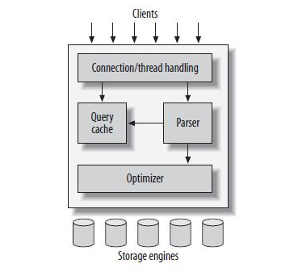
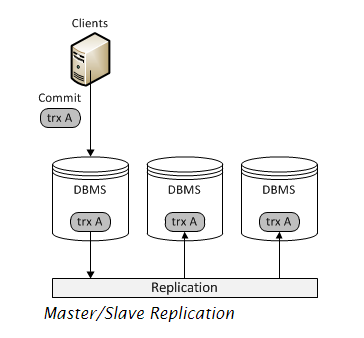
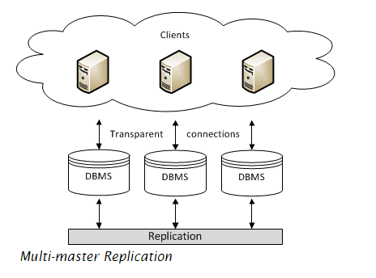

## 1. Một số các khái niệm liên quan

**Mysql** là một hệ quản trị cơ sở dữ liệu miễn phí được sử dụng phổ biến. **MariaDB** là một nhánh được fork từ mysql nên nó cũng có các chức năng tương tự, và phát triển thêm một số các tính năng mới. Khi tạo một bảng trong mysql sẽ có  nhiều  kiểu **storage engine** để lựa chọn.

* Tổng quan về kiến trúc logic của mysql



* Các thành phần cơ bản của mysql

	* Connection/thread handling
	* Query cache
	* Parser
	* Optimizer
	* Storage engine

**Storage Engine** thực chất là cách mà MySQL lưu trữ dữ liệu trên đĩa cứng. MySQL lưu các database của mình như các thư mục nằm trên cây thư mục của hệ thống. Khi một table được tạo ra, MySQL sẽ lưu định nghĩa bảng ở một file với đuôi là `.frm` và có tên trùng với tên của bảng được tạo. Việc quản lý định nghĩa bảng là nhiệm vụ của mysql server, cách lưu trữ và đánh chỉ mục (index) các dữ liệu là phụ thuộc vào storage engine.


**InnoDB** là một Storage Engine, và là kiểu mặc định trong MySQL 5.7. Thường được sử dụng cho các website với lượng cập nhật liên tục như các diễn đàn lớn. Ưu điểm  của InnoDB là khả năng kiểm tra tính toàn vẹn và ràng buộc dữ liệu rất cao, khó xảy ra tính trạng hỏng các chỉ mục và crash table. Tốc độ insert/update/dalete tốt nhất do hoạt động theo cơ chế Row Level Locking nên khi cập nhật (Thêm, sửa, xóa) trong một bảng thì chỉ có bản ghi đang thao tác bị khóa, các hoạt động khác trên bảng vẫn hoạt động bình thường. Nhưng nó hoạt động lại tốn khá nhiều ram so với MyISAM, một loại Storage Engine phổ biến khác.

**Memory engine** 

Memory engine hay còn được gọi là HEAP tables. Lưu trữ tất cả các dữ liệu nằm trên memory để có thể truy cập nhanh  khi được yêu cầu với các dữ liệu không quan trọng. Khi server restart, cấu trúc của bảng được bảo toàn, nhưng dữ liệu bị mất hết.

## 2. Database Replication

Database Replication đề cập tới việc liên tục thực hiện sao chép dữ liệu từ một node (một database trên một server) sang một node khác. Nó thực hiện trong một cụm cơ sở dữ liệu phân tán (distributed database) hay còn gọi là database cluster, nơi mà tất cả các node cùng thực hiện share các thông tin cùng nhau.

### Master - Slaves

Các  Database Management Systems (DBMS) replicate database.



Trong một hệ thống, master database server thực hiện ghi lại log update dữ liệu và truyền nó sang các node slaves qua network. Các server slaves nhận các luồng cập nhật từ các node master và apply việc thay đổi theo server.

Một cách thiết lập các việc replication phổ biến khác là sử dụng mutil-master replication, tất cả các node đều được coi là master



Trong một hệ thống multi-master replication, bạn có thể submit việc update trên bất cứ node nào, sau đó truyền qua mạng tới các node khác. Tất cả các nodes trong cụm đều có các tính năng của một node master. Nếu cập nhật thành công sẽ không có log hoặc bất cứ index nào được chỉ ra để thông báo.


## Một số trường hợp xảy ra với hệ thống cluster

Mô tả với một hệ thống cluster 3 node 

### 1. Trường hợp một node down

Trong trường hợp này, vì một lý do nào đấy hai node trong cụm mất liên lạc với node còn lại, các chỉ số về quorum và cluster size thay đổi. Khi 1 node đó quay trở lại, node đó sẽ không được tham gia xử lý các request cho tới khi được đồng hoàn toàn dữ liệu từ hai node còn lại trong cluster. Thực hiện recovery để đồng bộ dữ liệu giữa các node.

```sh
> mysqld_safe --wsrep-recover


190219 14:34:03 mysqld_safe Logging to '/var/log/mariadb/mariadb.log'.
190219 14:34:04 mysqld_safe Starting mysqld daemon with databases from /var/lib/mysql
190219 14:34:04 mysqld_safe WSREP: Running position recovery with --log_error='/var/lib/mysql/wsrep_recovery.35lHqP' --pid-file='/var/lib/mysql/cinder-recover.pid'
190219 14:34:07 mysqld_safe WSREP: Recovered position 87040921-2f68-11e9-ac2c-ebc5b57ed5ac:4
190219 14:34:10 maysqld_safe mysqld from pid file /var/run/mariadb/mariadb.pid ended

> systemctl start mariadb
```


### 2. Hệ thống tắt để bảo trì 

Trước khi off hệ thống cần kiểm tra lại trạng thái của cluster

```sh
mysql -u root -p123@123Aa -e "SHOW STATUS LIKE 'wsrep_local_state_comment'"
wsrep_local_state_comment	Synced
```

Sau đó thực hiện backup database

```sh
mysqldump -u root -p123@123Aa db_name > backup-file.sql
```

Trong trường hợp này, sẽ phải thưc hiện tắt cả 3 node. Ví dụ tắt service mariadb trên cả 3 con để thực hiện lab. Đầu tiên sẽ cần thực hiện tắt lần lượt từng node một, thứ tự sẽ là node 1 -> node 2 -> node 3

```sh
systemctl stop mariadb
systemctl disable mariadb
```

* Sau khi cả 3 node down thực hiện kiểm tra file `/var/lib/mysql/grastate.dat` trên cả 3 node đó, ta sẽ thấy node 3 có trạng thái như sau:

```sh
[root@trang3 ~]# cat /var/lib/mysql/grastate.dat
# GALERA saved state
version: 2.1
uuid:    3ef8ba98-d39a-11e9-a609-a2dfd5a101ac
seqno:   -1
safe_to_bootstrap: 1
```

* Hai node còn lại 

```sh
[root@trang1 ~]# cat /var/lib/mysql/grastate.dat
# GALERA saved state
version: 2.1
uuid:    3ef8ba98-d39a-11e9-a609-a2dfd5a101ac
seqno:   -1
safe_to_bootstrap: 0

[root@trang2 ~]# cat /var/lib/mysql/grastate.dat
# GALERA saved state
version: 2.1
uuid:    3ef8ba98-d39a-11e9-a609-a2dfd5a101ac
seqno:   3
safe_to_bootstrap: 0
```

* Do node 03 là node được tắt sau cùng, nên `safe_to_bootstrap` sẽ có giá trị là 1, thể hiện node 3 là node thực hiện giao dịch cuối cùng. Khi đó muốn khởi động lại cụm cluster thì cần khởi động từ node 3 trước để làm chuẩn cho các node còn lại khi join vào.

```sh
galera_new_cluster
systemctl start mariadb 
```

* Sau đó thực hiện bật **lần lượt** từng node trong hai node còn lại lên để đồng bộ vào cluster

```sh
systemctl start mariadb 
```

* Kiểm tra lại trạng thái của cluster

```sh
[root@trang1 ~]# mysql -u root -p123@123Aa -e "SHOW STATUS LIKE 'wsrep_cluster_size'"
+--------------------+-------+
| Variable_name      | Value |
+--------------------+-------+
| wsrep_cluster_size | 3     |
+--------------------+-------+
```

**Note** Khi cả ba node cùng down như trên, thực hiện chỉnh sửa option `safe_to_bootstrap` trong file `/var/lib/mysql/grastate.dat` từ 0 thành 1, sau đó khởi động cluster thì cũng không được. Sau khi khởi động lại hệ thống, thực hiện tìm đúng node có `safe_to_bootstrap = 1` để khởi chạy cluster


### 3. Một hệ thống bị tắt đột ngột

Hệ thống có thể sẽ bị tắt đột ngột, khi đó sẽ gây ra việc các dữ liệu của database có thể bị crash, sẽ không thể xác định được node nào đang là node thực hiện giao dịch cuối cùng, vì vậy cần phải sử dụng InnoDB để xác định node đó. Thực hiện recovery trên từng node. ví dụ:

```sh
mysqld_safe --wsrep-recover


root@compute1 ~]# mysqld_safe --wsrep-recover
190219 15:25:54 mysqld_safe Logging to '/var/log/mariadb/mariadb.log'.
190219 15:25:54 mysqld_safe Starting mysqld daemon with databases from /var/lib/mysql
190219 15:25:54 mysqld_safe WSREP: Running position recovery with --log_error='/var/lib/mysql/wsrep_recovery.m7iAwK' --pid-file='/var/lib/mysql/compute1-recover.pid'
190219 15:25:58 mysqld_safe WSREP: Recovered position 23cdb090-341e-11e9-8d54-962d3797b484:0
190219 15:26:01 mysqld_safe mysqld from pid file /var/run/mariadb/mariadb.pid ended

[root@compute2 ~]# mysqld_safe --wsrep-recover
190219 15:25:56 mysqld_safe Logging to '/var/log/mariadb/mariadb.log'.
190219 15:25:57 mysqld_safe Starting mysqld daemon with databases from /var/lib/mysql
190219 15:25:57 mysqld_safe WSREP: Running position recovery with --log_error='/var/lib/mysql/wsrep_recovery.SUcctM' --pid-file='/var/lib/mysql/compute2-recover.pid'
190219 15:26:00 mysqld_safe WSREP: Recovered position 87040921-2f68-11e9-ac2c-ebc5b57ed5ac:5
190219 15:26:03 mysqld_safe mysqld from pid file /var/run/mariadb/mariadb.pid ended


[root@compute3 ~]# mysqld_safe --wsrep-recover
190219 15:14:42 mysqld_safe Logging to '/var/log/mariadb/mariadb.log'.
190219 15:14:42 mysqld_safe Starting mysqld daemon with databases from /var/lib/mysql
190219 15:14:43 mysqld_safe WSREP: Running position recovery with --log_error='/var/lib/mysql/wsrep_recovery.LCxeHy' --pid-file='/var/lib/mysql/cinder-recover.pid'
190219 15:14:46 mysqld_safe WSREP: Recovered position 87040921-2f68-11e9-ac2c-ebc5b57ed5ac:4
190219 15:14:49 mysqld_safe mysqld from pid file /var/run/mariadb/mariadb.pid ended
```

Ta có thể nhìn thấy dòng `Recovered position` phía sau UUID có một số, node nào có số cao nhất là node thực hiện giao dịch cuối cùng. Vì vậy để có thể khởi động lại hệ thống cluster thì cần khởi động node này trước. Vào node đó, chỉnh sửa file `/var/lib/mysql/grastate.dat` thống số `safe_to_bootstrap` nếu đang là 0 thì cần chỉnh lại thành 1:

```sh
safe_to_bootstrap: 1
```

Sau đó thực hiện bootstrap và khởi động mariadb trên node 2 đó:

```sh
galera_new_cluster
systemctl start mariadb
```

Sau khi node này khởi động thành công thì tiếp tục khởi động hai node còn lại để thực hiện đồng bộ vào cluster.


## Tham khảo

[1] https://galeracluster.com/library/documentation/tech-desc-introduction.html


 