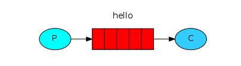
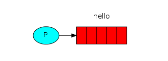

# Giới thiêu RabbitMQ

## 1. Introduction

RabbitMQ là một message broker thực hiện chấp nhận và chuyển tiến các messag. Bạn có thể hiểu nó như một cái bưu điện, khi bạn gửi gửi và bạn muốn gửi tới một post box. Bạn phải chắc chắn rằng đó là Mr hay Ms. Người đưa thư cuối cùng sẽ gửi tới người nhận. Tương tự vậy, RabbitMQ chính là một post box, và bưu điện chính là người đưa thư.

Điều khác biệt chính giữa RabbitMQ và bưu điện là nó không phải nhận những tờ giấy, thay vào đó nó sẽ accept, stores và forwards những đoạn dữ liệu dạng nhị phân gọi là messages.

RabbitMQ và messaging nói chung đều sử dụng một số các thuật ngữ sau:

* **Producing**: nghĩa là không có gì nhiều hơn là việc sending. Một chương trình gửi messages được gọi là **producer**, ký hiệu:


* **Queue**: Là tên của một post box, nó năm trong RabbitMQ. Các ứng dụng của bạn gửi các message qua RabbitMQ, chúng được lưu trữ vào bên trọng một queue. Một queue không bị giới hạn kích thước, bạn có thể lưu trữ bao nhiêu dữ liệu tùy thuộc vào bộ đệm mà bạn cấp cho RabbitMQ. Bất cứ **producer** nào cũng có thể gửi message vào một **queue** và có thể cung cấp cho bất cứ **comsumer** nào yêu cấu. Trong sơ đồ **queue** được ký hiệu như sau:


* **Consuming** được hiểu như một người nhận thư, nó là một chương trình được viết ra để phục vụ cho việc chờ và nhận message từ **RabbitMQ**, dược ký hiêu như sau:


Chú ý rằng producer, consumer và broker đều không bắt buộc nằm trên một host. Thực ra thì đa số các ứng dụng họ đều không làm vậy. Một application có thể vừa là producer và consumer.


## 2. Hello World!

### (Sử dụng Pika Python client)

Trong phần này tôi sẽ viết một hai chương trình python nhỏ: một producer (sender) gửi các single message và một consumer (receiver) nhận message và in chúng ra. Nó gọi là một "Hello World" messaging.

Trong sơ đồ dưới đây, "P" là producer và "C" là comsumer, ở giữa là message queue là một bộ đệm giữ các message trước khi đưa vào consumer.



Producer gửi message tới "hello" queue. Consumer nhận các messages từ queue.

**RabbitMQ libraries** 

RabbitMQ sử dụng nhiều giao thức, trong bài này hiện đang sử dụng AMQP 0-9-1, một giao thức mở dùng chung cho các messaging. Có nhiều client cho RabbitMQ sử dụng nhiều giao ngôn ngữ khác nhau. Trong series hướng dẫn này chúng tôi sẽ sử dụng Pika 1.0.0, và python client được khuyển khích sử dụng vởi RabbitMQ team. Để cài đặt nó bạn có thể phải sử dụng `pip` để thao tác với gói cài đặt Pika

	pip install pika --upgrade

Bây giờ Pika đã được cài đặt, chúng ta có thể viết một vài dòng code.

### Sending



Chương trình đầu tiên là `send.py` sẽ gửi một single message tới queue. Đầu tiên những gì bạn cần là thiết lần kết nối tới RabbitMQ server.

```sh
#!/usr/bin/env python
import pika

connection = pika.BlockingConnection(pika.ConnectionParameters('localhost'))
channel = connection.channel()
```

Chúng ta đã kết nối thành công tới broker trên local machine, nếu muốn kết nối tới một broker nằm trên một machine khác, đơn giản, bạn chỉ cần đổi `localhost` thành hostname hoặc IP của machine đó là được.

Tiếp theo, trước khi sending chúng ta cần chắc chắn rằng recipient queue tồn tại. Nếu chúng tôi gửi một message tới location không tồn tại, RabbitMQ sẽ drop message đó. Bây giờ hãy tạo ra một message sẽ được gửi đi:

	channel.queue_declare(queue='hello')

Tới đây, chúng ta có thể thực hiện send message. Message đầu tiên của chúng ta sẽ chỉ có nội dung đơn giản là một chuỗi `Hello Worrld!` và nó sẽ được gửi tới queue `hello`.


