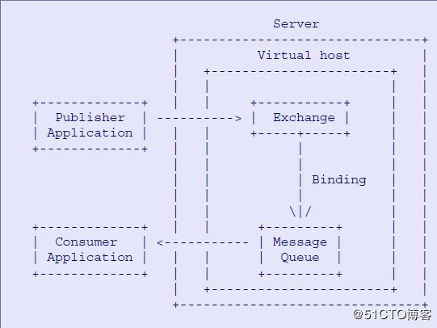

# First knowledge of openstack 2 - RabbitMQ message middleware and high availability

**Dịch bài**: https://blog.51cto.com/arkling/2131142

## 1. Giới thiệu chung

Với sự phát triển của các ứng dụng phân tán như hiện nay, message queue middleware trở thành một đường dẫn kết nối các thành phần dời dạc của kieense trúc client-server. Trong mô hình truyền tin (truyền message) truyền thống, khi client gửi một gói tin, thì phía server buộc phải online, nếu không nó sẽ không thể tiếp tục, nhưng mới mô hình mới có thêm message middleware thì client có thể gửi tin ngay khi server (coonsumer) không online mà không bị intereupted. 

RabbitMQ gồm các thành phần cơ bản sau:

Trong đó: 

1. Exchange: chức năng chính là nhận messages để gửi tới queue tương ứng.

2. Message: được sử dụng để làm không gian lưu trữ cho subcriber đọc message.

3. Binding: được sử dụng để định nghĩa routing mode thông qua đó chuyển đổi định tuyến các messages tới queue.

4. Channel: Channel messages được chuyển giữa subcriber queue và role of each message middleware được gọi là một broker, mỗi broker có thể bao gồm vhost broker, những cũng có thể bao gồm đa số các vhost server, để các broker đọc lập.

## 2. RabbitMQ management

RabbitMQ có thể được quản lý bởi web interface, hoạt động chủ yếu nhất để thao tác với nó là thêm, xóa user hoặc vhost thông qua rabbitmqctl command,  và xác thực user.

Ví dụ liệt kê các vhost đang tồn tại:

	rabbitmqctl list_vhosts

