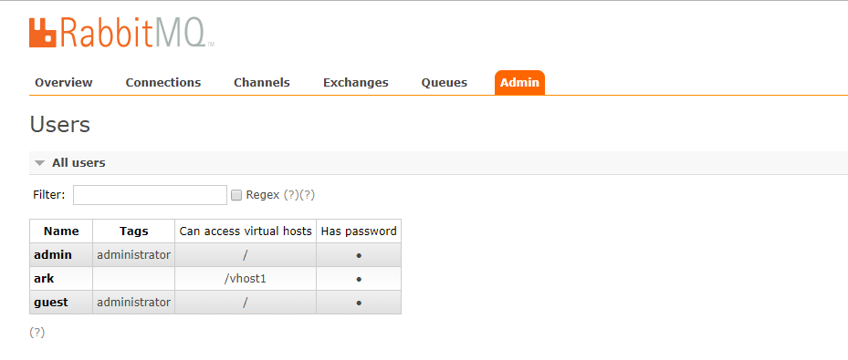

## Một số command thao tác với rabbitmq

1. Xem các virtual host trên server hiện tại. Mặc định vhost là `/`

```sh
[root@trang-40-71 ~(openstack)]# rabbitmqctl list_vhosts
Listing vhosts ...
/
...done.
```

2. Liệt kê các users đang tồn tại trên server hiện tại. Mặc định guest user có quyền của administrator. 

```sh
[root@trang-40-71 ~(openstack)]# rabbitmqctl list_users
Listing users ...
guest   [administrator]
openstack       []
...done.
```

3. Xem quyền hạn của các user, bạn có thể xem permissions của guest user hiện tại trên virtual host "/", bạn cũng có thể set permissions bằng command với syntax như sau:

```sh
set_permissions [-p <vhostpath>] <user> <conf> <write> < Read> 
```

permissions của user trên VM có thể áp dụng được cho cả các VM là con của VM đó

```sh
[root@trang-40-71 ~(openstack)]# rabbitmqctl list_permissions
Listing permissions in vhost "/" ...
guest   .*      .*      .*
openstack       .*      .*      .*
...done.
```

4. Cho một ví dụ: Tạo một vhost1 sub-virtual machine thuộc `/` virtual machine và thêm một tài khoản `ark` cho phép toàn quyền truy cập vào vhost1 virtual machine

```sh
[root@trang-40-123 ~]# rabbitmqctl add_user ark ark
Creating user "ark"
[root@trang-40-123 ~]# rabbitmqctl add_vhost /vhost1
Creating vhost "/vhost1"
[root@trang-40-123 ~]# rabbitmqctl set_permissions -p /vhost1 ark ".*" ".*" ".*"
Setting permissions for user "ark" in vhost "/vhost1"
```

Có thể kiểm tra trên web:




