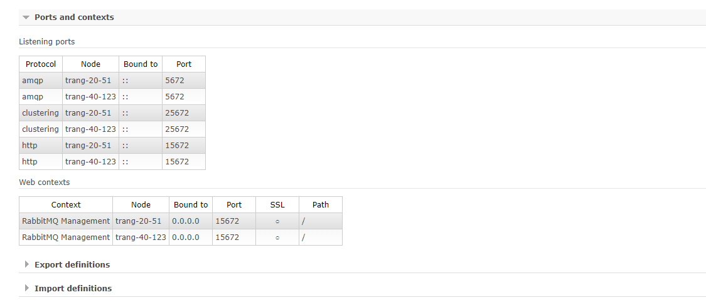

## RabbitMQ is highly available 

Message middleware đóng vai trò quan trọng trong kiến trúc distributed hiện nay, và nó có thể là single point. Ví dụ dưới đây sẽ giới thiệu triển khai RabbitMQ high availability mô hình hai nodes. Thông tin về các node:

|Node name|	IP address|Node information|
|----|----|---|
|Node3|	192.168.40.123|Master node|
|Node4|	192.168.20.51|Slave node|

**Chuẩn bị**

Đầu tiên sửa đổi host file, cấu hình IP tương ứng với node3 và node4, cấu hình NTP để đồng bộ time giữa hai server.

**Lauch plugins và service** 

Thực hiện trên master node 

```sh
rabbitmq-plugins enable rabbitmq_management  
rabbitmq-server -detached  
```

Service có thể bị stop sau đó bởi command `rabbitmqctl stop`

**Xem cluster nơi chứa các node**

```sh
[root@trang-20-51 opt]# rabbitmqctl set_permissions -p / admin ".*" ".*" ".*"
Setting permissions for user "admin" in vhost "/"
[root@trang-20-51 opt]# rabbitmqctl cluster_status
Cluster status of node 'rabbit@trang-20-51'
[{nodes,[{disc,['rabbit@trang-20-51']}]},
 {running_nodes,['rabbit@trang-20-51']},
 {cluster_name,<<"rabbit@trang-20-51">>},
 {partitions,[]},
 {alarms,[{'rabbit@trang-20-51',[]}]}]


[root@trang-40-123 ~]# rabbitmqctl cluster_status
Cluster status of node 'rabbit@trang-40-123'
[{nodes,[{disc,['rabbit@trang-40-123']}]},
 {running_nodes,['rabbit@trang-40-123']},
 {cluster_name,<<"rabbit@trang-40-123">>},
 {partitions,[]},
 {alarms,[{'rabbit@trang-40-123',[]}]}]
```

**Copy the cookie**

Copy cookie file từ master node sang các node khác, chú ý với permisions 400 và cookie 

```sh
[root@trang-40-123 ~]# scp  /var/lib/rabbitmq/.erlang.cookie root@192.168.20.51:/var/lib/rabbitmq/

[root@trang-20-51 ~]# ll -a /var/lib/rabbitmq/
total 8
drwxr-xr-x.  3 rabbitmq rabbitmq   42 Jul  5 11:23 .
drwxr-xr-x. 24 root     root     4096 Jul  5 11:23 ..
-r--------.  1 rabbitmq rabbitmq   20 Jul  5 11:39 .erlang.cookie
drwxr-x---.  4 rabbitmq rabbitmq  103 Jul  5 11:23 mnesia
```

Thực hiện add node trên master node

```sh
[root@trang-40-123 ~]#  rabbitmqctl cluster_status
Cluster status of node 'rabbit@trang-40-123'
[{nodes,[{disc,['rabbit@trang-40-123']}]},
 {running_nodes,['rabbit@trang-40-123']},
 {cluster_name,<<"rabbit@trang-40-123">>},
 {partitions,[]},
 {alarms,[{'rabbit@trang-40-123',[]}]}]

[root@trang-40-123 ~]# rabbitmqctl stop_app
Stopping rabbit application on node 'rabbit@trang-40-123'

[root@trang-40-123 ~]# rabbitmqctl join_cluster rabbit@trang-20-51
Clustering node 'rabbit@trang-40-123' with 'rabbit@trang-20-51'

[root@trang-40-123 ~]# rabbitmqctl start_app
Starting node 'rabbit@trang-40-123'

[root@trang-40-123 ~]#  rabbitmqctl cluster_status
Cluster status of node 'rabbit@trang-40-123'
[{nodes,[{disc,['rabbit@trang-20-51','rabbit@trang-40-123']}]},
 {running_nodes,['rabbit@trang-20-51','rabbit@trang-40-123']},
 {cluster_name,<<"rabbit@trang-20-51">>},
 {partitions,[]},
 {alarms,[{'rabbit@trang-20-51',[]},{'rabbit@trang-40-123',[]}]}]
```

Kiểm tra trạng thái của cluster trên web:




**Sử dụng Haproxy reverse proxy**

Sau khi triển khai thành công HA, RabbitMQ cần cung cấp địa chỉ truy cập đồng nhất. Nginx được giới thiệu là proxy của tcp protocol sau phiên bản 1.9. Ở đây chúng ta sử dụng nó làm reverse proxy. Sau khi cài đặt haproxy và start nó, tạo một file cấu hình mới với nội dung như sau:

```sh
[root@host5 ~]# vim /etc/rabbitmq/rabbitmq.conf
listen  rabbitmq 172.16.10.50:5672  
        mode    tcp  
        balance roundrobin  
        server  rabbit1 172.16.10.30:5672 check inter 5000   
        server  rabbit2 172.16.10.40:5672 check inter 5000   
```

Service name (rabbitmq | rabbit1 | rabbit2) và lắng nghe port (5672) có thể được gọi như vậy, hoạt động của service được hoàn thành, và high-availablity cho haproxy có thể sử dụng keepalived.

## RabbitMQ Cluster 3 node

### Prerequisites

Chuẩn bị 3 node CentOS7 đã cài đặt RabbitMQ:

```sh
node1: 192.168.40.123  trang-40-123
node2: 192.168.20.51   trang-20-51
node3: 192.168.70.121  trang-70-121
```


Cấu hình file hosts trên 3 node:

```sh
192.168.20.51   trang-20-51
192.168.40.123  trang-40-123
192.168.70.121  trang-70-121
```

### Enable RabbitMQ Management Plugins

RabbitMQ Management Plugins là một interface cho phép bạn monitor và xử lý RabbitMQ server từ webserver, mặc định chạy TCP port 15672

	rabbitmq-plugins enable rabbitmq_management
	systemctl restart rabbitmq-server

Kết quả:

```sh
[root@trang-70-121 ~]# rabbitmq-plugins enable rabbitmq_management
The following plugins have been enabled:
  amqp_client
  cowlib
  cowboy
  rabbitmq_web_dispatch
  rabbitmq_management_agent
  rabbitmq_management

Applying plugin configuration to rabbit@trang-70-121... started 6 plugins.
[root@trang-70-121 ~]# systemctl restart rabbitmq-server
```


### Set up RabbitMQ Cluster 

để thiết lập RabbitMQ Cluster, chúng ta cần chắc chắn rằng file `.erlang.cookie` trên tất cả các node đều giống nhau, thực hiện copy file `.erlang.cookie` từ node 1 sang các node còn lại:

```sh
scp /var/lib/rabbitmq/.erlang.cookie root@trang-20-51:/var/lib/rabbitmq/
scp /var/lib/rabbitmq/.erlang.cookie root@trang-70-121:/var/lib/rabbitmq/
```	


### Thực hiện add các node vào làm cluster 

Thực hiện trên node 2 và node 3 như sau:

```sh
sudo systemctl restart rabbitmq-server
sudo rabbitmqctl stop_app
sudo rabbitmqctl join_cluster rabbit@trang-40-123
sudo rabbitmqctl start_app
sudo rabbitmqctl cluster_status
```

Kiểm tra lại sau khi add 3 node thành một cluster:

```sh
[root@trang-40-123 ~]# rabbitmqctl cluster_status
Cluster status of node 'rabbit@trang-40-123'
[{nodes,[{disc,['rabbit@trang-20-51','rabbit@trang-40-123',
                'rabbit@trang-70-121']}]},
 {running_nodes,['rabbit@trang-70-121','rabbit@trang-20-51',
                 'rabbit@trang-40-123']},
 {cluster_name,<<"rabbit@trang-20-51">>},
 {partitions,[]},
 {alarms,[{'rabbit@trang-70-121',[]},
          {'rabbit@trang-20-51',[]},
          {'rabbit@trang-40-123',[]}]}]
```

### Tạo mới một user Administrator

Trên node 1, tạo mới một user admin và xóa guest user

```sh
rabbitmqctl add_user trangnth trang1234
rabbitmqctl set_user_tags trangnth administrator
rabbitmqctl set_permissions -p / trangnth ".*" ".*" ".*"
rabbitmqctl delete_user guest
```

Kiểm tra lại các user hiện có:

```sh
[root@trang-40-123 ~]# rabbitmqctl list_users
Listing users
admin   [administrator]
trangnth        [administrator]
```

### RabbitMQ Setup Queue Mirroring

Đây là thiết lập bắt buộc, chúng ta cần cấu hình `ha policy` cluster cho queue mirroring và replication cho tất cả các cluster node. Nếu node master fails, mirros cũ nhất sẽ được tiến cử làm master miễn là nó đã được đồng bộ, phụ thuộc vào `ha-mode` và `ha-params` policies.

Dưới đây là một vài ví dụ về RabbitMQ ha policies.

Thiết lập ha policy có tên là `ha-all`, tất cả các queues nằm trên RabbitMQ cluster sẽ mirroring cho tất cả các nodes trên cluster.

	sudo rabbitmqctl set_policy ha-all ".*" '{"ha-mode":"all"}'

Thiết đặt một ha  policy có tên là `ha-two`, tất cả các queues có tên bắt đầu bằng `two` sẽ được mirroring hai node trên cluster.

	sudo rabbitmqctl set_policy ha-two "^two\." '{"ha-mode":"exactly","ha-params":2,"ha-sync-mode":"automatic"}'

Thiết lập ha policy tên là `ha-nodes` tất cả các queues có tên bắt đầu là `nodes` sẽ mirroring  trên hai node được chỉ định.

	sudo rabbitmqctl set_policy ha-nodes "^nodes\." '{"ha-mode":"nodes","ha-params":["rabbit@node02", "rabbit@node03"]}'

Thực hiện check lại các policies:

```sh
[root@trang-40-123 ~]# sudo rabbitmqctl list_policies;
Listing policies
/       ha-all  all     .*      {"ha-mode":"all"}       0
/       ha-two  all     ^two\\. {"ha-mode":"exactly","ha-params":2,"ha-sync-mode":"automatic"}  0
/       ha-nodes        all     ^nodes\\.       {"ha-mode":"nodes","ha-params":["rabbit@node02","rabbit@node03"]}       0
```

Nếu bạn muốn xóa policy thì sử dụng command sau:

	sudo rabbitmqctl clear_policy ha-two

Lên web để xem lại cho trực quan.

### Xóa node khởi cluster

Trên node muốn xóa, ví dụ node 3 thực hiện như sau:

```sh
rabbitmqctl stop_app
rabbitmqctl reset
rabbitmqctl start_app
```

Kiểm tra lại trang thái cluster trên các node:

```sh
[root@trang-70-121 ~]# rabbitmqctl cluster_status
Cluster status of node 'rabbit@trang-70-121'
[{nodes,[{disc,['rabbit@trang-70-121']}]},
 {running_nodes,['rabbit@trang-70-121']},
 {cluster_name,<<"rabbit@trang-70-121">>},
 {partitions,[]},
 {alarms,[{'rabbit@trang-70-121',[]}]}]

[root@trang-20-51 ~]# rabbitmqctl cluster_status
Cluster status of node 'rabbit@trang-20-51'
[{nodes,[{disc,['rabbit@trang-20-51','rabbit@trang-40-123']}]},
 {running_nodes,['rabbit@trang-40-123','rabbit@trang-20-51']},
 {cluster_name,<<"rabbit@trang-20-51">>},
 {partitions,[]},
 {alarms,[{'rabbit@trang-40-123',[]},{'rabbit@trang-20-51',[]}]}]

[root@trang-40-123 ~]# rabbitmqctl cluster_status
Cluster status of node 'rabbit@trang-40-123'
[{nodes,[{disc,['rabbit@trang-20-51','rabbit@trang-40-123']}]},
 {running_nodes,['rabbit@trang-20-51','rabbit@trang-40-123']},
 {cluster_name,<<"rabbit@trang-20-51">>},
 {partitions,[]},
 {alarms,[{'rabbit@trang-20-51',[]},{'rabbit@trang-40-123',[]}]}]
```


## Tham khảo 

[1] https://www.howtoforge.com/how-to-set-up-rabbitmq-cluster-on-centos-7/

[2] https://www.rabbitmq.com/clustering.html#removing-nodes