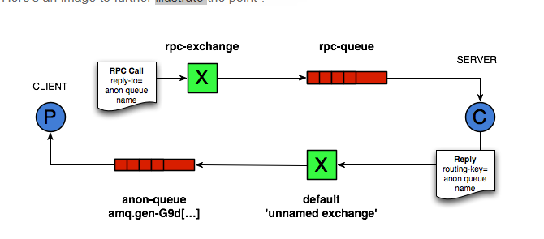

# Message queue in Openstack

Openstack sử dụng một Message queue để điều phối các hoạt động và trạng thái thông tin giữa các service. Message queue service thường chạy trên controller node. Openstack hỗ trợ một vài message queue service bao gồm RabbitMQ, Qpid và ZeroMQ. Tuy nhiên hầu hết các bản phân phối Openstack đều hỗ trợ một message queue service cụ thể. 


## 1. AMQP và Nova

AMQP là một công nghệ messaging được lựa chọn bởi Openstack cloud. AMQP broker mặc định là  RabbitMQ, nằm giữa hai thành phần Nova, cho phép chúng giao tiếp với nhau một cách "long lẻo". Chính xác hơn, các thành phần của Nova sử dụng Remote Procedure Calls (RPC hereinafter) để giao tiếp với một thành phần khác; tuy nhiên một mô hình như vậy được xây dựng dựa trên mô hình publish/subscribe để có thể đạt được các mục đích sau: 

* Phân tách giữa client và servant (người phục vụ), chẳng hạn, client không cần biết servant’s reference ở đâu.
* Đồng bộ toàn bộ giữa client and servant (như client không cần servant chạy cùng lúc với thời điểm remote call)
* Random balancing of remote calls (chẳng hạn nếu nhiều servant up và running, các cuộc gọi được gửi tới một cách minh bạch tới servant nào có sẵn đầu tiên).

Nova sử dụng direct, fanout, and topic-based exchanges. Kiến trúc được miêu tả như hình dưới đây:


## 2. RabbitMQ trong Openstack 

* RabbitMQ broker nằm giữa các thành phần của các service trong Openstack (ví dụ: nova-conductor, nova-scheduler trong nova service) và cho phép chúng giao tiếp với nhau theo các kết hợp long lẻo (the loosely coupled way).

* RabbitMQ chạy trên controller như một tiến trình và lấy message từ Invoker (API hoặc scheduler) thông qua rpc.call() hoặc rpc.cast()

	* rpc.cast: đừng đợi kết quả (one-way (một chiểu))
	* rpc.call: đợi kết quả (khi có một cái gì đó trả về) (request + response)

* Trong các tin nhắn một chiều, một loạt các client gửi request bao gồm một tin nhắn. Các client này sẽ không đợi phản hồi từ phía server và vẫn tiếp tục xử lý. Request được gửi tới transport layer từ đó server sẽ lấy các request. Các request không được thực thi ngay lập tức, nó nằm trên queue cho tới khi transport layer gửi nó tới server. Sau đó request được chập nhận bởi transport layer, client sẽ không được thông báo nếu server không tồn tại hoặc bị lỗi khi nó cố gắng thử thực thi request. Ví dụ, server từ chối request trong khi xác thực và client không được thông báo về vấn đề này.

* Oslo.messaging được sử dụng để tạo một RPC interface bao gồm RPC Client và RPC Server methods. Ví dụ, trong Nova service, khi nova scheduler muốn nói với nova compute, nó sẽ gọi tới RPC client được định nghĩa trong oslo.messaging. RPC client sẽ kích hoạt rpc.call(), rpc.cast() và gửi message vào một queue phần hối cho việc transferring message queing/receiving phần hồi to/from RPC server. RPC server method được triển khai trong các thành phần khác của Nova như nova-network, nova-compute,... Làm thế nào để một queue được tạo ra? Đó là nhiệm vụ của RabbitMQ.

### Một chút về RPC qua RabbitMQ

Theo các thông số kỹ thuật của AMQP, có một cuộc trao đổi trực tiếp không có tên công khai mà mỗi queue phải được ràng buộc theo tên mặc định dử dụng tên của queue như rouing key. Các server có thể sử dụng exchange này để phản hồi cho các client của nó, publishing các message được routing key đã được nhắc tới. 

Phần tiếp theo trong cấu hỏi của chúng tôi là thuộc tính "reply-to" từ AMQP message. Khi client publishes một request, nó sẽ gửi queue name qua thuộc tính "reply-to". Khi request được published nó sẽ đợi và lắng nghe hàng đợi ẩn danh của chính nó. Khi RPC server sẵn sàng reply, nó sẽ gửi tới các exchange, sau đó phản hồi lại cho client.

Hay xem một sơ đồ dưới đây để có cái nhìn tổng quan hơn:



Source: http://videlalvaro.github.io/2010/10/rpc-over-rabbitmq.html

### Openstack Nova và RPC

> "Mỗi thành phần của Nova kết nối tới message broker và phụ thuộc vào bản chất của nó (ví dụ một compute node hoặc một network node), có thể sử dụng queue cũng như một Invoker (như API hoặc Scheduler) hoặc một worker (tương tự như Compute hoặc Network). Invokers và Workers không thực sự tồn tại trong Nova object model, nhưng chúng tôi dự định sẽ sử dụng chúng như an abstraction for sake of clarity. Một Invoker là một thanh phần gửi message trong queuing system quá hai hoạt động: 1 là rpc.call 2 là rpc.cstr. Một worker là một thành phần nhận messages từ queuing system và reply tương ứng với các hành động rpc.call."

Source: http://docs.openstack.org/developer/nova/devref/rpc.html

Với Nova service, trong mỗi một thành phần, cơ chế của giao tiếp giữa các thành phần là sử dụng RPC. Thành phần chủ yếu của Nova có một python module để xử lý sự sắp xếp của các tiến trình RPC. Ví dụ, nova-network có /nova/network/api.py hay nova-conductor có nova/conductor/api.py, hoặc nova-compute có /nova/compute/api.py. Khi các thành phần đó của Nova được khởi tạo, nova sẽ chạy /nova/service.py để tạo RPC server cho mỗi thành phần đó.

```sh
target = messaging.Target(topic=self.topic, server=self.host)

endpoints = [
     self.manager,
     baserpc.BaseRPCAPI(self.manager.service_name, self.backdoor_port)
]

endpoints.extend(self.manager.additional_endpoints)
serializer = objects_base.NovaObjectSerializer()
self.rpcserver = rpc.get_server(target, endpoints, serializer)
self.rpcserver.start()target = messaging.Target(topic=self.topic, server=self.host)

endpoints = [
     self.manager,
     baserpc.BaseRPCAPI(self.manager.service_name, self.backdoor_port)
]

endpoints.extend(self.manager.additional_endpoints)
serializer = objects_base.NovaObjectSerializer()
self.rpcserver = rpc.get_server(target, endpoints, serializer)
self.rpcserver.start()
```


## Tham khảo

[1] https://blog.51cto.com/arkling/2131142

[2] https://docs.openstack.org/nova/rocky/reference/rpc.html

[3] https://vietstack.wordpress.com/2015/09/17/rpc-in-openstack/
